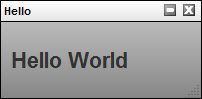

# Custom Widget Basics

Although any execution environment can interact with TACTIC by
interfacing through the Client API, most often, users will be
interacting with TACTIC through the browser. TACTIC’s main interface is
the browser. All browsers come with the Javascript language interpreter
built-in and thus any rich interface that integrates with TACTIC will
need to interact with the various components using Javascript.

Three core frameworks in TACTIC work together to create a rich web
interface.

-   CustomLayoutWdg: provides the ability to create the visual interface
    by laying out widgets using HTML templating

-   Behaviors: provides a framework to create complex behaviors that is
    much easier to use than the browsers default event system.

-   Applet: provides the interaction to the client machine to do
    operations that the browser would otherwise not be permitted to do

The TACTIC Client API can access server functionality through the
TacticServerStub in the same manner as its Python equivalent. Note the
similarities in code structure in the following example:

Python code:

    server = TacticServerStub.get()
    snapshot = server.checkin(search_key, context, path, mode="upload")
    print snapshot.get("code")

Javascript code:

    var server = TacticServerStub.get();
    var snapshot = server.checkin(search_key, context, path, {mode: "upload"} );
    alert(snapshot.code)

There are a few differences due to the syntax of the two different
languages. Keyword arguments are not natively supported by Javascript.
Since some of the functions in the server stub have numerous arguments,
it is desirable to only use those that are needed without having to
"fill in" all of the preceding arguments with nulls.

For example, the previous Javascript code would have to read like the
above:

    server.checkin(search_key, context, path, null, null, null, null, "upload")

In general, a given function will have a few necessary arguments and all
"optional" arguments are given in a kwargs dictionary. Another
difference is that the sobjects returned are Javascript "objects" whose
members are values from the database. Attributes can be accessed in two
ways:

1.  code = snapshot\['code'\]

2.  code = snapshot.code

The most convenient method to test and implement the Javascript examples
is in the TACTIC Script Editor. This can be convenient accesses by
pressing the "9" hot key to bring it up. Alternatively, the TACTIC
Script Editor can be brought up under the gear menu under: **Tools →
TACTIC Script Editor**.

This is a simple "Hello World" example.

    <html>
      <h1>Hello World</h1>
    </html>

The XML document embeds an HTML tag that will be used to layout elements
in the application.

The simplest way to view this is to open up the TACTIC Script Editor and
input the following code:

    var html = "<html><h1>Hello World</h1></html.>";
    var kwargs = {
      'html': html
    };
    spt.panel.load_popup('Hello', 'tactic.ui.panel.CustomLayoutWdg', kwargs);

    // NOTE: this should be:
    // spt.api.load_popup('Hello', 'tactic.ui.panel.CustomLayoutWdg', kwargs);

This previous code is completely in Javascript, however, layout pages
using strings in Javascript rapidly becomes unwieldy. It is thus
preferential to create these layouts using the widget config. This is
done by going to the side bar and going to **Project Admin → Widget
Config**. This will open up the "widget\_config" table. This table is used
to store all custom interface configurations for widgets.

Create a new entry by pressing the \[+\] button on the right side. Input
the following into the **config\*field and for \*view** input
*example01*.&lt;config&gt; &lt;example01&gt; &lt;html&gt; &lt;h1&gt;Hello World&lt;/h1&gt; &lt;/html&gt;
&lt;/example01&gt; &lt;/config&gt;

This is the full XML document describing the widget config. Note that
the HTML is now embedded within that XML document. This will be
important to know later when behaviors and elements are added to the
widget.

Finally, in the TACTIC Script Editor, enter the following:

    kwargs = {
      view: 'example01'
    };
    spt.panel.load_popup('Example01', 'tactic.ui.panel.CustomLayoutWdg', kwargs);

The following will appear when you click on "Run" in the TACTIC Script
Editor the script above:

Add a new entry to the widget\_config table with view = 'example02' and
with the following config definition.&lt;config&gt; &lt;example02&gt; &lt;html&gt;
&lt;span&gt;This is a button:&lt;/span&gt; &lt;input type='button' class='button1'
value='Press Me'/&gt; &lt;/html&gt; &lt;behavior class='button1'&gt;\\{ "type":
"click\_up", "cbjs\_action": ''' alert('Hello World'); ''' }&lt;/behavior&gt;
&lt;/example02&gt; &lt;/config&gt;

In this example, an HTML button is added to the HTML layout. By default,
a button doesn’t do anything when it is clicked. A behavior has to be
added for something to happen. TACTIC behaviors are added to DOM
elements by their class attributes.

When the button is clicked (corresponding to the "click\_up" event type),
the Javascript in the "cbjs\_action" attribute is executed. This example
will alert a "Hello World" message on clicking.

The following example will add a text area to the interface as well as
extract information from that text area once the button has been
clicked.

    <?xml version='1.0' encoding='UTF-8'?>
    <!-- This examples displays some html UI and then reacts to it using the TACTIC
          behavior system -->
    <config>
    <example03>
    <html>
    

        <textarea name='description' class='spt_input'></textarea>
        <input type='button' class='spt_button1' value='Press Me'/>
    

    </html>

    <behavior class='spt_button1'>{
      "type": "click_up",
      "cbjs_action": '''
        var top = bvr.src_el.getParent('.spt_top');
        var values = spt.api.Utility.get_input_values(top);
        var description = values.description;
        alert('You entered: ' + description);
      '''
    }</behavior>

    </example03>
    </config>

Note that currently, get\_input\_values() requires that every input
element have class='spt\_input' attribute. Future versions may remove
this requirement, but currently this is necessary.

    Please note that when an API for 2.6/2.7, the following lines will be changed:

    The following line:
     var values = spt.api.Utility.get_input_values(top);
    will be replace by:
     var values = spt.api.get_input_values(top);

    The following line:
    var top = bvr.src_el.getParent('.spt_top');
    will be replaced by:
    var top = spt.api.get_parent(bvr.src_el, ".spt_top");

The behavior definition warrants a closer examination:

    <behavior class='spt_button1'>{
      "type": "click_up",
      "cbjs_action": '''
        var top = bvr.src_el.getParent('.spt_top');
        var values = spt.api.Utility.get_input_values(top);
        var description = values.description;
        alert('You entered: ' + description);
      '''
    }</behavior>

First, there is an implied bvr object that exists in the namespace of
the behavior. This bvr objects contains useful data for the purposes of
executing behaviors. The most important attribute is "bvr.src\_el". This
element is the source element that called the event. This element can be
used as a starting point to navigate the DOM to search for elements.var
top = bvr.src\_el.getParent('.spt\_top');

It is common practice to find a top level element of a widget from the
source element. This top element is a starting point from which searches
under a DOM hierarchy can be made. By starting from a top element, it is
ensured that the returned values are isolated to that single widget.

The next line gets all of the values of all of the input elements under
the top element.var values = spt.api.Utility.get\_input\_values(top);

This returns a dictionary of name/value pairs of all of the input
elements underneath the top element.

By adding expressions to a report, it becomes very easy to create
reports that extract important information and combine it into a single
view.

&lt;?xml version='1.0' encoding='UTF-8'?&gt; &lt;config&gt; &lt;example04&gt; &lt;html&gt;
&lt;h1&gt;My login is \[expr\]$LOGIN\[expr\]&lt;/h1&gt; &lt;table&gt; &lt;tr&gt;&lt;td&gt;Number of
tasks&lt;/td&gt;&lt;td&gt;\[expr\]@COUNT(sthpw/task)\[/expr\]&lt;/td&gt;&lt;/tr&gt; &lt;tr&gt;&lt;td&gt;Number
of checkins&lt;/td&gt;&lt;td&gt;\[expr\]@COUNT(sthpw/snapshot)\[/expr\]&lt;/td&gt;&lt;/tr&gt;
&lt;tr&gt;&lt;td&gt;Number of model checkins&lt;/td&gt;
&lt;td&gt;\[expr\]@COUNT(sthpw/snapshot\['context','model'\])\[/expr\]&lt;/td&gt; &lt;/tr&gt;
&lt;/table&gt; &lt;/html&gt; &lt;/example04&gt; &lt;/config&gt;

Expression can be added into the html code by inserting it between
\[expr\]\[/expr\] tags. The expression will be evaluated and the result will
be replaced into the html. This provides an ability to layout an
arbitrary layout in javascript and then fill in the missing data with
expressions. The full power of the TACTIC expression language is
available. Please refer to the expression language reference for more
information on the expression language.

The CustomLayoutWdg can make use of the Mako templating engine to create
dynamic content. Mako is a powerful templating system similar in concept
to PHP, but instead uses the Python programming language. The expression
language on its own is quite powerful, but it is still and expression
lanaguage and sometimes, it is necessary to have full programming logic.
Mako provides a path to create content that is too complex for the
expression alnaguage to handle alone.

The following example shows a report generated with the help of
Mako:&lt;?xml version='1.0' encoding='UTF-8'?&gt; &lt;!-- Simple test using mako
templating -→ &lt;config&gt; &lt;example06 include\_mako='true'&gt; &lt;html&gt; &lt;div&gt;
&lt;!\[CDATA\[ &lt;% \# get some data total = 0 for ctx in \['model', 'texture',
'rig'\]: num\_snapshots =
server.eval("@COUNT(sthpw/snapshot\['context','%s'\])" % ctx)
context.write("Number of %s checkins: %s&lt;br/&gt;" % (ctx, num\_snapshots) )
total += num\_snapshots %&gt; Total number of tasks: ${total}&lt;br/&gt; \]\]&gt;
&lt;/div&gt; &lt;/html&gt; &lt;/example06&gt; &lt;/config&gt;

Mako is not enabled by default. This must done with with the
"include\_make" attribute:&lt;example06 include\_mako='true'&gt;

All code between &lt;% and %&gt; tags are parsed as python code and executed
on the server. In order to write out to the html, Mako uses the
context.write() method. This is important to note because the "context"
is a reserved word in Mako. This can cause a confusing error because
context is a common variable name when programming in TACTIC.

    context.write("Number of %s checkins: %s " % (ctx, num_snapshots) )

The python code with the python block can still make use of the entire
TACTIC Client API through the use of a builtin variable "server". This
also means that expressions can be acccesed here as well:num\_snapshots =
server.eval("@COUNT(sthpw/snapshot\['context','%s'\])" % ctx)

Also note that the entire Mako code is wrapped around an XML CDATA block
( &lt;!\[CDATA\[ …​ \]\]&gt; ). This is because python code very easily breaks
XML integrity rules. The CDATA block allows for any special characters
to be entered in the XML document. It is good practice to add the CDATA
tags in order to avoid errors later on.

Any variables that are declared in python blocks can be accessed outside
of the python blocks using the ${var} syntax. The following will
replace ${total} with the corresponding variable defined in the python
block.

    Total number of tasks: ${total} 

Combining the expression language with Mako Templating provides
unlimited flexibility in creating complex reports.

The CustomLayoutWdg can be used inside of a table element. This makes it
easy to create arbiraritly complex table elements within a standard
TACTIC table layout widget. The following displays the number of tasks
for the row sobject.&lt;config&gt; &lt;my\_view&gt; &lt;element name='num\_tasks'&gt;
&lt;display class='tactic.ui.panel.CustomLayoutWdg'&gt; &lt;html&gt; &lt;div
class='top'&gt; &lt;b&gt;\[expr\]@COUNT(sthpw/task)\[/expr\] tasks&lt;/b&gt; &lt;/div&gt; &lt;/html&gt;
&lt;behavior&gt;\\{ 'type': 'load', 'cbjs\_action': ''' var search\_key =
bvr.kwargs.search\_key; alert(search\_key) ''' }&lt;/behavior&gt; &lt;/display&gt;
&lt;/element&gt; &lt;/my\_view&gt; &lt;/config&gt;

This element behaves just like the previous CustomLayoutWdg, however
there are a few additions. There is a starting sobject that corresponds
to the table row that is passed in and is used as the starting sobject
for all expressions. The following expression finds the number of tasks
for the sobject in question and not all of the tasks in the
system.&lt;b&gt;\[expr\]@COUNT(sthpw/task)\[/expr\] tasks&lt;/b&gt;

Another addition is that callbacks have the search key of the sobject
for the row available through the bvr object passed into the behvaior
callback.var search\_key = bvr.kwargs.search\_key;

With the search key, it becomes possible to use the client API to change
data or checkin files for that specific sobject.

It is often necessary to be able to interact with the server using
Javascript in a behavior callback. This is done using the Javascript
implementation of the TACTIC Client API

The following example illustrates how to interact with the server using
the TacticServerStub object. This object is used to issue commands that
will be run on the server such as updating data in the database or
checking in files.

First, add any image in "C:/Temp/test.jpg"

&lt;?xml version='1.0' encoding='UTF-8'?&gt; &lt;config&gt; &lt;example04&gt; &lt;html&gt; &lt;div
class='spt\_top'&gt; &lt;textarea name='description'
class='spt\_input'&gt;&lt;/textarea&gt; &lt;input type='button' class='spt\_button1'
value='Press Me'/&gt; &lt;/div&gt; &lt;/html&gt; &lt;behavior class='spt\_button1'&gt;\\{
"type": "click\_up", "cbjs\_action": ''' var top =
bvr.src\_el.getParent('.spt\_top'); var values =
spt.api.Utility.get\_input\_values(top); var description =
values.description; var applet = spt.Applet.get(); var paths =
applet.open\_file\_browser("C:/Temp"); var path = paths\[0\]; var search\_key
= bvr.kwargs.search\_key(); var server = TacticServerStub.get();
server.checkin(search\_key, "icon", path, \\{description: description});
''' }&lt;/behavior&gt; &lt;/example04&gt; &lt;/config&gt;

The applet is used to interact with the client machine. It defines a
number of useful methods such as listing directories, moving and copying
files, uploading and downloading files. For a complete list of the
functionality present in the applet, please refer to the Applet
Reference manual. In this case, the example is using the applet to open
up a file browser so the user can select a file.

    var applet = spt.Applet.get();
    var paths = applet.open_file_browser("C:/Temp");
    var path = paths[0];

The search key can be obtained from the behavior. This will be required
to check into the correct sobject.var search\_key =
bvr.kwargs.search\_key();

Once a file path has been selected, the server stub is used to check in
the file to the server.var server = TacticServerStub.get();
server.checkin(search\_key, "icon", path, \\{description: description});

Generally, it is not desirable to show a full interface for the checking
directly in the table cell. It is much cleaner to have a simple publish
button that will open up the interface in a pop-up.

Many widgets are defined on the server side. These can be integrated in
a custom interface by using the TACTIC specific &lt;element&gt; tag in the
html definition of a CustomLayoutWdg.&lt;config&gt; &lt;example11&gt; &lt;html&gt;
&lt;h1&gt;This is a list of users&lt;/h1&gt; &lt;element name='users'/&gt; &lt;/html&gt;
&lt;element name='users'&gt; &lt;display class='tactic.ui.panel.TableLayoutWdg'&gt;
&lt;search\_type&gt;sthpw/login&lt;/search\_type&gt; &lt;view&gt;table&lt;/view&gt; &lt;/display&gt;
&lt;/element&gt; &lt;/example11&gt; &lt;/config&gt;
