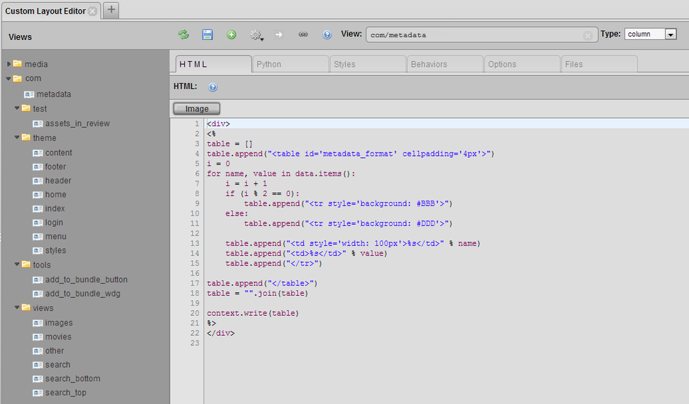
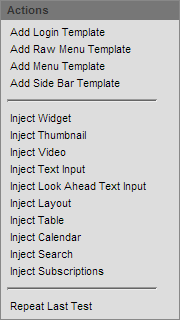
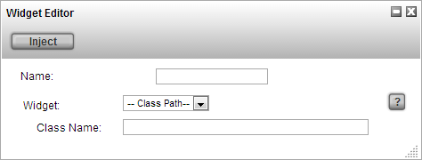
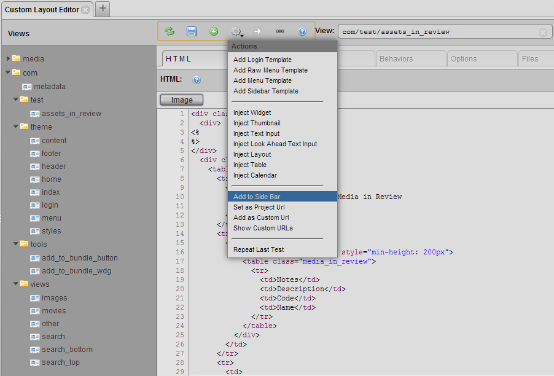

# Custom Layout Editor

**What the Custom Layout Editor Provides**

The Custom Layout Editor allows you to have complete control over the
look and feel of TACTIC using many of the standard web technologies
(HTML, CSS and Javascript). With this tool, you can build your own
TACTIC components (called widgets) that have the ability to interact
with one another intelligently, making it easier for you to design your
very own TACTIC interface.

**HTML**

Custom Layouts enable the laying out of custom widgets using standard
HTML.

**Element Tag**

TACTIC Custom Layout introduces a new html tag &lt;element&gt; which lets
TACTIC widgets to be embedded into HTML.

There are two formats for a TACTIC element: a short form and a long
form:

short form:

    <element view='forms/my_form'/>

long form:

    <element>
      <display class='tactic.ui.panel.CustomLayoutWdg'>
        <view>forms/my_form</view>
      </display>
    </element>

This ability to reference other views and elements makes it easy to keep
a top level view that draws from other views.

For display class names of other widgets, see section on Common Widgets.

**Styles**

You can create styles for each view in the Styles tab. However, most of
the time it will be useful to reference a central stylesheet for a
number of views.

In order to include a top level stylesheet, you can create an empty view
with only styles defined and include these styles into other top level
views, just as how you would reference a normal view.

For example, you can create a view called 'common/styles' and add this
line to the HTML of a view where you want the styles to appear.

    <element view='common/styles'/>

**Behaviors**

TACTIC’s behavior system makes use of standard JavaScript behaviors with
the added functionality of some built-in classes.

Here are two ways to add an alert behavior to a button class called
'my\_button'. The event attribute format is more concise.

    <behavior class='my_button' event='click_up'>
    alert('Hello World');
    </behavior>

    <behavior class='my_button'>{
    'type': 'click_up',
    'cbjs_action': "'

    alert('Hello World');

    "'
    }</behavior>

To relay the same behavior to many elements having the same class attribute,
one can use the "relay\_class" attribute. One would presumably apply this behavior to
a parent element that contains the elements targeted.

    <behavior relay_class='my_button_item' event='click_up'>

    alert('Hello World');

    </behavior>

Here are the types of events that the TACTIC behavior system has
built-in support for:

    click_up | click | wheel | double_click | drag | hover | move | change | blur | mouseover | mouseout | keyup | keydown | listen

You can set the behavior class to activate upon the firing of another
event using the 'listen' type event.

    <behavior class='my_button'>{
    'type': 'click_up', 'cbjs_action': "'
    spt.named_events.fire_event('my_event_trigger'); "'
    }</behavior>

    <behavior class='my_class'>{
    'type': 'listen',
    'event_name': 'my_event_trigger',
    'cbjs_action': "'

    alert('Hello World');

    "'
    }</behavior>

When the behavior is applicable to a specific HTML element (eg. click,
click\_up, mouseover, etc.), you can get element for which the behavior
originated from using the 'bvr.src\_el' (Behavior Source Element) tag.

    var table = bvr.src_el.getParent('.my_table');
    var cells = table.getElements('.my_cells');
    cells.setStyle('background', 'red');

TACTIC’s powerful framework comes with many API functions that make
developing for TACTIC easier. Here are some common ones.

Show loading popup:

    spt.app_busy.show('Saving data...')

Hide loading popup:

    spt.app_busy.hide()

Load an element:

    spt.panel.load(element_name, class_name, kwargs)

Load an element into a popup:

    spt.panel.load_popup(element_name, class_name, kwargs)

Close a popup:

    spt.popup.close(popup_element)

**Options**

The Custom Layout Editor’s Options tab incorporates the administrative
ability of modifying column, theme, view and table definitions with the
ability of creating these widgets. Various views, themes, columns and
tables can be created in the Custom Layout Editor with the desired
content and appearance.

Options of these custom features can be defined in the Options tab,
similar to how a predefined column or Column Manager custom column is
modified through the Edit Column Definition window. These options can be
set to change widget appearances, functions and behaviours, often in
addition to any options established in the HTML and Python tabs. Many of
the same options provided in the Edit Definition window are available
and can be used to customize created features.

The custom feature options are set through the use of Python in the
Options tab. A variety of different examples written in Python have been
shown below. They are structured exactly as they would need to be
defined in the Options tab with all possible subsets to refine a
particular option.

*Option Tab Examples*

        "mode": {
            'description': "Determines whether to draw with widgets or just use the raw data",
            'type': 'SelectWdg',
            'values': 'widget|raw',
            'order': 00,
            'category': 'Required'
        },
        "search_type": {
            'description': "search type that this panels works with",
            'type': 'TextWdg',
            'order': 01,
            'category': 'Required'
        },
        'expression': {
            'description': 'Use an expression to drive the search.  The expression must return sObjects e.g. @SOBJECT(sthpw/task)',
             'category': 'Display',
             'type': 'TextAreaWdg',
             'order': '01'
        },
        "element_names": {
            'description': "Comma delimited list of elemnent to view",
            'type': 'TextWdg',
            'order': 0,
            'category': 'Optional'
        }

Customized options are also available to the user which offer additional
flexibility when modifying custom features. Some examples have been
provided below.

*Option Tab Custom Option Examples*

        {
        'basic_option': 'You can describe your option here',
        'advanced_option': { 'description' : 'You can describe your option here and in type specify what type of edit widget is used to display the option.',
                             'category': 'Display',
                             'type': 'TextWdg'
        }

**Images**

Images can be checked into TACTIC and used in interface design. In the
Files tab, you can check in images using the Check-in wizard.

Once the file is checked in, you use the web path as the URL of the
image.

**Python**

TACTIC integrates the efficiency of Python in a Custom Layout Editor
tab, functioning together seamlessly with HTML, CSS and JavaScript. As
can be seen in the example below, Python works in connection with these
other languages to produce a desired output.

*Example*

HTML code in Custom Layout Editor HTML tab:

    

        Hello World
    

CSS code in Custom Layout Editor Styles tab:

    .hello_world {
        font-size: 2em;
        padding: 1px;
        border: solid 1px black;
        background: ${background};
    }

Python code in Custom Layout Editor Python tab:

    background = "#F00"

Custom Layout Editor Test Output:

The example demonstrates the use of Python in the creation of a title
block. Essentially, the Python coding is only setting the background
color of the title block. However, it can be used for more complicated
applications, as in the Testing Interface section.

The Python tab provides the user with the opportunity to use the Python
language in the editor without the restriction of having to explicitly
use embedded Mako, which is another TACTIC feature that is described in
the following section. The dedicated Python tab is an implicit
integration of Mako. Both Mako and the Python tab essentially use Mako
templating, while both providing equivalent Python utility and
efficiency.

**Mako**

The custom layout engine embeds the Mako, a powerful templating engine
which allows you to embed Python scripts and logic within HTML. In order
to embed Python coding within the HTML, the code must be surrounded by
the special Mako tag: &lt;% \\{Python Code} %&gt;. Here is a simple example of
its usage:

    

    <%
    my_car = 'A ferrari'
    %>
    

    
${my_car}

Mako makes passing and accessing of data in TACTIC easy, especially
combined with the support of XML by TACTIC widgets for passing
arguments.

The 'kwargs.get' function can be used to get the value of an XML
attribute of an element, whether it is an attribute already supported by
the element or an arbitrary one. Here is an example of setting a value
for an arbitrary attribute.

HTML code in top level view:

    <element>
      <display class='tactic.ui.panel.CustomLayoutWdg'>
        <view>my_forms.photoshoot_form</view>
        <args>Hello</args>
      </display>
    </element>

HTML code in a view named 'my\_forms.photoshoot\_form':

    <element>
      <display class='tactic.ui.input.TextInputWdg'>
        <default>${kwargs.get("args")}</default>
      </display>
    </element>

For the example above, the text field will be populated with the string
'Hello'.

Most of the time, it will be beneficial to use Mako to pass search keys
from one view to another. That’s covered in a bit more detail in the
Creating Forms section of this document.

**Injecting Widgets**

You can inject your custom widgets or TACTIC built-in widgets into your
view through the user interface. You can do it through the gear menu:

All these injection options allow you to inject the widget you want
directly where your cursor is in the code. All these injections have the
name field in common. The name field allows you to name your widget in
case you want to refer to it later in the code.

**Inject Widget** allows you to inject **any** widget you want. You need to
define which widget to inject. You can select your widget through the
dropdown or select classpath and write the class path of a built-in
TACTIC widget. After selecting, a built-in widget, you may have to fill
in additional arguments which are required to successfully run the
widget.

Similarly, you can inject a thumbnail, video, table, calendar, etc. and
customize the options respectively. The more popular widgets have been
added for your convenience to the gear menu. They are listed below.

**Inject Thumbnail** injects a thumbnail widget.

**Inject Video** injects a video.

**Inject Text Input** injects the text input field widget. You can specify
many options like the width of the input field.

**Inject Look Ahead Text Input** is similar except there is a look ahead
which comes with the input field.

**Inject Layout** injects a View Panel Widget.

**Inject Table** injects a Fast Table Layout Widget.

**Inject Calendar** injects a Calendar Widget.

**Inject Search** injects a Global Search Widget.

**Inject Subscription** injects a Subscription Bar Widget into your HTML.

**Adding View to sidebar**

You can add the view you have created directly to the sidebar. To do
this, click on the gear in the top menu and select “Add to Side Bar”.
This will add this view to the sidebar under the Project Views. By
default, It will get named according to the view name and '/' will be
treated as a space. For example, 'app/chart' will be named 'App Chart'.
You can always rename these views in the sidebar by right clicking on
them and selecting “Edit Side Bar”. Now select the view you want to edit
and change the Title field.

**Creating URLs**

When you startup tactic and go to the main project URL
(/tactic/&lt;project\_code&gt;), you are presented with the tactic homepage of
the project. That tactic homepage URL can be changed to show one of your
created views. To do this, open up your view in the custom layout
editor, then from the gear menu select 'Set as Project Url'. The current
view you have open will be shown when you go the main project URL. You
can come back to admin side of tactic by adding '/admin' to the URL
(/tactic/&lt;project\_code&gt;/admin).

You can also turn your view into a custom URL. This means that your view
will open when you go to a specific URL. To do this, open your view in
the custom layout editor, then from the gear menu select 'Add as Custom
Url'. This will open up a dialog box where you can specify what URL
should open up the view. The URL specified there is showing the URL
which is appended to (/tactic). You can specify which widget to run in
the URL in the widget field. By default, it shows the widget code for
the view that was open in the custom layout editor. You can check all
your custom URLs by going to the gear menu and selecting 'Show Custom
URLs'. This will show all the existing custom URLs. This is where you
can delete existing custom URLs.

**Creating Forms**

Forms provide an interface for updating TACTIC data. The Custom Layout
Editor makes the creation of forms easy with built-in widgets and
functions.

TACTIC already has some predefined input widgets that can be used as
input fields for forms, and they are referenced like any other widget.

TextInputWdg

SelectWdg

TextAreaWdg

CalendarInputWdg

ActionButtonWdg

    <element name='my_text_input_field'>
      <display class='tactic.ui.input.TextInputWdg'>
        <default>Hello</default>
        <width>100px</width>
      </display>
    </element>

You can find more details on the exact XML attributes that are supported
by each widget in the Common Widgets section.

Here are some useful functions for generating forms.

    spt.api.get_input_values(div_container)

This gets the values of the all the input fields of a div as an array
with the attributes being the names of the element names.

    server.update(search_key, data)

This updates an sobject with data that is passed in as an array.

The search key is a key that uniquely identifies an sobject.

Here is an example of usage of both for updating a TACTIC task through a
form.

In this example, the search key of an sobject is passed into the view
through a list of keyword arguments, and it is kept as a hidden input
for ease of access. The clicking of the save button activates the
behavior for saving the form.

    HTML: 

      <input type="hidden" name="spt_search_key" value="${kwargs.get('search_key')}"/>
        <element name='spt_status'>
          <display class='SelectWdg'>
            <values>Assigned|Pending|Approved|Waiting</values>
            <search_key>${kwargs.get("search_key")}</search_key>
          </display>
        </element>

      <input type="button" class="spt_save_button" value="Save >>"/>
    

    JavaScript:

    <behavior class="spt_save_button" event="click"> {
      //gets the parent of the behavior source element
      var top = bvr.src_el.getParent('.spt_form');

      //gets all the input values
      var values = spt.api.get_input_values(top);

      var data = {
        //gets value of element named 'spt_status'
        //sets it as the value of the 'status' column for the task sobject
        status: values.spt_status;
      }

      search_key = values.spt_search_key;
      server.update(search_key, data)
    }

**Testing Interface**

You can customize your views to behave during a testing phase. To do
this, you can add a condition in your code to check whether the code is
being run in testing mode. You can use the following condition in the
python section of the code:

    if kwargs.get("is_test") in [True, 'true']:

This condition will be true if it is testing mode. You can now use this
condition to setup your variables correctly. You can run the view in
testing mode by clicking the test button in the top menu.

In addition, these custom views can also be defined to take the form of
a specific view type: widget, column, chart, report or dashboard.

Widget is a free form view type. It is designed to allow your view to be
versatile in its presentation in TACTIC. These widget type views can
appear in stand-alone pop-up windows, tab view layouts, forms, tables,
text inputs, menus, or even buttons. An extension of this versatility
lies in their ability to be injected into other custom views as well,
much like what was described in the Injecting Widgets section.

Column allows for the customization of a table column. This column is
available to be added to any table through the Column Manager under
Plugin Widgets. The ability to modify the aesthetics and data
presentation of a column will allow the user to display the data they
want in a specific format. For example, if metadata for a particular
asset, such as an image, needs to be shown in a table, a column can be
formatted to list the metadata information through the use of an
embedded table, as shown below. Other formatting techniques, like
alternating row colors, can be added as well.

*Example*

HTML code in HTML Custom Layout tab:

    

    <%
    table = []
    table.append("<table cellpadding='4px'>")
    i = 0
    for name, value in data.items():
        i = i + 1
        if (i % 2 == 0):
            table.append("<tr style='background: #BBB'>")
        else:
            table.append("<tr style='background: #DDD'>")

        table.append("<td style='width: 100px'>%s</td>" % name)
        table.append("<td>%s</td>" % value)
        table.append("</tr>")

    table.append("</table>")
    table = "".join(table)

    context.write(table)
    %>
    

Python code in Custom Layout Python tab:

    data = {
        'Frame Size:': "768 x 512",
        'Colorspace:': "yuvj420p",
        'Location:': "C:\...\",
        'File Type:': "MJPEG (Motion JPEG)",
    }

Output Column in Table:

Chart, report and dashboard view types present the ability to create
customized charts, reports and dashboards that are easily accessible to
users. Custom views can be defined to present data in the form of line
charts, budgeting reports or department specific dashboards that display
tables or views that are commonly used by that department.

However, only by specifying the view type do these views become easily
accessible to users. For example, by setting a custom layout view to
Chart, in the Examples section under Project Configuration, this custom
view will be added to the list of charts that are already available. By
selecting the drop down arrow menu on the created chart icon, there is
an option to "Add to Side Bar". This will add this chart view to the
side bar for easy accessibility, under a defined "Chart" section.

In addition, if a custom theme is created and utilizes sidebar views and
associated links in the menu, this new chart view will be automatically
added in the menu of theme.

To begin a custom chart, report or dashboard, going to the Examples
section under the Project Configuration is a good place to establish a
base to build one of these customized tools. For example, by selecting
Dashboards in the Examples section, a selection of different sample
dashboards will be displayed. If one of the dashboards is of particular
interest, but requires some modification, by going to the arrow drop
down menu on the dashboard icon and selecting "Show Definition", the
definition can be copied and pasted in the Custom Layout Editor and
modified to the desired appearance.

**Tips and Techniques:**

**Handling None**

The default value for the empty string in Python is the word "None".
This does not help very much when you want to obtain something like the
search key of an sobject because if there is no search key, instead of
getting an empty string, you get the string "None". And if you try to
pass "None" into an element, an error will likely result.

The way to work around that is to add an "or" at the end of your
kwargs.get function.

    ie: kwargs.get("search_key") or ""

**Embed Elements**

A shortcut for embedding elements into the HTML is by clicking on the
gear menu.

Similarly, if you would like to inject another view into your current
view, you can do so by right clicking on the view you want to inject.

**Element Name as Column of sObject**

If you pass a search key into an element, it automatically takes the
element name as the column if you do not specify one. In the example
below, the text input will display the id of the sObject with the given
search key.

    <element name="id">
      <display class="tactic.ui.input.TextInputWdg">
        <search_key>${search_key}</search_key>
        <width>100px</width>
      </display>
    </element>
