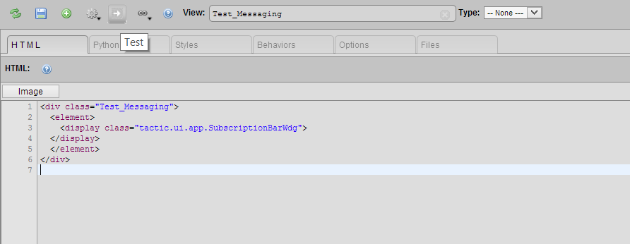
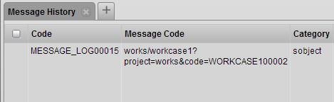

# Messaging

**Description**

The Subscription Bar Widget allows user to subscribe to an sObject. This
widget provides a convenient way to track any actions or behaviors on an
sObject, including actions from different users. All the messages will
be recorded into Subscription Bar Widget and Message History.

**Info**

<table>
<colgroup>
<col width="28%" />
<col width="71%" />
</colgroup>
<tbody>
<tr class="odd">
<td>
<strong>Name</strong>
</td>
<td>
Subscription Bar Widget
</td>
</tr>
<tr class="even">
<td>
<strong>Class</strong>
</td>
<td>
tactic.ui.app.SubscriptionBarWdg
</td>
</tr>
<tr class="odd">
<td>
<strong>TACTIC Version Support</strong>
</td>
<td>
4.1+
</td>
</tr>
<tr class="even">
<td>
<strong>Required database columns</strong>
</td>
<td>
none
</td>
</tr>
</tbody>
</table>

**Implementation**

Specify (or look up) the name of the *Inject Subscription Action* under
**Admin Views → Project → Custom Layout Editor→Gear Menu**.

In the example below, in order to activate the *Subscription Bar*, a
sample script has been created and named **Test\_Messaging**:

Look up and edit that Test\_Messaging script in the custom layout editor.
Use the following HTML code as an example of what to add to the sample
script:

    

      <element>
        <display class="tactic.ui.app.SubscriptionBarWdg">
      </display>
      </element>
    

After running the test button, a Test Custom layout window will appear:

Once the subscription bar has been set up, users can select the sObject
they want to subscribe by right clicking the sObject and choosing the
option **Subscribe to Item**:

Now a simple subscription bar has been set up and targeted to selected
sObject. Any actions, such as checking in files, editing description and
changing status, from other users will be recorded.

**Advanced**

A detailed subscription history could be viewed in **Message History**.
This tab can be found by clicking the **Subscription History** icon in
every message:

Each entry contains all the detailed information of the message, such as
'Code', 'Category' and 'Login'.

