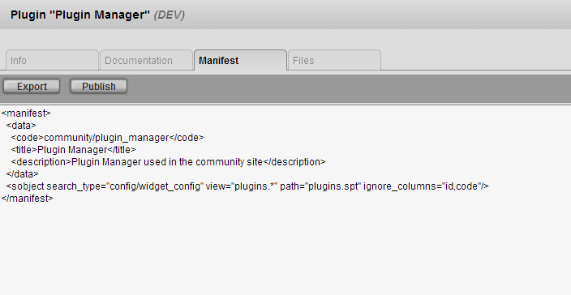

# Packaging a Plugin

**Plugin Directory**

A TACTIC plugin package is simply a .zip file containing all the files
of a plugin. Plugins are installed in the following directory:

&lt;TACTIC\_DATA\_DIR&gt;/plugins

The .zip files are usually stored in:

&lt;TACTIC\_DATA\_DIR&gt;/dist

**Categories of Plugins**

Plugins are defined into categories. Due to the flexibility of the
plugin architecture, a single plugin can package tools, columns, and
themes in any combination. These categories are only used to organize
plugins and can also bootstrap common functionality that would be
packaged into a plugin.

All of these will have most of the view definitions in the Custom Layout
Editor. Each individual view can have a type. See Custom Layout Editor
documentation for more information on this.

-   project: this defines the structure of the project. It may or may not
    include a theme, but it is usually possible to use different themes for
    a given project provided the theme has been set up correctly.

-   theme: a theme defines the look and feel of a project as experienced
    by end users. A theme should have the following requirements:

    -   a means of displaying links as represented by the side bar.

    -   a means of logging out

    -   overriding the login page (optional)

-   column - This represents a plugin that will be added to columns in a table. These will generally consist of one or more columns that can be
    added to a tabular layout.

-   tool - A tool is a widget that provides additional functionality to
    the users. Generally a tool needs to be launched by a button or a menu
    item from the sidebar.

**Publishing the Plugin**

To package your created plugin to the tactic data directory, select the
plugin and go to the manifest tab. Here, you can make sure that the
plugin is named and versioned appropriately. You now need to make sure
that the manifest you’ve wrote is exported, exporting saves the manifest
data you have there to the manifest.xml file.You can now select Publish
and TACTIC will package all the files and create a .zip file of the
plugin folder from the root plugin folder (ie: &lt;TACTIC\_DATA\_DIR&gt;/plugins
). When a version is published, the folder of the current plugin is
taken and copied to a new folder with the name &lt;PLUGIN\_CODE&gt;-&lt;VERSION&gt;.
Note that the PLUGIN\_CODE can have “/” to present folders.
