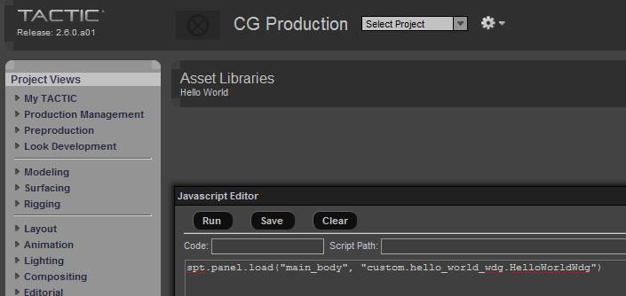
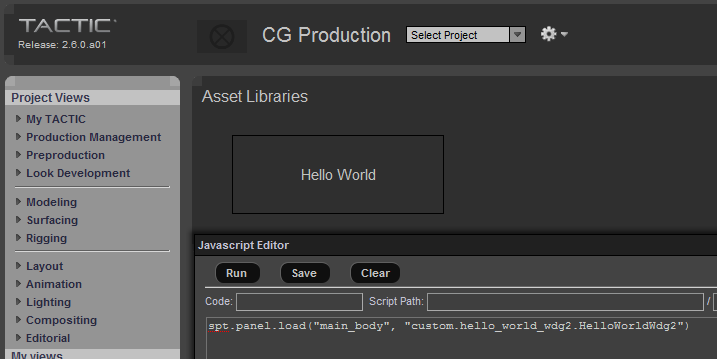
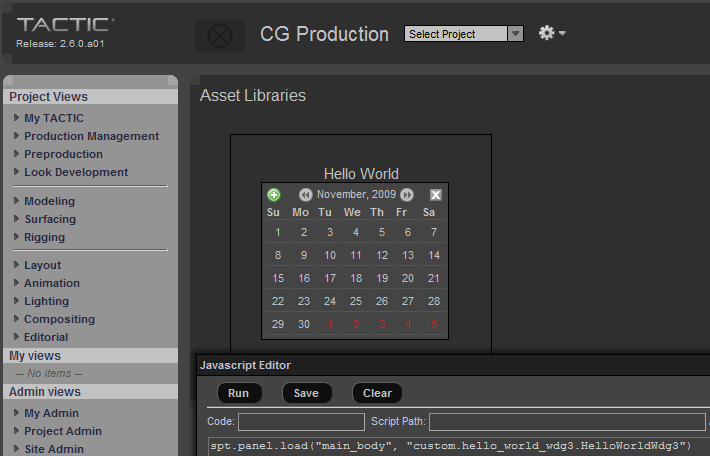
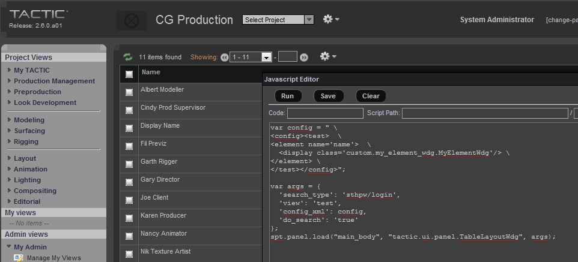
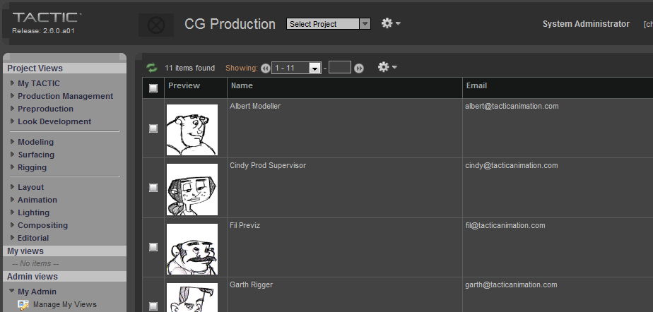
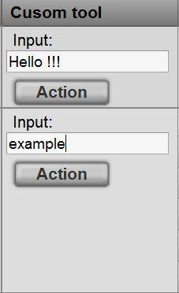

# Widget Development

As of 2.5, all widgets are derived from BaseRefreshWdg. This refresh
widget is a new style widget which has some added functionality allowing
to to be "smart" enough to refresh itself. It also standardizes the
interface for passing construction parameters to the widget. All new
style widgets take kwargs (keyword arguments) as argumets to the
constructor

    widget = MyWidget(option1=value1, option2=value2)

All new style widgets defined a method called "get\_args\_keys", which
return a dictionary of defined and allowable arguments:

    def get_args_keys(my):
      return {
        "option1": "this is option #1",
        "option2": "this is option #2"
      }

TACTIC provides the ability to create your own widgets and integrate
them seamlessly into the TACTIC interface.

There are 3 main types of widgets:

\*Widget:\*A widget derived from a the base Widget class is a free
standing widget that requires no parent widget.

\*Table Element Widget:\*An element widget is a widget that needs expected
to be put inside a TableLayoutWdg.

\*Input Widget:\*An input widget is a widget that requires one or more
values to put entered or extracted.

**Create your own custom widget**

You can create your own custom widgets in Tactic that become completely
integrated in the user interface.

All widgets are derived from the base Widget (pyasm.web.Widget) class.
This class defines the fundamental functionality required for all
widgets that appear in TACTIC. To create your own widget, you can derive
off of this class.

**Hello World**

In order to start showing how custom widgets can be created, we will
start with the base "Hello World" widget. Create a folder called
"custom" and then create a new file called "hello\_world\_wdg.py" in this
new folder. In the file add the following lines:

    from pyasm web import Widget

    class HelloWorldWdg(Widget):
        def get_display(my):
            return "Hello World"

In order for TACTIC to be able to use this class,TACTIC must be able to
see this file: this "custom" folder must be either in the PYTHONPATH or
in sys.path of the TACTIC process (you can alternatively, use any class
that complies with Python’s module handling.

> **Note**
>
> You can also use the python\_path variable in the TACTIC config file to
> add paths to the sys.path dictionary

In order to view this widget quickly, you can open up the javascript
editory and type:

    spt.panel.load("custom.hello_world_wdg.HelloWorldWdg");

and press the "Run" button. You should see the following:

Note that the title does not change. This is something that the link
will do automatically.

**Formatting the Widget**

We could format the widge a litlle more using some basic HTML widgets.

    from pyasm.web import Widget, DivWdg

    class HelloWorldWdg2(Widget):
        def get_display(my):
            top = DivWdg()
            top.add_style("font-size: 15px")
            top.add_style("margin: 30px")
            top.add_style("padding: 30px")
            top.add_style("width: 150px")
            top.add_style("text-align: center")
            top.add_style("border: solid 1px black")

            top.add("Hello World")

            return top

Adding this to a file called hello\_world\_wdg2.py and then in javascript
editor, type:

    spt.panel.load("custom.hello_world_wdg2.HelloWorldWdg2");

Pressing the "Run" button gives:

**HTML**

Here we introduce the basic HTML widget DivWdg. The add\_style() allows
you to add arbitrary CSS styles to the widget. There are various
operations that can be added to HTML widgets that are useful for
formatting the layout of the page. These methods include:

-   set\_attr(name, value)

-   add\_style(name, value)

-   add\_class(css\_class)

-   add\_event(event, js\_action)

There are few useful predefined widgets that sit on top of HtmlElement:

-   DivWdg

-   SpanWdg

-   Table

These are all based of of HtmlElement which are basic html elements and
provide a thin layer above HTML.  HtmlElement also defines a number of
static constructors to address most HTML elements:

-   HtmlElement.br()

-   HtmlElement.p()

-   HtmlElement.br()

These return variations of HtmlElement that represent the different HTML
elements. These are useful for laying out a complex widget. All HTML
elements and their properties are accessible from these.

**Using other widgets**

You can add other predefined widget, for example, the CalendarWdg

    from pyasm.web import Widget, DivWdg

    from tactic.ui.widget import CalendarWdg

    class HelloWorldWdg3(Widget):
        def get_display(my):
            top = DivWdg()
            top.add_style("font-size: 15px")
            top.add_style("margin: 30px")
            top.add_style("padding: 30px")
            top.add_style("width: 200px")
            top.add_style("text-align: center")
            top.add_style("border: solid 1px black")

            top.add("Hello World")

            calendar = CalendarWdg()
            top.add(calendar)

            return top

Adding this to a file called hello\_world\_wdg3.py and then in javascript
editor, type:

    spt.panel.load("custom.hello_world_wdg3.HelloWorldWdg3");

Pressing the "Run" button gives:

This adds one of the predefined widget "CalendarWdg". Widgets are
hierarchical and can be added to other widgets. Any widget can embed any
other widget within it’s display. This provides a very flexible
archictecure for building up complex hierarchical widgets.

**Create your own table element widget**

There is a special class of widgets that are designed to be used in
conjuntion with TableLayoutWdg, the primary widget used for laying out
tabular data. These widgets should be derived from BaseTableElementWdg,
which extends the basic Widget class with a number of specific methods.

The TableLayoutWdg uses it’s child widgets slightly differently than
most widgets. It creates a single widget for each column and calls the
get\_display() method repeatedly for each row; each row representing a
single sobject. Each element widgets does have knowledge of all of the
sobjects, however, for each row, there will be a current sobject set.
This means that the widgets get\_display() method will be called
repeatedly for each row. So, instead of operating on a list of widgets,
the table element widget should get the current widget using the
"get\_current\_widget()" method.

The following is a simple example of a table element widget.

    from pyasm.web import DivWdg
    from tactic.ui.common import BaseTableElementWdg

    class MyElementWdg(BaseTableElementWdg):
        def get_display(my):
            sobject = my.get_current_sobject()
            first_name = sobject.get_value("first_name")
            last_name = sobject.get_value("last_name")
            div = DivWdg()
            div.add("%s %s" % (first_name, last_name) )
            return div

The class is almost identical to a regular class, except that it is
derived from BaseTableElementWdg and that it uses get\_current\_sobject()
to get the current sobject being drawn. This widget still has access to
all of the sobjects in all of the rows, through get\_sobjects(), if this
is necessary.

To test this, save the code above in a file called my\_element\_wdg.py and
enter this into the javascript editor:

> **Note**
>
> This only works in 2.6: in 2.5, you have to create the view in the
> widget config table

    var config = " \
    <config><test>  \
    <element name='name'>  \
      <display class='custom.my_element_wdg.MyElementWdg'/> \
    </element> \
    </test></config>";

    var args = {
      'search_type': 'sthpw/login',
      'view': 'test',
      'config_xml': config,
      'do_search': 'true'
    };
    spt.panel.load("main_body", "tactic.ui.panel.TableLayoutWdg", args);

Pressing the "Run" button gives:

Your custom table element widget completely integrates within the TACTIC
interface. You can add other widgets by expanding the config definition.

    var config = " \
    <config><test>  \
    <element name='preview'/>  \
    <element name='name'>  \
      <display class='custom.my_element_wdg.MyElementWdg'/> \
    </element> \
    <element name='email'/>  \
    </test></config>";

    var args = {
      'search_type': 'sthpw/login',
      'view': 'test',
      'config_xml': config,
      'do_search': 'true'
    };
    spt.panel.load("main_body", "tactic.ui.panel.TableLayoutWdg", args);

This adds a preview and an email column (which are predefined for
sthpw/login search type) and appear with your custom widget.

**BaseTableElementWdg**

This example describes how to create your own BaseTableElementWdg to
execute a server-side command. The user can type some words in the text
field, and then click on the "Action" button. The words will be written
as the content of a file in the /tmp folder of the server. In the tactic
config file, tactic\_linux-conf.xml, let’s say the python\_path is
'/home/apache/custom'. You can create a file called custom\_wdg.py and
*init*.py in it.

Here is the content of*init*.py:

    from custom_wdg import *

Here is the content of custom\_wdg.py:

    __all__ = ['CustomToolElementWdg','CustomCmd']

    from tactic.ui.common import BaseTableElementWdg
    from tactic.ui.widget import ActionButtonWdg
    from pyasm.web import HtmlElement, SpanWdg
    from pyasm.widget import TextWdg
    from pyasm.command import Command

    class CustomToolElementWdg(BaseTableElementWdg):

        def get_display(my):

            top = DivWdg()
            top.add_class('spt_custom_tool_top')
            text = TextWdg('user_input')

            action_button = ActionButtonWdg(title='Action', tip='Write a file in /tmp based on the data in the text field')
            action_button.add_behavior({'type':'click_up',
                'cbjs_action': '''var server = TacticServerStub.get();
                try {
                    var top = bvr.src_el.getParent(".spt_custom_tool_top");
                    var values = spt.api.get_input_values(top, null, false);

                    # this path is assumed importable in your Python environment
                    server.execute_cmd('custom_wdg.CustomCmd', values);
                }
                catch(e) {
                    alert(spt.exception.handler(e));
                }
                '''})

            top.add(SpanWdg('Input:', css='small'))
            top.add(text)
            top.add(HtmlElement.br())
            top.add(action_button)

            return top

    class CustomCmd(Command):

        def execute(my):
            text = my.kwargs.get('user_input')
            f = open('/tmp/my_file.txt','w')
            f.write(text)
            f.close()

If you click the first "Action" button, a file with "Hello !!!" will be
created. On clicking the second "Action" button, the file content will
be replaced with the word "example".
