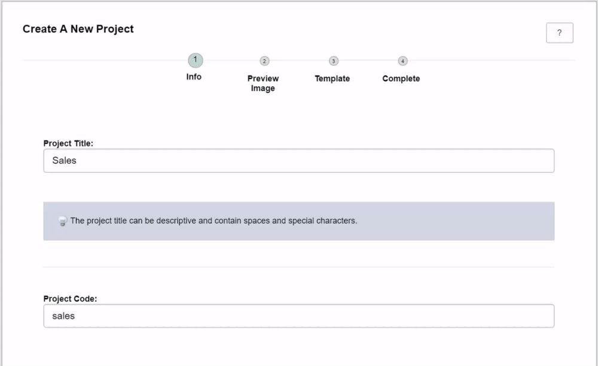
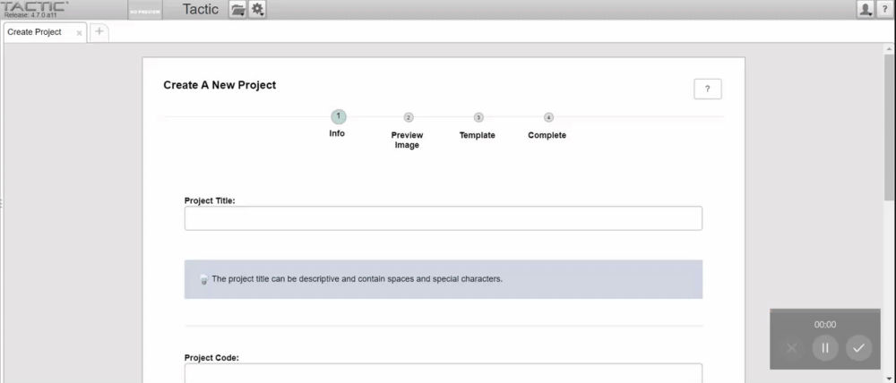
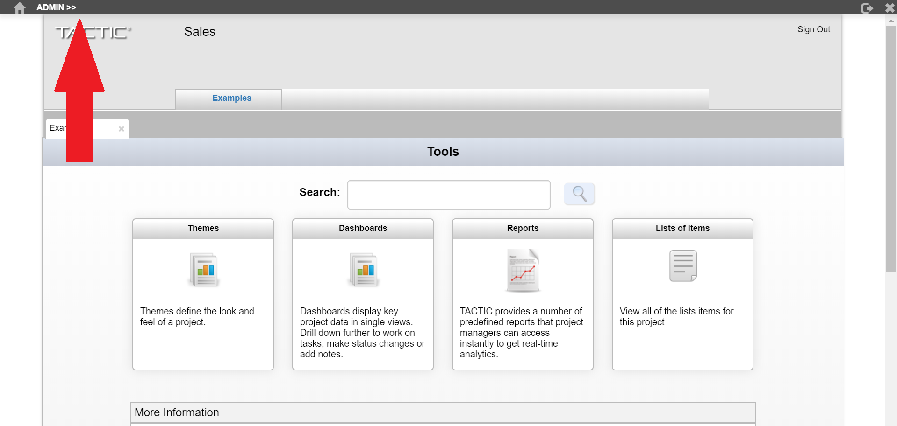
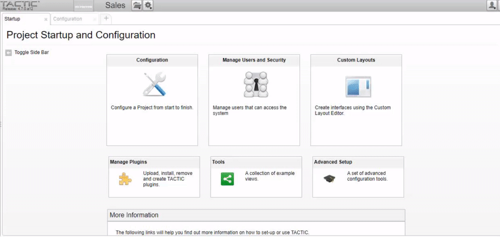

# Setup TACTIC

## 1. Set Admin Login

When you open TACTIC for the first time, you will need to set the TACTIC Administrator account login.
The admin user has full access to TACTIC, and is used to do system configuration.
Hence, remember the password you set.

## 2. Create a Project
Next, create a project. A TACTIC Project contains all project related metadata in a database.

You must provide a name and code for your project. Select "Create" to get started with the default 
TACTIC theme.

Open your new project using the project menu from the navigation bar. 

This will bring you to the project index page. The index is landing page where users can begin to interact with data
and the workflow engine.

## 3. Create an SType

A workflow must be run under an SObject (Search Object). An SObject is a container of data that represents a database entry or an entry in a spreadsheet.
The workflow engine will retrieve and store information from this SObject during execution. An SObject can have tasks, notes and assets.

Every SObject belongs to a SType (Search Type), or table where it is stored. An SType table can have any number of SObjects, and any number of columns to 
store metadata.

Before you start running workflows, you must first create a SType, then SObjects under that SType.

Open the TACTIC administrative interface by clicking on the admin bar. By default, only the admin user has access to the administrative interface.

You can also access the administrative page by visiting the URL,

    <SERVER IP>/tactic/<PROJECT CODE>/admin

Select Configuration to open the configuration panel, and select the plus button to add your first search type.

Provide a title for your SType, and a Searchable Type code will be automatically created. Optionally, you can provide a description and preview image as well.

Jump to the 3rd step - "Workflow", and enable pipelines for your SType.

Finally, select register, and your SType will be created. You can now create a workflow for your SType.

