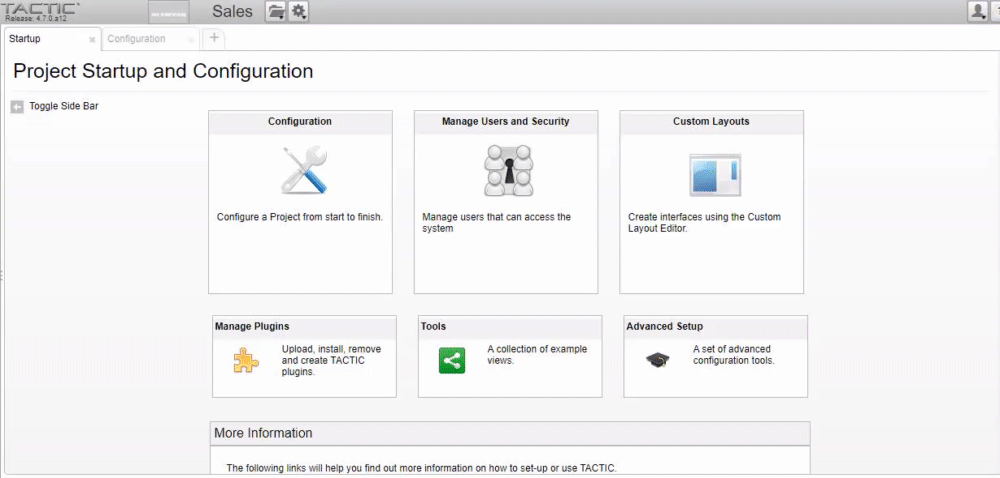
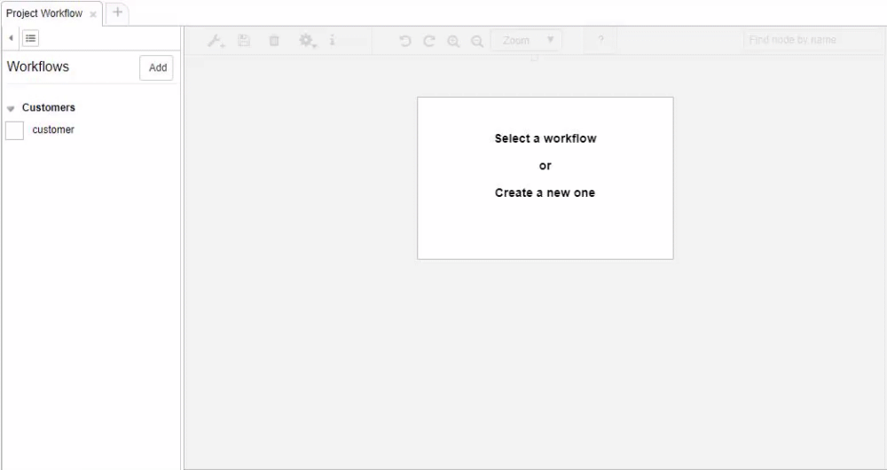
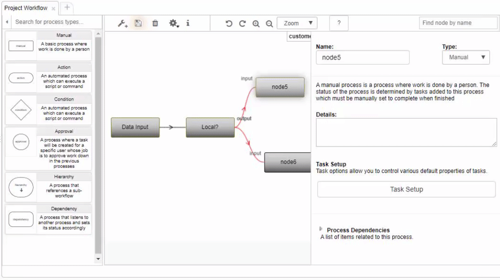
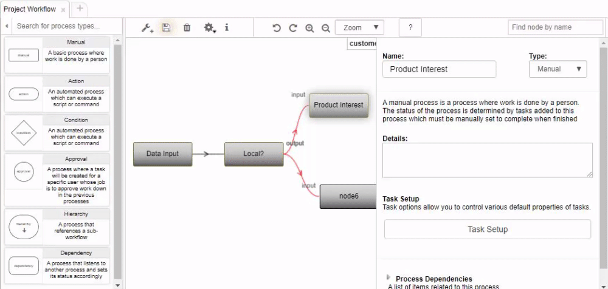

# Build and Run a Workflow


## 1. Create a Workflow

In the adminstrative panel, open the workflow editor by toggling the left sidebar and navigating to Project > Project Workflow.




A default workflow will be created for your search type, and you can create a new workflow from the "Add" button. Select the default workflow, 
and click the starter box to add your first node. 

You can create more nodes by dragging a connector line from the left or right nobs of the node.





You can also drag a node from the left node panel. Click the wrench to toggle the node panel.


You can rename nodes by editing the title in the process info panel to the right of the canvas, or by right-clicking the node, and selecting rename.





You can change node types from the process info panel select.




## 3. Configure manual nodes

Manual node become manual tasks that are assigned to users for completion. You can configure manual tasks using process info panel, and task setup popup.

## 4. Configure condition nodes

Condition nodes allow automated decision trees within your workflow. Using Python or Javascript, you can choose which output streams your workflow should take. The input object contains data from the execution flow.

In the following example, we use the customer SObject to choose whether to refer the customer externally, or continue to the next conditional node.

```Python
customer = input.get("sobject")
phone_number = customer.get("phone_number")
if phone_number.startswith("647"):
    return "Product Interest"
else:
    return "Refer out"
```

```Python
product_interest = input.get("product_interest")
products = product_interest.split(,)

outputs = []
if "Product 1" in products:
    outputs.append("Product 1 Automated Reponse")
if "Product 2" in products:
    outputs.append("Product 2 Automated Reponse")
if "Product 3" in products:
    outputs.append("Product 3 Automated Reponse")

return outputs
```

## 5. Configure action nodes

Action nodes allow for execution of custom scripts within your workflow. Using Python or Javascript, you can interact with the TACTIC API or external services. 

In the following example, we use a customer's email to send information related to their product interest.

```Python

# Send customer email
message = """
Thank you for your interest in Product 1.
You will be contacted by a sales representative in the next 48 hours.

Product 1 Lorem ipsum dolor sit amet, consectetur adipiscing elit. Cras et nibh est. Quisque sit amet auctor enim, a lobortis tellus. Suspendisse semper vel nulla nec cursus. Sed sodales metus sit amet mauris consectetur, eget facilisis ipsum lacinia. Cras tristique elit vel iaculis interdum. Maecenas velit est, ultrices a pharetra sagittis, placerat vel sem. In sodales purus non mauris porta, non sagittis risus posuere. Nam non hendrerit est, sed euismod dui. Vivamus congue gravida sem, eget pretium nulla pretium vel. Suspendisse eu eros non velit tristique venenatis porttitor et eros. Vivamus sed nisl non quam ultrices varius. 
  
More information about this product can be found on our website.

Best,
    
Sales
Best-In-Sales Inc.
"""

subject = "You will be contacted shortly."

customer = input.get("customer")
recipient_email= customer.get("email")

sender_email = "sales@bestinsales.com"

from pyasm.command import SendEmail
email_cmd = SendEmail(
    sender_email=sender_email,
    recipient_emails=recipient_emails,
    msg=message,
    subject=subject,
)
email_cmd.execute()

# Update end date of follow-up (output) task
code = customer.get("code")

search_type = "sthpw/task"
process = "Follow-up"
output_task = server.get_unique_sobject(search_type, {'search_code': code, "process": process})

search_key = output_task.get("__search_key__")
from datetime import datetime, timedelta
today = datetime.today()
end_date = today + timedelta(days=2)
server.update(search_key, {'bid_end_date': end_date})
```

## 6. Import data


## 7. Run workflow
