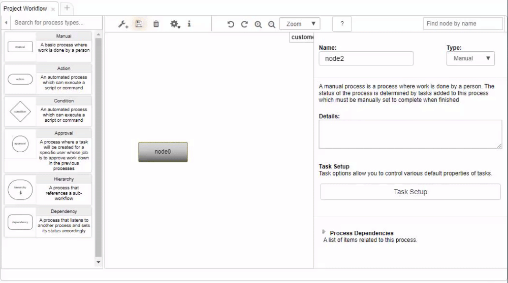
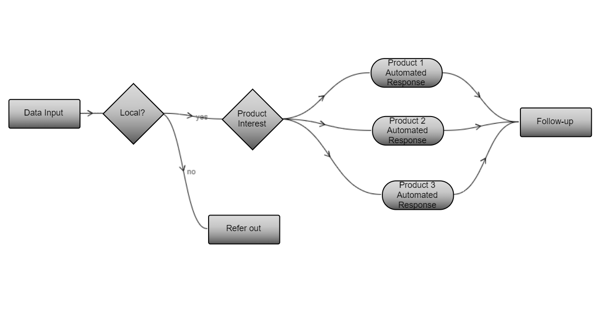
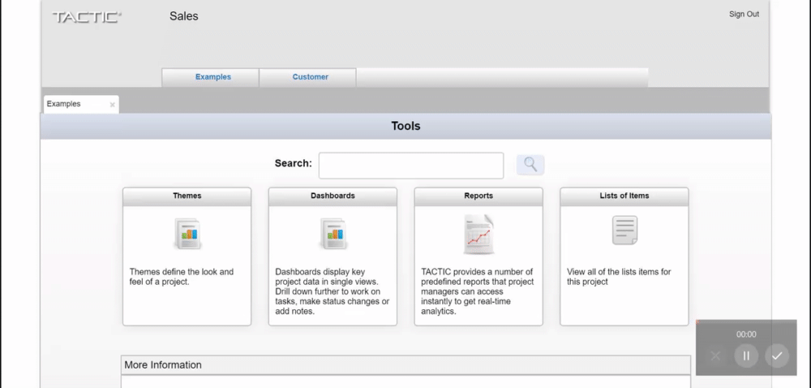
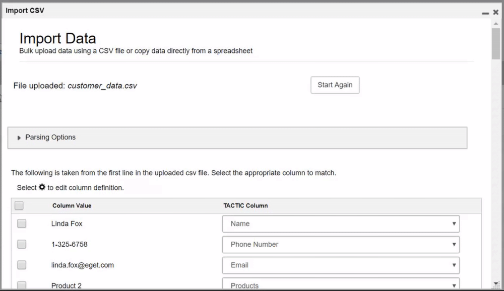
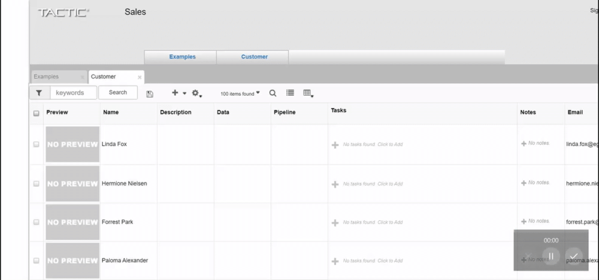
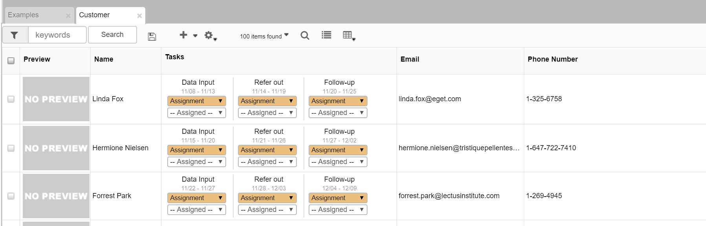
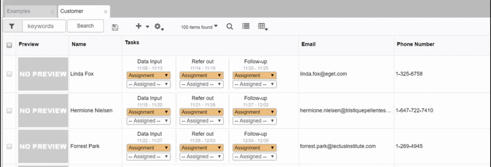
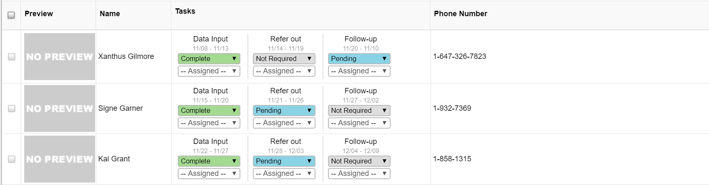

# Build and Run a Workflow


## 1. Create a Workflow

In the adminstrative panel, open the workflow editor by toggling the left sidebar and navigating to Project > Project Workflow.


A default workflow will be created for your search type, and you can create a new workflow from the "Add" button. Select the default workflow, 
and click the starter box to add your first node. 

You can create more nodes by dragging a connector line from the left or right nobs of the node.


You can also drag a node from the left node panel. Click the wrench to toggle the node panel.





You can rename nodes by editing the title in the process info panel to the right of the canvas, or by right-clicking the node, and selecting rename.


You can change node types from the process info panel select.


## 2. Example workflow

In this guide, we will work with the following examples Sales Customer Lead workflow. 



This workflow includes,

- manual tasks for data input, referral and follow-up
- automated decisions based on customer locale and customer product interest
- automated email notifications


## 3. Configure condition nodes

Condition nodes allow automated decision trees within your workflow. Using Python or Javascript, you can choose which output streams your workflow should take. The input object contains data from the execution flow.

In the following example, we use the customer SObject to choose whether to refer the customer externally, or continue to the next conditional node.
Specify the chosen stream by returning the process name.

**Local? conditional node Python code:**

```Python
customer = input.get("sobject")
phone_number = customer.get("phone_number")
if phone_number.startswith("1-647"):
    return "Product Interest"
else:
    return "Refer out"
```

In the next example, we use the customer SObject to choose the appropriate action node that will generate an automated response.
Note that you are able to choose multiple streams, and you can specify output streams with a list of process names.

**Product interest conditional Python code:**

```Python
customer = input.get("sobject")
product_interest = customer.get("products")
products = product_interest.split(",")

outputs = []
if "Product 1" in products:
    outputs.append("Product 1 Automated Response")
if "Product 2" in products:
    outputs.append("Product 2 Automated Response")
if "Product 3" in products:
    outputs.append("Product 3 Automated Response")

return outputs
```

## 4. Configure action nodes

Action nodes allow for execution of custom scripts within your workflow. Using Python or Javascript, you can interact with the TACTIC API or external services. 

In the following example, we use a customer's email to send information related to their product interest.

**Product 1 Automated Response Python code:**

```Python
customer = input.get("sobject")
customer_name = customer.get("name")

# Send customer email
message = """
Dear %s,

Thank you for your interest in Product 1.
You will be contacted by a sales representative in the next 48 hours.

Product 1 Lorem ipsum dolor sit amet, consectetur adipiscing elit. Cras et nibh est. Quisque sit amet auctor enim, a lobortis tellus. Suspendisse semper vel nulla nec cursus. Sed sodales metus sit amet mauris consectetur, eget facilisis ipsum lacinia. Cras tristique elit vel iaculis interdum. Maecenas velit est, ultrices a pharetra sagittis, placerat vel sem. In sodales purus non mauris porta, non sagittis risus posuere. Nam non hendrerit est, sed euismod dui. Vivamus congue gravida sem, eget pretium nulla pretium vel. Suspendisse eu eros non velit tristique venenatis porttitor et eros. Vivamus sed nisl non quam ultrices varius. 

More information about this product can be found on our website.

Best,

Sales
Best-In-Sales Inc.
""" % customer_name

subject = "You will be contacted shortly."

recipient_email= customer.get("email")

sender_email = "sales@bestinsales.com"

from pyasm.command import SendEmail
email_cmd = SendEmail(
    sender_email=sender_email,
    recipient_emails=[recipient_email],
    msg=message,
    subject=subject,
)
email_cmd.execute()

# Update end date of follow-up (output) task
code = customer.get("code")

search_type = "sthpw/task"
process = "Follow-up"
output_task = server.get_unique_sobject(search_type, {'search_code': code, "process": process})

search_key = output_task.get("__search_key__")
from datetime import datetime, timedelta
today = datetime.today()
end_date = today + timedelta(days=2)
server.update(search_key, {'bid_end_date': end_date})
```

> Note: To test the email configuration, you will need to configure the mail servce, and use a working sender email.
See the [Sys-Admin docs](http://community.southpawtech.com/docs/sys-admin/setup-email/) for details.

Now that the pipeline is configured, we can import a customer list, and execute the workflow under each customer.

## 5. Import data

In order to execute a workflow, you must first create SObjects. There are a number of ways you can create SObjects:

- TACTIC API insert or insert multiple methods
- EditWdg
- CSV Import Tool

In this example, we will use the CSV Import Tool as it will allow us to easily create columns for customer metadata email, phone and products.

Navigate to the Customer SType table from the project dashboard.



Open the CSV Import Tool from the gear menu > File > Import CSV

 

Upload a csv file available here. An example customer list can be found [here](data/customer_data.csv).
Select which columns you want to import. For this example, import at least name, email, phone number and products. 




## 6. Run workflow

To run our workflow we need to assign the workflow to customers, and create initial tasks for these SObjects. We will then trigger the first process in the workflow.

You can use the TACTIC API or the TACTIC interface to achieve this. In this example, we will show how to use the TACTIC interface to run the workflow.

First, assign the workflow to each customer in the customer table using the multi-select tool.



Second, create tasks for these customers using the Create Tasks tool under the gear menu > Tasks > Add Tasks to Selected.

This will create 3 tasks for each customer as seen below,



To trigger the start of the working, we set the first process to pending.



In this example, the first process is a manual task. When this task is complete, an assigned user can set this task to Complete to the next step in the workflow. 

If the first process in your workflow is automatic, you can trigger the start of the action node using the API method call_pipeline_event.

Once the Data Input task is set Complete, the workflow will run. It will mark chosen decision tree output streams as pending, and other streams as not required.



## Conclusion

In this example, we created a workflow containing manual processes (tasks), automated decisions (condition nodes) and automated actions (action nodes).
We were able to import a dataset and execute our workflow on this dataset.

