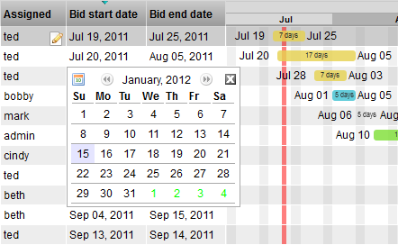
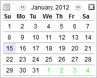

# Calendar Input Widget

**Calendar Input Widget**

**Description**

The CalendarInputWdg displays a navigable calendar where dates can be
selected. It is an input widget that conforms to the BaseInputWdg
interface and is used for inline editing or as one of the items in the
EditWdg layout.

**Info**

<table>
<colgroup>
<col width="28%" />
<col width="71%" />
</colgroup>
<tbody>
<tr class="odd">
<td>
<strong>Name</strong>
</td>
<td>
Calendar Input
</td>
</tr>
<tr class="even">
<td>
<strong>Class</strong>
</td>
<td>
tactic.ui.widget.CalendarInputWdg
</td>
</tr>
<tr class="odd">
<td>
<strong>Category</strong>
</td>
<td>
Input widget
</td>
</tr>
<tr class="even">
<td>
<strong>Supported Interfaces</strong>
</td>
<td>
EditWdg, TableLayoutWdg (edit view)
</td>
</tr>
<tr class="odd">
<td>
<strong>TACTIC Version Support</strong>
</td>
<td>
2.5.0 

</td>
</tr>
<tr class="even">
<td>
<strong>Required database columns</strong>
</td>
<td>
none unless editing a specific date column
</td>
</tr>
</tbody>
</table>

**Implementation**

The simple implementation does not require any options. It displays a
non-editable text box with a value that represents a date. Clicking on
the cell opens up the calendar widget.

**Options**

<table>
<colgroup>
<col width="28%" />
<col width="71%" />
</colgroup>
<tbody>
<tr class="odd">
<td>
<strong>first_day_of_week</strong>
</td>
<td>
Integer representing first day of the week (0=Sunday, 6=Saturday)
</td>
</tr>
<tr class="even">
<td>
<strong>read_only</strong>
</td>
<td>
Sets the widget to be read only. In read-only mode, clicking on the cell does not bring up the calendar for input. Only a text box with the date value is displayed.
</td>
</tr>
</tbody>
</table>

**Advanced**

The simplest and most common usage is the default implementation.

    <element name='start_date'>
      <display class='tactic.ui.widget.CalendarInputWdg'/>
    </element>

To set the work week to start on a different day than Sunday, change the
first\_day\_of\_week . This option is an integer which represents the days
of the week where 0=Sunday and 6=Saturday.

    <element name='start_date'>
      <display class='tactic.ui.widget.CalendarInputWdg'>
        <first_day_of_week>6</first_day_of_week>
      </display>
    </element>
