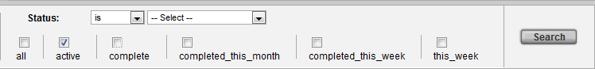
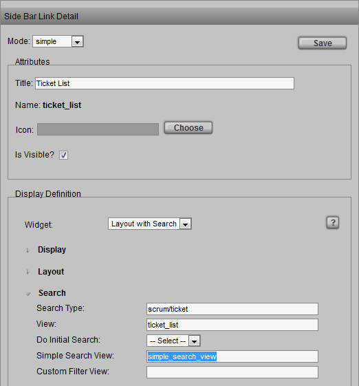
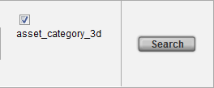
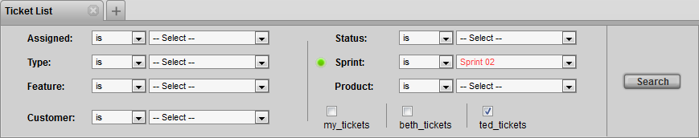

# Checkbox Filter Element Widget

**Description**

The Checkbox Filter Element Widget appears as a check box which
activates filteringm when checked. This widget provides a convenient way
to perform more complex search operations.

**Info**

<table>
<colgroup>
<col width="28%" />
<col width="71%" />
</colgroup>
<tbody>
<tr class="odd">
<td>
<strong>Name</strong>
</td>
<td>
Checkbox Filter Element Widget
</td>
</tr>
<tr class="even">
<td>
<strong>Class</strong>
</td>
<td>
tactic.ui.filter.CheckboxFilterElementWdg
</td>
</tr>
<tr class="odd">
<td>
<strong>TACTIC Version Support</strong>
</td>
<td>
3.7+
</td>
</tr>
<tr class="even">
<td>
<strong>Required database columns</strong>
</td>
<td>
none
</td>
</tr>
</tbody>
</table>

**Options**

Titles for Checkbox Filter Element. For example:

<table>
<colgroup>
<col width="28%" />
<col width="71%" />
</colgroup>
<tbody>
<tr class="odd">
<td>
<strong>titles</strong>
</td>
<td>
&lt;display class='tactic.ui.filter.CheckboxFilterElementWdg'&gt; &lt;titles&gt;Active|Pending|Closed&lt;/titles&gt; &lt;/display&gt;
</td>
</tr>
<tr class="even">
<td>
<strong>options</strong>
</td>
<td>
&lt;options&gt;my_tickets|beth_tickets|ted_tickets&lt;/options&gt; &lt;my_tickets&gt;@SOBJECT(scrum/ticket['assigned',$LOGIN])&lt;/my_tickets&gt; &lt;beth_tickets&gt;@SOBJECT(scrum/ticket['assigned','beth'])&lt;/beth_tickets&gt; &lt;ted_tickets&gt;@SOBJECT(scrum/ticket['assigned','ted'])&lt;/ted_tickets&gt;
</td>
</tr>
</tbody>
</table>

**Implementation**

Specify (or look up) the name of the *Simple Search View* under **Admin
Views → Project → Manage Side Bar → Simple Search View**.

In the example below, the *Simple Search View* is named:
**simple\_search\_view**

Look up and edit that simple search view in the Widget Config. Use the
following XML code as an example of what to add to the config:

    <config>
      <simple_search_view>
        <element name='dynamic'>
          <display class='tactic.ui.filter.CheckboxFilterElementWdg'>
            <options>asset_category_3d</options>
            <asset_category_3d>@SOBJECT(project/asset['asset_category_code','3d'])</asset_category_3d>
          </display>
        </element>
      </simple_search_view>
    </config>

For the above example, this filter returns results where the
*asset\_category\_code* is: **3d**

**Examples**

Below is an example of adding 3 check box filters: a filter to search
for tickets that belong to the currently logged in user, the user **beth**
and the user **ted**. Notice that the options are pipe '|' separated.

    <config>
      <simple_search_view>
         <element name='mine'>
            <display class='tactic.ui.filter.CheckboxFilterElementWdg'>
              <options>my_tickets|beth_tickets|ted_tickets</options>
              <my_tickets>@SOBJECT(scrum/ticket['assigned',$LOGIN])</my_tickets>
              <beth_tickets>@SOBJECT(scrum/ticket['assigned','beth'])</beth_tickets>
              <ted_tickets>@SOBJECT(scrum/ticket['assigned','ted'])</ted_tickets>
            </display>
         </element>
      </simple_search_view>
    </config>

**Advanced**

Below is an example of filtering for the condition of having one or more
icons snapshots related to shots:

    <config>
      <simple_search_view>
        <element name='dynamic'>
          <display class='tactic.ui.filter.CheckboxFilterElementWdg'>
            <options>some_icon</options>
            <some_icon>@SOBJECT(prod/shot.sthpw/snapshot['context','icon']['project_code','sample3d'].prod/shot)</some_icon>
          </display>
        </element>
      </simple_search_view>
    </config>
