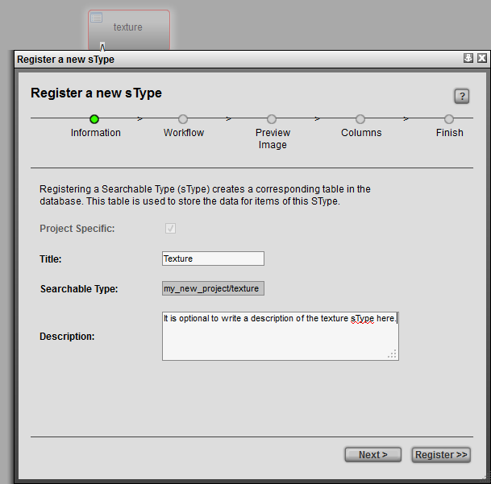
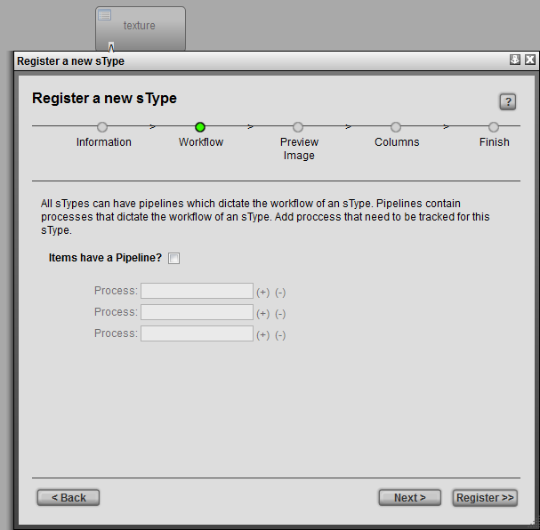
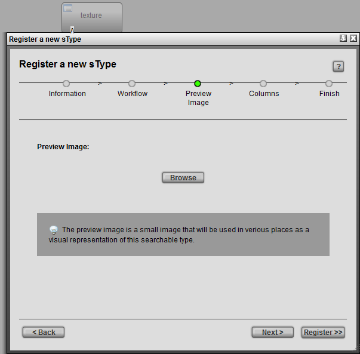
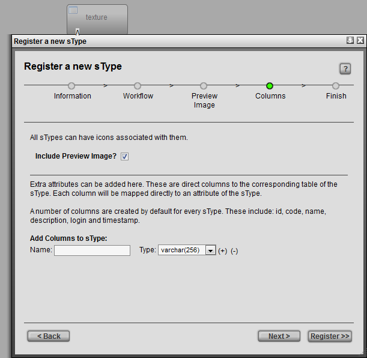
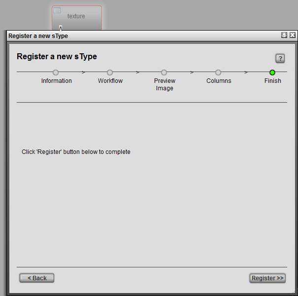

# Add new sType

**Add new sType**

Registering a new sType or "Searchable Type" in TACTIC provides
opportunity to track separate list of items. From a technical
standpoint, a new sType is a separate table in the project’s database.
This allows for the following configuration aspects:

-   Views

-   Custom Columns (properties)

-   Workflows processes and status

-   Notifications

-   Triggers

-   Tools

-   Security

-   …​and more

To register a new sType, click the \[+\] button in the top-left of the
configuration page. The **Register a new sType** wizard will appear:

**Information**

<table>
<colgroup>
<col width="50%" />
<col width="50%" />
</colgroup>
<tbody>
<tr class="odd">
<td>
<strong>Project Specific</strong>
</td>
<td>
<em>(available when creating a new sType for a project that is based on a template)</em>
</td>
</tr>
<tr class="even">
<td>
<strong>Title</strong>
</td>
<td>
The title for the sType is used in the UI for display purposes.
</td>
</tr>
<tr class="odd">
<td>
<strong>Searchable Type</strong>
</td>
<td>
Refers to the database name for the sType. in a &quot;&lt;project&gt;/&lt;name&gt;&quot; format. If no project is defined (i.e.. &quot;art/&quot;) than the current project namespace will be used.
</td>
</tr>
<tr class="even">
<td>
<strong>Description</strong> <em>(optional)</em>
</td>
<td>
An optional description of the sType.
</td>
</tr>
</tbody>
</table>

Once the fields are completed, press "Next" or press "Register" to
complete the registration process. Note: It is recommended to go through
the series of steps outlined in the "Register a new sType" wizard, as
this allows for quick and easy configuration of the new sType that is
outside of the TACTIC defaults.

**Workflow**

<table>
<colgroup>
<col width="50%" />
<col width="50%" />
</colgroup>
<tbody>
<tr class="odd">
<td>
<strong>Items have a Pipeline?</strong>
</td>
<td>
When selected, sets up an association for a pipeline workflow for the sObjects in that sType. <em>The section below describes this relationship in more detail</em>
</td>
</tr>
<tr class="even">
<td>
<strong>Process</strong> <em>(optional)</em>
</td>
<td>
Stages in the process. <em>eg. processes for an asset sType: design, model, texture, rigging eg. processes for a shot sType: layout, animation/fx, lighting, render, comp</em>
</td>
</tr>
</tbody>
</table>

**Preview Image**

<table>
<colgroup>
<col width="51%" />
<col width="48%" />
</colgroup>
<tbody>
<tr class="odd">
<td>
<strong>Preview Image</strong> <em>(optional)</em>
</td>
<td>
Browse to select a preview image for the new sType.
</td>
</tr>
</tbody>
</table>

**Columns**

<table>
<colgroup>
<col width="50%" />
<col width="50%" />
</colgroup>
<tbody>
<tr class="odd">
<td>
<strong>Include Preview Image?</strong>
</td>
<td>
Preview image for each item (sObject) of that sType.
</td>
</tr>
<tr class="even">
<td>
<strong>Add Columns to sType</strong> <em>(optional)</em>
</td>
<td>
During the registration process, default columns are added to the new sType table. You can also add additional columns during this process. Note - columns can be added after this process using the Table Manager
</td>
</tr>
</tbody>
</table>

**Finish**

<table>
<colgroup>
<col width="50%" />
<col width="50%" />
</colgroup>
<tbody>
<tr class="odd">
<td>
<strong>Finish</strong>
</td>
<td>
To complete the registration process, press &quot;Register&quot;. A this point, the option is provided to go back and change any information by clicking on the &quot;Back&quot; button.
</td>
</tr>
</tbody>
</table>

