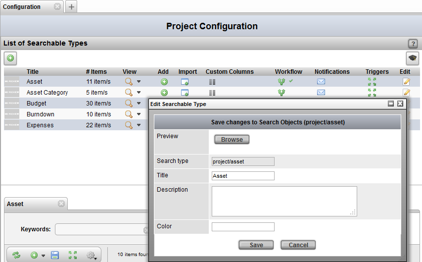
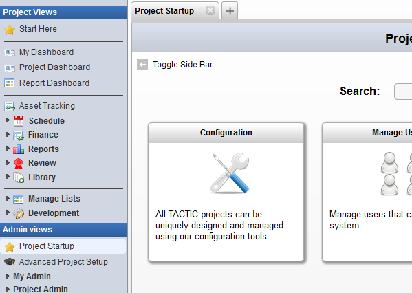
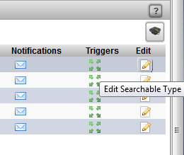
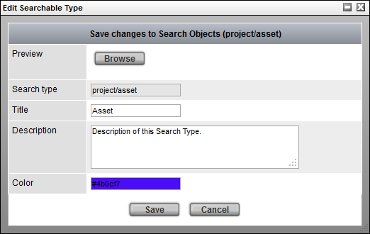

# Edit sType

**Edit sType**

**How to Edit a Search Type**

1) First, open the **Configuration View** under:

Project Startup → Configuration

2) Next (assuming a Searchable Type has already been created), click on
the **Edit** button corresponding to the search type to edit.

3) Finally, the edit pop-up will appear to allow modifiications to the
sType.

> **Note**
>
> The field **Search Type**, indicating the name of the Search Type cannot
> be modified once the type has been created.
