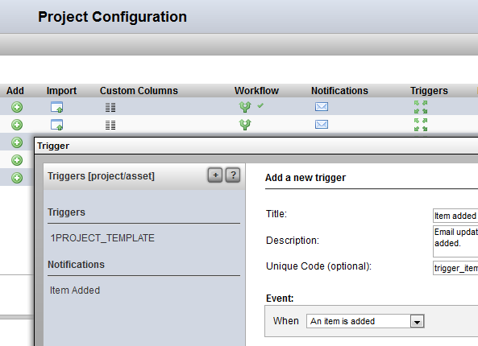
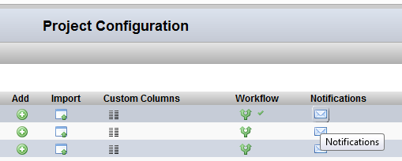
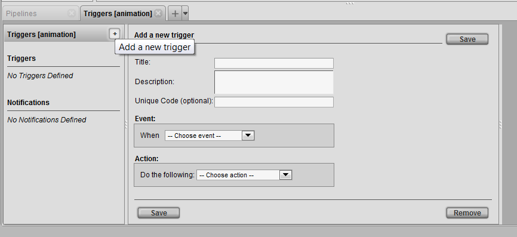
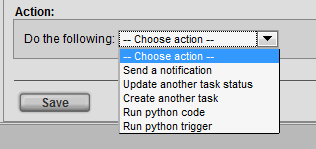
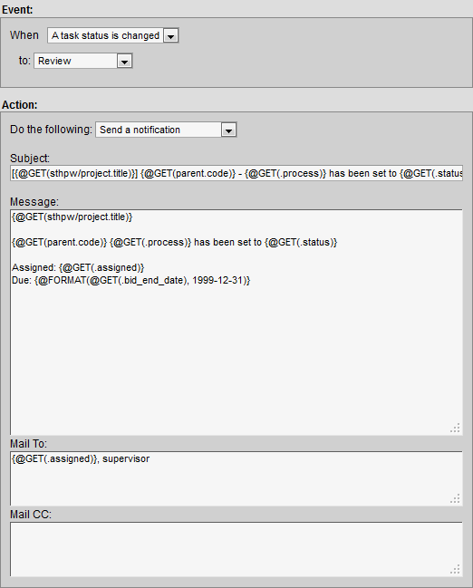
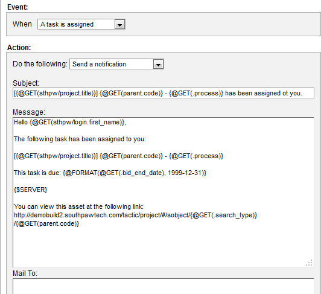

# Notifications

**Notifications**

**How to Add a Notification for a Search Type**

1) In the **Project Startup → Configuration View** (assuming a
Searchable Type has already been created), click on the **Notification**
button corresponding to row of the search type to edit.

2) In the **Notifcation** pop-up (the title for the pop-up might be
labelled **Trigger**):

Click on the plus **\[+\]** button to create a new notification. This will
open the trigger/notification UI.

Notifications and Triggers work together in many ways. A notification is
defined as an Action. To send a notification, an event must occur.

In the Action drop down list **Send a Notification** must be selected.

**Send a Notification** - This action will send a notification. The action
box will open additional options to insert a subject and message.

**Example 1**

Below is an example of a notification being sent on the event when a
task status is changed to review:

The **Mail To:** and **Mail CC:** input fields accepts the following types
of input:

**Email** - Capability to add regular emails allows to send personal email
addresses e.g. joe@my\_email.com

**Group** - Capabilty to send to a group of users in TACTIC e.g.
Supervisor

**Expression** - Capabilty to insert expressions that specifies a user in
TACTIC. It could be pointing to an sobject - @SOBJECT with an email attribute or pointing to just the login name of the user - @GET. e.g.
@SOBJECT(sthpw/login)
@GET(sobject.assigned)
@GET(sobject.supervisor)

**Send a Notification** - This action will send a notification. The action
box will open additional options to insert a subject and message.

**Example 2**

Below is an example which uses more expressions for a notification being
sent whenever a task is assigned.

