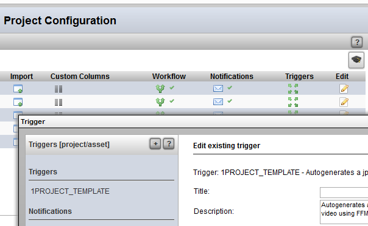
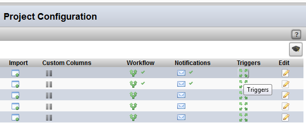
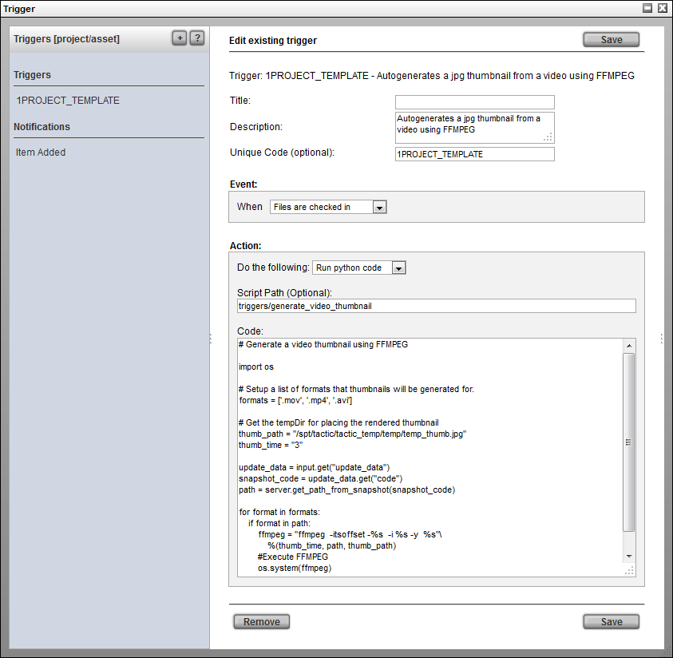

# Triggers

**Triggers**

**How to Add a Trigger for a Search Type**

> **Note**
>
> These workflow triggers are the same as the regular triggers but are
> scoped/filtered for the particular process.

1) In the **Project Startup → Configuration View** (assuming a
Searchable Type has already been created), click on the **Triggers**
button corresponding to row of the search type to edit.

2) In the **Triggers** pop-up:

Click on the plus **\[+\]** button to create a new trigger. This will open
the trigger/notification UI.

For further help on how to add a new trigger, refer to the **Project
Automation - Triggers** documentation by clicking on the question mark
**\[?\]** in the Triggers UI to show the help for this interface.
