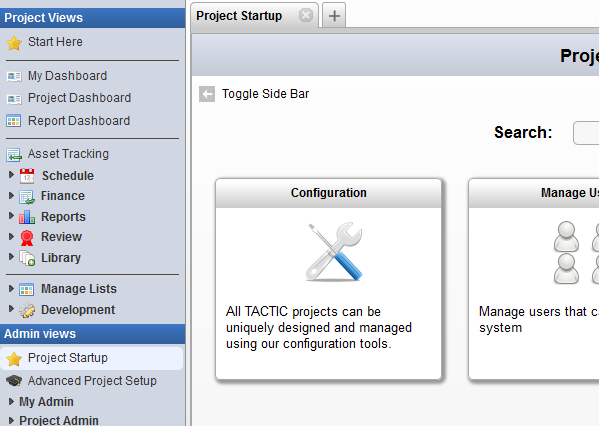

# View Items

**View Items**

**How to view items for a Search Type**

1) First, open the **Configuration View** under:

Project Startup → Configuration

2) Next (assuming a Searchable Type has already been created), click on
the **View** button corresponding to the type to view items for.

> **Note**
>
> Next to the **View** button is down arrow which opens up a selection list.
> This list contains different layouts to display the items below.

3) Finally, look in the lower panel for the view of the items for the
requested Search Type. Below is a sample of the different item layouts.

**Tile View**

**List View**

**Content View**

**Task Schedule View**

**Checkin View**

**Overview**

