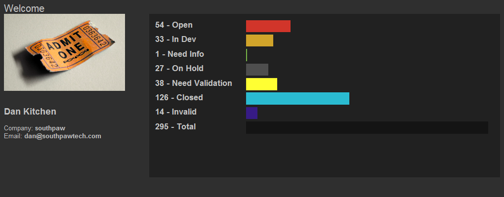
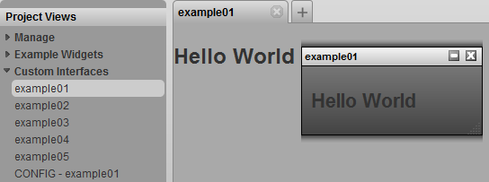
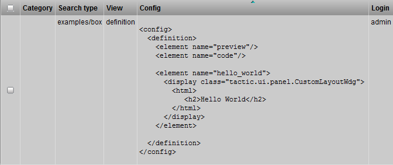
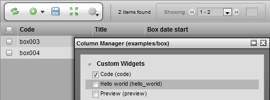
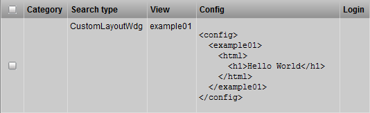
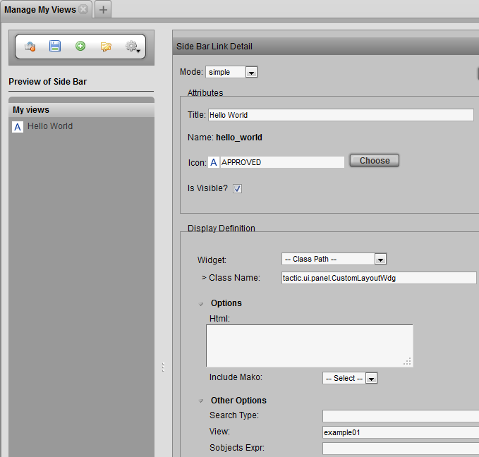
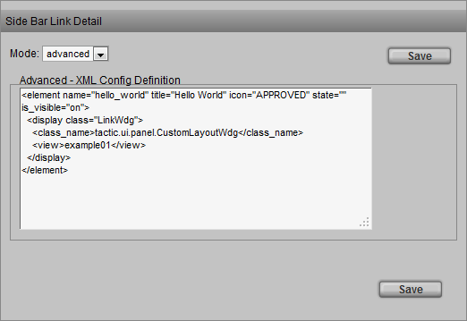
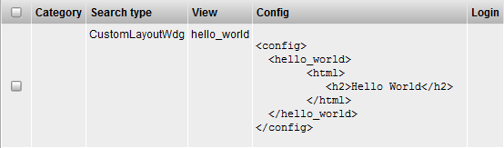
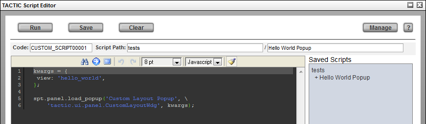

# Custom Layout

**Custom Layout**

**Description**

The Custom Layout Widget is a simple tool which opens up an incredible
amount of customizable interface flexibility and integration from within
the TACTIC UI. This widget provides a container in the web page which
supports embedding of HTML code including TACTIC Widgets, Expressions
and Behaviours. This allows development of complex widgets similar to
the standard widgets delivered with TACTIC.

With this, the following examples can be achieved:

-   Custom reports can be made which include dynamic TACTIC Expressions
    presented in a customized web page design.

-   Views can be assembled using a combination of TACTIC widgets along
    with regular HTML elements.

-   Embeddable web code such as Google maps, timezone clocks, web mail
    clients etc. can be embedded in the TACTIC interface.

**Info**

<table>
<colgroup>
<col width="28%" />
<col width="71%" />
</colgroup>
<tbody>
<tr class="odd">
<td>
<strong>Name</strong>
</td>
<td>
CustomLayoutWdg
</td>
</tr>
<tr class="even">
<td>
<strong>Class</strong>
</td>
<td>
tactic.ui.panel.CustomLayoutWdg
</td>
</tr>
<tr class="odd">
<td>
<strong>TACTIC Version Support</strong>
</td>
<td>
2.5.0 

</td>
</tr>
<tr class="even">
<td>
<strong>Required database columns</strong>
</td>
<td>
none
</td>
</tr>
</tbody>
</table>

**Implementation**

The Custom Layout Widget in its simplest form is a delivery mechanism
for HTML code. The following "Hello World" example below demonstrates
this.

    <element name="hello_world">
      <display class="tactic.ui.panel.CustomLayoutWdg">
        <html>
           <h2>Hello World</h2>
        </html>
      </display>
    </element>

Where a large part of the considerations for usage of a Custom Layout is
where it will be embedded and how it will get retrieved. There are a few
ways to implement this widget:

-   In a cell (element) in a TableLayoutWdg (Example 1a).

-   In the widget config, then called from a link in the sidebar (Example 1b).

-   In the widget config, than called from a Custom Script (Javascript)
    (Example 1c).

Once a delivery method has been decided, it also needs to be decided if
the custom Layout will need to evaluate based on an item being passed in
as the parent or 'starting point' (technically speaking a 'relative'
expression). For example, to use a CustomLayout to display a report for
a item, the dynamic data in the CustomLayout needs to be derived
starting from the specified item.

Taking advantage of relative expressions is usually accessed/assumed
through the search\_key value for the widget. This is most often done
through TACTIC Expressions embedded in the HTML code or, through
JavaScript code interacting with the CustomLayout. Either way, the
search\_key value must me passed into the widget for relative behavior. A
simple example is that a button in a table can pass in the search key
based on the item (row) it was clicked for. This would allow for loading
of a custom dashboard which shows all information pertaining to that
item.

**Embedded Expressions**

Expressions can be embedded in the Custom Layout through usage of a
\[expr\] style tag. This Tag allows for embedding of expressions that are
evaluated before the HTML which provide the resulting values into the
HTML code.

The following example displays the task status of the modelling process.

    <element name="hello_world">
     <display class="tactic.ui.panel.CustomLayoutWdg">
      <html>
       

         Model Status: [expr]@GET(sthpw/task['process', 'model'].status)[/expr]
       

      </html>
     </display>
    </element>

**Embedded Widgets**

The CustomLayoutWdg provides full support for embedding of TACTIC
Widgets. For example TableLayoutWdg and EditWdg can placed in a
CustomLayout. This for allows, for example, the ability to create a
'dashboard' which can show multiple Tables, CustomLayouts HTML, etc.

    <element name="hello_widget">
      <display class="tactic.ui.table.CustomLayoutwdg">
        <html>
          <element name="tasks">
            <display class="TableLayoutWdg">
              <search_type>sthpw/task</search_type>
              <view>task_list</view>
              <mode>simple</mode>
              <do_search>true</do_search>

            </display>
          </element>
        </html>
      </display>
    </element>

> **Note**
>
> In the example above, the &lt;search\_key&gt; option is automatically being
> passed the search\_key from the state of the overall Custom Layout. What
> this will do is pass in the searhc key to the table which will
> automatically filter it to only show items related to the search\_key
> (parent). For example in a dashboard for a shot, the tasks table will
> only display tasks related to the shot as opposed to all tasks in the
> system.

**Embedded Behaviours**

The Custom Layout also supports usage of the TACTIC JavaScript Behaviour
system. With this, elements in the Custom Layout can contain embedded
behaviours which allow for creation of custom interfaces and utilities.
This opens up full a connection with the interface, clientAPI and Java
Applet.

    <?xml version='1.0' encoding='UTF-8'?>
    <config>
      <hello_world>
        <html>
          This is a button:
          <input type='button' class='spt_button1' value='Press Me'/>
        </html>
        <behavior class='spt_button1'>{
         "type": "click_up",
         "cbjs_action": '''
             alert('Hello World');
         '''
        }</behavior>
      </hello_world>
    </config>

**Options**

<table>
<colgroup>
<col width="28%" />
<col width="71%" />
</colgroup>
<tbody>
<tr class="odd">
<td>
<strong>view</strong>
</td>
<td>
The view to retrieve from the Widget Config. This is not required if the HTML option is supplied.
</td>
</tr>
<tr class="even">
<td>
<strong>html</strong>
</td>
<td>
This option is where the HTML code is embedded.
</td>
</tr>
<tr class="odd">
<td>
<strong>search_type</strong>
</td>
<td>
The Search Type the CustomLayoutWdg applies to (if applicable)
</td>
</tr>
</tbody>
</table>

**Examples**

**Example 1a**

This can be stored in the definition view and called as an element by
name (&lt;element name="hello\_world"/&gt;) or, directly in the view config.

If added to the definition, it will be available as a Widget Column in
the **Column Manager**.

    <config>
      <definition>
        <element name="preview"/>
        <element name="code"/>

        <element name="hello_world">
          <display class="tactic.ui.panel.CustomLayoutWdg">
            <html>
               <h2>Hello World</h2>
            </html>
          </display>
        </element>

      </definition>
    </config>

**Example 1b**

The following example shows how to create a sidebar link which loads a
Custom Layout view defined in the Widget Config.

1.  In the Widget Config enter the following hello\_world view. This can
    be called from The Javascript code and sent to a popup.

    

2.  The link can be configured in the Project Views Manager. Under the
    action menu, select "New Link". In the pop-up, Fill the options as shown
    in the following image.

    

3.  Once the link is saved, select it in the Preview of Side Bar to load
    its options into the Element Detail panel on the right. Once loaded
    switch the mode to 'Advanced' and double check that the XML config
    contains the following:

        <element name="hello_world" title="Hello World" icon="APPROVED" state="" is_visible="on">
          <display class="LinkWdg">
            <class_name>tactic.ui.panel.CustomLayoutWdg</class_name>
            <view>example01</view>
          </display>
        </element>

    

**Example 1c**

The following example shows how to create a CustomLayoutWdg View in the
widget config then, call it from the Javascript Editor

1.  In the Widget Config enter the following hello\_world view. This can
    be called from The Javascript code and sent to a pop-up.

    

2.  In the Javascript Editor create the following custom script example
    to load the view into a pop-up.

        kwargs = {
         view: 'hello_world',
        };

        spt.panel.load_popup('Custom Layout Popup', \
            'tactic.ui.panel.CustomLayoutWdg', kwargs);

    

