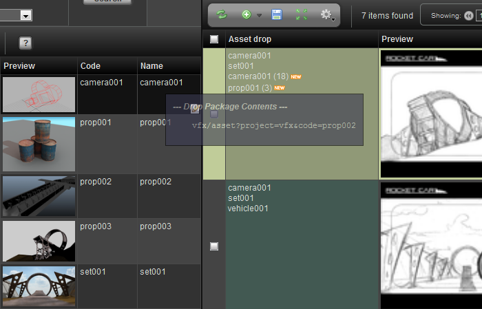
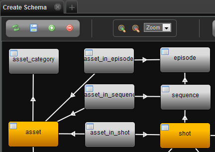
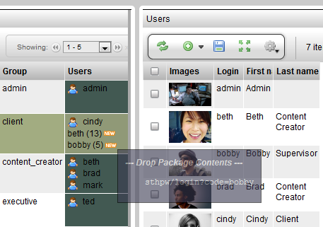

# Drop Item

**Drop Item**

**Description**

Facilitates drag-and-drop of an item between 2 views. For example, drag
a user from one view and drop it into a user group.

**Info**

<table>
<colgroup>
<col width="28%" />
<col width="71%" />
</colgroup>
<tbody>
<tr class="odd">
<td>
<strong>Name</strong>
</td>
<td>
Drop Element Widget
</td>
</tr>
<tr class="even">
<td>
<strong>Common Title</strong>
</td>
<td>
Drop Element Widget
</td>
</tr>
<tr class="odd">
<td>
<strong>Class</strong>
</td>
<td>
tactic.ui.table.DropElementWdg
</td>
</tr>
<tr class="even">
<td>
<strong>TACTIC Version Support</strong>
</td>
<td>
3.0.0 

</td>
</tr>
<tr class="odd">
<td>
<strong>Required database columns</strong>
</td>
<td>
none
</td>
</tr>
</tbody>
</table>

**Usage**

For example, in the Shot Planner view, individual assets can be added to
a shot by simply dragging the asset from one view and dropping it onto
the shot in another view. Once the asset is dropped onto the shot, the
asset will appear in the column with a "NEW" flag. Hit the save button
in the shot view to preserve the changes.

**Options**

<table>
<colgroup>
<col width="28%" />
<col width="71%" />
</colgroup>
<tbody>
<tr class="odd">
<td>
<strong>Accepted Drop Type</strong>
</td>
<td>
The acceptable sType that can be clicked on to be dragged and dropped onto another type. For example, sType is vfx/asset.
</td>
</tr>
<tr class="even">
<td>
<strong>Instance Type</strong>
</td>
<td>
For the item that is being dragged, it is the sType that the item can be dropped onto. For example, sType is vfx/asset_in_shot&quot;
</td>
</tr>
<tr class="odd">
<td>
<strong>Cbjs Drop Action</strong>
</td>
<td>
The call back JavaScript to run each time an item is dropped into the column.
</td>
</tr>
<tr class="even">
<td>
<strong>Display Expr</strong>
</td>
<td>
The expression to run to display in view mode. For example &quot;@&quot;
</td>
</tr>
</tbody>
</table>

**Implementation**

A many-to-many relationship between the 2 types needs to be created in
the Schema Editor. By convention, the "join" node that need to be
created to connect the 2 types should be named: "&lt;sType1&gt;\_in\_&lt;sType2&gt; ".
For example, for the join node named: "asset\_in\_shot". The
"asset\_in\_shot" node stores the data representing the relationship
between the asset and which shot it appears in.

The view where the item to be dropped onto the Drop Element column of,
can exist in a custom layout table or a view opened in a new window
within the TACTIC session.

    <element name="asset_drop" width="333px" edit="false">
      <display class="tactic.ui.table.DropElementWdg">
        <instance_type>vfx/asset_in_shot</instance_type>
        <accepted_drop_type>vfx/asset</accepted_drop_type>
        <css_background-color>#425952</css_background-color>
      </display>
      <action class="tactic.ui.table.DropElementAction">
        <instance_type>vfx/asset_in_shot</instance_type>
      </action>
    </element>

**Examples**

Example 1: implementation of "asset\_in\_shot', where an asset can be drag
and dropped onto a shot:

    <element name="asset_drop" width="333px" edit="false">
      <display class="tactic.ui.table.DropElementWdg">
        <instance_type>vfx/asset_in_shot</instance_type>
        <accepted_drop_type>vfx/asset</accepted_drop_type>
        <css_background-color>#425952</css_background-color>
      </display>
      <action class="tactic.ui.table.DropElementAction">
        <instance_type>vfx/asset_in_shot</instance_type>
      </action>
    </element>

Example 2: implementation of "user\_in\_group', where a user can be drag
and dropped onto a group:

    <element name="users">
      <display class="tactic.ui.table.DropElementWdg">
        <css_background-color>#425952</css_background-color>
        <instance_type>sthpw/login_in_group</instance_type>
        <accepted_drop_type>sthpw/login</accepted_drop_type>
      </display>
    </element>
