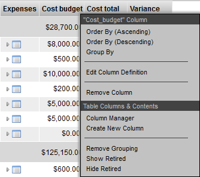
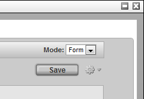
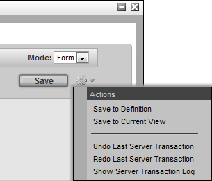

# Element Definition Widget

**Element Definition Widget**

Editing the configuration of widgets is an important part of configuring
TACTIC. Widgets are drawing elements that display information on the
TACTIC interface. Widgets can be configured for a wide variety of
applications. The Element Definition Widget allows for the generic
configuration of any widget using an easy to use interface directly in
TACTIC.

**Accessing the Element Definition Widget**

The Element Definition Widget can be used to edit existing widgets or to
create entirely new ones. It can be accessed from a few locations. The
common way to access the widget is by right clicking on the column
header in the table. This will bring up the context menu:

Selecting **Edit Column Definition** opens a pop-up with the appropriate
data filled in for the selected element.

The "Create New Column" selection opens up an empty Element Definition
pop-up so that new elements can be created.

**Tool Bar**

The tool bar can be found in the top right hand corner of this widget.

**Mode**: This can be set to either **Form** or **XML**. The **Form** selection
is the default which displays the user interface for entering in
attributes for this widget. The **XML** section is for advanced usage
which allows direct control of the XML definition of the widget.

**Save**: This button will save the settings in the widget to the
definition view.

**Gear**: Clicking on the gear menu will display a number of other options
available as described in the next section.

**Gear Menu**

The gear menu contains a number of operations.

**Save to Definition**: This will save the current contents to the
"definition" view. The definition view is a view where all widgets for a
particular sType are defined.

**Save to Current View**: Occasionally, it is desirable to save a view
definition in the current view. This means it will not be available to
other views, so this option should only be used if it is completely
specific to this view.

The next 3 are the standard Undo/Redo/Show Server Transaction Log menu
options for convenience.

**Widget Sections**

The Element Definition Widget is broken into sections:

1.  **Attributes**: These are generic attributes to describe the overall
    drawing of this element. All elements possess these same attributes:

    -   **Title**: The title to be displayed in the column header for this widget. If it is empty, then TACTIC will use the element **Name** for the
        title

    -   **Name**: The name of the column in the database (autogenerated based on
        the title when creating a new column)

    -   **Width**: The default width of the column

    -   **Enable Colors**: Enables the cell colors as set under the Colors section.

2.  **Display**: The display section defines the configuration of the
    widget that will be used to display data.

3.  **Colors**: Set the color for the cell for specific cell values.

4.  **Definitions in Config (Advanced)**: This is an advanced display and
    typically used to find out where in the config hierarchy a particular
    element definition is located.

For those familiar with the widget config table, the underlying drawing
mechanism does not change. XML defined widgets still drive the drawing
engine, however, the Element Definition widget makes it much easier to
create new elements and edit existing ones.

**Display Section**

Each element has uses a drawing widget which will determine how an
element will draw itself. Each drawing widget contains a number of
configuration attributes which alter the functionality of the widget.
The attributes displayed depend on which widget is selected.

The following widgets are predefined in TACTIC and can be selected in
the drop down.

<table>
<colgroup>
<col width="32%" />
<col width="67%" />
</colgroup>
<thead>
<tr class="header">
<th><strong>Empty</strong></th>
<th>Specifies that no widget is to be used.</th>
</tr>
</thead>
<tbody>
<tr class="odd">
<td>
<strong>Raw Data</strong>
</td>
<td>
Displays the data &quot;as is&quot; from the database.
</td>
</tr>
<tr class="even">
<td>
<strong>Formatted</strong>
</td>
<td>
Formats the display of the data. eg. -($1,234.00)
</td>
</tr>
<tr class="odd">
<td>
<strong>Expression</strong>
</td>
<td>
Use a relative TACTIC Expression to calculate what to display for each item. One expression defines what to display for the entire column.
</td>
</tr>
<tr class="even">
<td>
<strong>Expression Value</strong>
</td>
<td>
Allow each item to be able to have an absolute TACTIC Expression to calculate what to display. If there is an expression specified, the resulting value will be displayed in the cell.
</td>
</tr>
<tr class="odd">
<td>
<strong>Button</strong>
</td>
<td>
Display an icon button that runs a JavaScript action when clicked.
</td>
</tr>
<tr class="even">
<td>
<strong>Link</strong>
</td>
<td>
Create a hyperlink button.
</td>
</tr>
<tr class="odd">
<td>
<strong>Gantt</strong>
</td>
<td>
Horizontal bar graph for dates.
</td>
</tr>
<tr class="even">
<td>
<strong>Hidden Row</strong>
</td>
<td>
Toggle button to open a hidden row where another widget (element) is displayed. For example a Table, Custom Layout, Edit Panel etc.
</td>
</tr>
<tr class="odd">
<td>
<strong>Drop Item</strong>
</td>
<td>
Column where items from another view can be dropped.
</td>
</tr>
<tr class="even">
<td>
<strong>Custom Layout</strong>
</td>
<td>
Use HTML to specify what to display. Supports TACTIC Expressions and MAKO.
</td>
</tr>
<tr class="odd">
<td>
<strong>-- Class Path --</strong>
</td>
<td>
The path to a fully qualified Python class for a custom widget.
</td>
</tr>
</tbody>
</table>

Full descriptions of each widget can be found in the widget
documentation.

When "-- Class Path --" is selected, the input field to specify the path
to a fully qualified python class appears. Arbitrary python classes can
be specified to create complete custom widgets that are seamlessly
integrated into TACTIC. Refer to the developer section below for details
on how TACTIC creates the widget element interface.

When a widget or class path is selected, the available configuration
attributes will be dynamically loaded.

Each widget will define its own attributes that will configure what gets
displayed.

**Edit Mode Tab**

The edit section configures the edit-ability of this widget. It works
very similarly to the display section except that the options are
specific to edit inputs.

**Edit Section**

The widgets available here are:

<table>
<colgroup>
<col width="32%" />
<col width="67%" />
</colgroup>
<thead>
<tr class="header">
<th><strong>---</strong></th>
<th>Specifies that no widget is to be used.</th>
</tr>
</thead>
<tbody>
<tr class="odd">
<td>
<strong>Default</strong>
</td>
<td>
Use the default input widget.
</td>
</tr>
<tr class="even">
<td>
<strong>Text</strong>
</td>
<td>
Use the Text Widget as the input widget.
</td>
</tr>
<tr class="odd">
<td>
<strong>Select</strong>
</td>
<td>
Create a drop down selection menu and specify the selection options as the input widget.
</td>
</tr>
<tr class="even">
<td>
<strong>Calendar</strong>
</td>
<td>
Use the Calendar Input Widget
</td>
</tr>
<tr class="odd">
<td>
<strong>Calendar Time</strong>
</td>
<td>
Use the Calendar and Time Input Widget
</td>
</tr>
<tr class="even">
<td>
<strong>-- Class Path --</strong>
</td>
<td>
The path to a fully qualified Python class to a custom input widget.
</td>
</tr>
</tbody>
</table>

**Advanced**

This section displays the various definitions of this widget.

