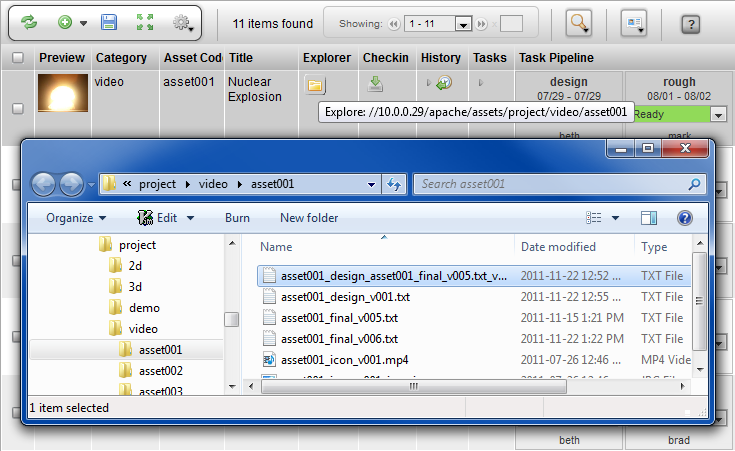
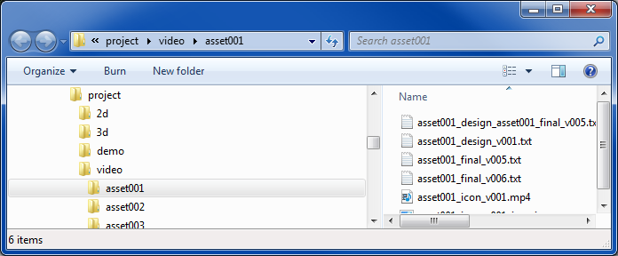

# Explorer Button

**Explorer Button**

**Description**

The Explorer Widget can be configured to launch Windows Explorer for
Windows (or Finder for OSX). It can be configured to open to a directory
which is either the sandbox or to the repository of the corresponding
item.

**Info**

<table>
<colgroup>
<col width="28%" />
<col width="71%" />
</colgroup>
<tbody>
<tr class="odd">
<td>
<strong>Name</strong>
</td>
<td>
Explorer
</td>
</tr>
<tr class="even">
<td>
<strong>Class</strong>
</td>
<td>
tactic.ui.table.ExplorerElementWdg
</td>
</tr>
<tr class="odd">
<td>
<strong>Category</strong>
</td>
<td>
Common Columns
</td>
</tr>
<tr class="even">
<td>
<strong>TACTIC Version Support</strong>
</td>
<td>
3.0+
</td>
</tr>
<tr class="odd">
<td>
<strong>Required database columns</strong>
</td>
<td>
none
</td>
</tr>
</tbody>
</table>

**Implementation**

When added to the view, the Explorer Widget button is represented as an
icon of a folder. The button opens up Windows Explorer (or Finder on
OSX). This gives the user a quick starting point for navigating to a
directory that is relevant to the corresponding item. The convenience is
greater when the repository contains a lot of items or the directory
folder structure is very deep. Users save time by not having to navigate
through endless directories to get to where they need to go to do work.

By default, the Explore Widget opens a window to the corresponding item
if it exists in the user’s sandbox.

**Options**

<table>
<colgroup>
<col width="28%" />
<col width="71%" />
</colgroup>
<tbody>
<tr class="odd">
<td>
<strong>mode</strong>
</td>
<td>
sandbox
</td>
</tr>
</tbody>
</table>

**Advanced**

The following example configures the Explorer Widget to browse to the
assets directory as specified in the **Tactic Config File**

    <element name='explorer'>
      <display class='tactic.ui.table.ExplorerElementWdg'>
        <mode>client_repo</mode>
      </display>
    </element>

    <element name='explorer'>
      <display class='tactic.ui.table.ExplorerElementWdg'/>
    </element>
