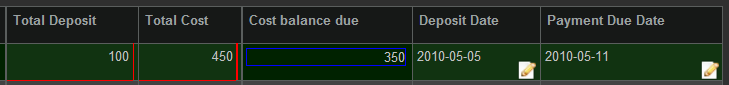

# Expression

**Expression**

**Description**

The ExpressionElementWdg allows you to use the TACTIC expression
language to determine the value displayed in the table cell. The
expression is caclulated from a starting sobject which represents the
sobject in the particular row in the table. The expression is evaluated
for each sobject on every row. When an expression is evaluated, the
value is added to a dynamic attribute of the sobject and can be used in
future expressions in this widget. Please refer to the expression
language reference for more information on the expression language.

**Info**

<table>
<colgroup>
<col width="28%" />
<col width="71%" />
</colgroup>
<tbody>
<tr class="odd">
<td>
<strong>Name</strong>
</td>
<td>
ExpressionElementWdg
</td>
</tr>
<tr class="even">
<td>
<strong>Class</strong>
</td>
<td>
tactic.ui.table.ExpressionElementWdg
</td>
</tr>
<tr class="odd">
<td>
<strong>Category</strong>
</td>
<td>
Common Columns
</td>
</tr>
<tr class="even">
<td>
<strong>Supported Interfaces</strong>
</td>
<td>
TableLayoutWdg
</td>
</tr>
<tr class="odd">
<td>
<strong>TACTIC Version Support</strong>
</td>
<td>
2.5.0 

</td>
</tr>
<tr class="even">
<td>
<strong>Required database columns</strong>
</td>
<td>
depends on expression
</td>
</tr>
</tbody>
</table>

**Implementation**

Display the total cost of an item by multiplying the total\_number column
with the unit\_cost column When an expression is evaluated by the
ExpressionElementWdg, a new attribute with the name of the element is
dynamically added to the sobject (in this cost) which can be used in the
"bottom" directive.

    <element name='cost'>
      <display class='tactic.ui.table.ExpressionElementWdg'>
        <expression>@GET(.total_number) * @GET(.unit_cost)</expression>
        <bottom>@SUM(.cost)</bottom>
      </display>
    </element>

**Options**

<table>
<colgroup>
<col width="28%" />
<col width="71%" />
</colgroup>
<thead>
<tr class="header">
<th><strong>expression</strong></th>
<th>Expression to evaluate the widget</th>
</tr>
</thead>
<tbody>
<tr class="odd">
<td>
<strong>display_format</strong>
</td>
<td>
Display format string like DATETIME, DATE, -$1,234 applicable for various Formatted Element can be used here.
</td>
</tr>
<tr class="even">
<td>
<strong>inline_styles</strong>
</td>
<td>
Styles to add to the DIV generated that contains the result of the expression
</td>
</tr>
<tr class="odd">
<td>
<strong>return</strong>
</td>
<td>
single
</td>
</tr>
<tr class="even">
<td>
list - Determines what the expression return type should be
</td>
<td>
<strong>bottom</strong>
</td>
</tr>
<tr class="odd">
<td>
Expression to calculate the bottom row of the table
</td>
<td>
<strong>group_bottom</strong>
</td>
</tr>
<tr class="even">
<td>
Expression to calculate the group bottom row of the table
</td>
<td>
<strong>mode</strong>
</td>
</tr>
<tr class="odd">
<td>
value
</td>
<td>
boolean
</td>
</tr>
<tr class="even">
<td>
check
</td>
<td>
icon - Display mode for this widget
</td>
</tr>
<tr class="odd">
<td>
<strong>expression_mode</strong>
</td>
<td>
default
</td>
</tr>
<tr class="even">
<td>
absolute - If absolute mode is selected, it does not relate to the current SObject
</td>
<td>
<strong>calc_mode</strong>
</td>
</tr>
<tr class="odd">
<td>
fast
</td>
<td>
slow - fast uses new calculation mode. Only @SUM, @COUNT, @SOBJECT and @GET are current supported
</td>
</tr>
<tr class="even">
<td>
<strong>enable_eval_listener</strong>
</td>
<td>
Currently javascript expression evaluation is not fully baked, so only use the client side evaluation listener when needed and NOT by default
</td>
</tr>
<tr class="odd">
<td>
<strong>icon_expr</strong>
</td>
<td>
Expression to evaluate which icon to use when mode = 'icon'
</td>
</tr>
<tr class="even">
<td>
<strong>order_by</strong>
</td>
<td>
provide a simple string to order by e.g. code or by an attribute in a related sType in the same database, e.g. prod/sequence.dsecription
</td>
</tr>
<tr class="odd">
<td>
<strong>group_by</strong>
</td>
<td>
true
</td>
</tr>
<tr class="even">
<td>
false - Turn on group by in context menu if set to true
</td>
<td>
<strong>group_by_time</strong>
</td>
</tr>
<tr class="odd">
<td>
true
</td>
<td>
false - Turn on group by time options in context menu if set to true
</td>
</tr>
<tr class="even">
<td>
<strong>justify</strong>
</td>
<td>
default
</td>
</tr>
<tr class="odd">
<td>
left
</td>
<td>
right
</td>
</tr>
</tbody>
</table>

**Examples**

Display the number of tasks for a given sobject and then display the
total number at the bottom.

    <element name='num_tasks'>
      <display class='tactic.ui.table.ExpressionElementWdg'>
        <expression>@COUNT(sthpw/task)</expression>
        <bottom>@SUM(.num_tasks)</bottom>
      </display>
    </element>

Mode "boolean" displays a green dot for every sobject that has an
expression that evalutes to True. In this case, a green dot is display
on every row where the number of tasks is greater than zero.

    <element name='has_tasks'>
      <display class='tactic.ui.table.ExpressionElementWdg'>
        <expression>@COUNT(sthpw/task) > 0</expression>
        <mode>boolean</mode>
      </display>
    </element>

Another example of a mode which displays a checkbox instead of red/green
dots. The checkbox appears for any result greater than zero

    <element name='has_tasks'>
      <display class='tactic.ui.table.ExpressionElementWdg'>
        <expression>@COUNT(sthpw/task) > 0</expression>
        <mode>check</mode>
      </display>
    </element>

The expression language has the ability to get values from other related
tables. The following example illustrates an expression to find the
description of the parent sequence of a shot.

    <element name='sequence_description'>
      <display class='tactic.ui.table.ExpressionElementWdg'>
        <expression>@GET(prod/sequence.description)</expression>
      </display>
    </element>

The expression language has the ability to get values from other related
tables and format it using the DATETIME project setting which can be
customized per project

    <element name='task_due_date'>
      <display class='tactic.ui.table.ExpressionElementWdg'>
        <expression>@GET(sthpw/task.bid_end_date)</expression>
        <display_format>DATETIME</display_format>
      </display>
    </element>

Ultimately, the ExpressionElementWdg can make use of any expression in
the TACTIC Expression Lanaguage.

When using mode = 'icon', it is possible to set up an expression using
icon\_expr to determine what that icon should be. A special variable
$VALUE is used to determine the value of the expressions

    <element name="is_synced" title='Synced' edit='false'>
      <display class='tactic.ui.table.ExpressionElementWdg'>
        <expression>@GET(.is_synced) == True</expression>
        <mode>icon</mode>
        <icon_expr>@IF( '$VALUE' == True, 'CHECK', 'CROSS' )</icon_expr>
      </display>
    </element>
