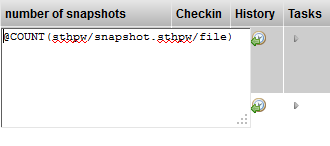
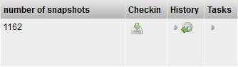

# Expression Value Element

**Expression Value Element**

**Description**

The Expression Value Element widget accepts a TACTIC Expression as the
input and displays the evaluated expression as the output.

**Info**

<table>
<colgroup>
<col width="31%" />
<col width="68%" />
</colgroup>
<tbody>
<tr class="odd">
<td>
<strong>Name</strong>
</td>
<td>
Expression Value Element Widget
</td>
</tr>
<tr class="even">
<td>
<strong>Class</strong>
</td>
<td>
expression_value
</td>
</tr>
<tr class="odd">
<td>
<strong>TACTIC Version Support</strong>
</td>
<td>
2.5.0 

</td>
</tr>
<tr class="even">
<td>
<strong>Required database columns</strong>
</td>
<td>
Yes, a database column by the same name.
</td>
</tr>
</tbody>
</table>

**Usage**

For example, we can dynamically display the number of login names in the
login table. This would be an example of an absolute expression because
the expression does not take into input any data from the row the field
is on. A relative expression has access to the row and table information
that the row the expression is on.

> **Note**
>
> The difference between an **absolute expression** and a **relative
> expression**:
>
> -an **absolute expression** does not take into input any data from the row
> or table that the field exists on
>
> -a **relative expression** has access to the row and table information
> that the field exists on

**Implementation**

Go into edit mode for the Expression Value Element widget. Input an
absolute TACTIC expression as the value.

In display mode, this widget will display the result of the evaluation
of the expression.

**Options**

There are no options available for this widget.

**Example 1**

For example, enter the following absolute TACTIC Expression as the value
for the Expression Value Element widget:

    @COUNT(sthpw/snapshot.sthpw/file)

In display mode, this widget will evaluate the expression and display
the count of the number snapshot files in the database.

**Example 2**

For example, enter the following absolute TACTIC Expression as the value
for the Expression Value Element widget:

    @COUNT(sthpw/login.sthpw/login)

In display mode, this widget will evaluate the expression and display
the count of the number of logins in the login table.

**Example 3**

For example, enter the following absolute TACTIC Expression as the value
for the Expression Value Element widget:

    @GET(sthpw/task["context = 'model'"].code)

In display mode, this widget will evaluate the expression and display
the code for all the tasks where the context is 'model'.
