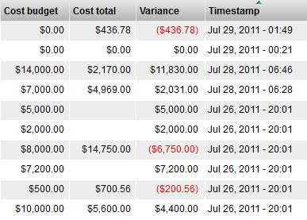
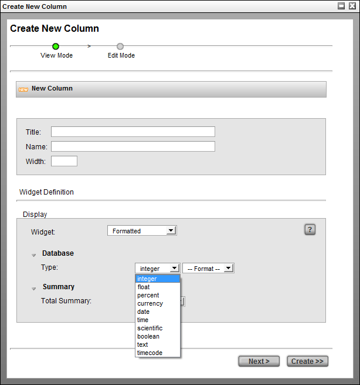
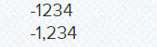
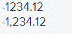
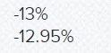
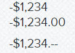
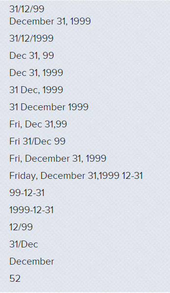
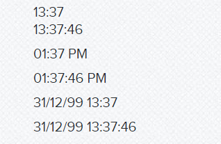
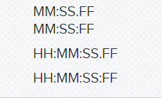

# Formatted Widget

The Formatted Widget displays a raw data value as a formatted string so
the user can recognize and interpret the value more easily.

For example, the Format Widget will display a number in the format
$1,234.00 which the user quickly recognizes as a currency value in
dollars and cents.

<table>
<colgroup>
<col width="30%" />
<col width="69%" />
</colgroup>
<tbody>
<tr class="odd">
<td>
<strong>Name</strong>
</td>
<td>
Formatted Widget
</td>
</tr>
<tr class="even">
<td>
<strong>Class</strong>
</td>
<td>
FormatElementWdg
</td>
</tr>
<tr class="odd">
<td>
<strong>Category</strong>
</td>
<td>
Simple Table Element Widget
</td>
</tr>
<tr class="even">
<td>
<strong>Supported Interfaces</strong>
</td>
<td>
[]
</td>
</tr>
<tr class="odd">
<td>
<strong>TACTIC Version Support</strong>
</td>
<td>
3.6.0+
</td>
</tr>
<tr class="even">
<td>
<strong>Required database columns</strong>
</td>
<td>
none
</td>
</tr>
</tbody>
</table>

<table>
<colgroup>
<col width="50%" />
<col width="50%" />
</colgroup>
<tbody>
<tr class="odd">
<td>
<strong>integer</strong>
</td>
<td>

</td>
</tr>
<tr class="even">
<td>
<strong>float</strong>
</td>
<td>

</td>
</tr>
<tr class="odd">
<td>
<strong>percent</strong>
</td>
<td>

</td>
</tr>
<tr class="even">
<td>
<strong>currency</strong>
</td>
<td>

</td>
</tr>
<tr class="odd">
<td>
<strong>date</strong>
</td>
<td>

</td>
</tr>
<tr class="even">
<td>
<strong>time</strong>
</td>
<td>

</td>
</tr>
<tr class="odd">
<td>
<strong>scientific</strong>
</td>
<td>

</td>
</tr>
<tr class="even">
<td>
<strong>boolean</strong>
</td>
<td>

</td>
</tr>
<tr class="odd">
<td>
<strong>timecode</strong>
</td>
<td>

</td>
</tr>
</tbody>
</table>

