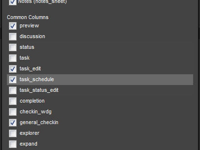
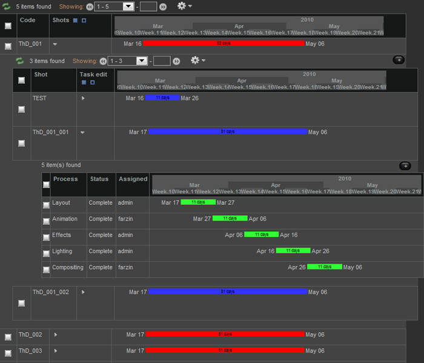

# Gantt

**Gantt**
**Description**

The Gantt widget has the capability of displaying all projects schedules
along with sequences and tasks schedules. With the widget you can switch
between weeks to months view. This widget can be utilized and edited in
multiple different ways. It also displays the start and end date along
with the amount of days.

**Info**

<table>
<colgroup>
<col width="30%" />
<col width="69%" />
</colgroup>
<tbody>
<tr class="odd">
<td>
<strong>Name</strong>
</td>
<td>
Calendar Gantt Widget
</td>
</tr>
<tr class="even">
<td>
<strong>Class</strong>
</td>
<td>
GanttWdg
</td>
</tr>
<tr class="odd">
<td>
<strong>Category</strong>
</td>
<td>
Common Columns
</td>
</tr>
<tr class="even">
<td>
<strong>Supported Interfaces</strong>
</td>
<td>
<strong>TACTIC Version Support</strong>
</td>
</tr>
<tr class="odd">
<td>
2.6.0+
</td>
<td>
<strong>Required database columns</strong>
</td>
</tr>
</tbody>
</table>

**Usage**

There are many ways to edit the Gantt Widget. You can also edit what
part of the month, week or year of the schedule to view. Clicking on the
header date of the Gantt Widget will toggle the different viewing
options.

Above shows two different displays of viewing the range of the date.
Clicking on the weeks will toggle to another viewing range.

The bars that show the schedule can also be edited using the UI.
Hovering the mouse over the bars will popup a a window that will display
the dates of the schedule.

The bars can also be editied by selecting the start and end dates and
sliding the either end from the right to left. The first image below
shows the end of the date stretched to May 14 and the second image shows
the start date streched back to March 13.

The schedule bar can also move sideways while keeping the number of days
constant by selecting the bar and shifting it from left to right.

The Gantt Widget can also be edited using multi selection. Whether it is
changing the end date, start date or sliding the bars forward and
backward, the Gantt Widget can hande it. Below are images of a few
examples of having the sequences muli-selected and edited.

The Gantt Widget also has the capability of sliding the full time line
by selecting the empty area of the widget and dragging the mouse left or
right.

The Gantt Widget can be found under the column manager as task schedule.

**Advanced**

The following example illustrates a Gantt Widget that shows all tasks
for a project, the schedule for all asset tasks, and the schedule for
all shot tasks.

    <element name='task_schedule'>
      <display class='tactic.ui.table.GanttElementWdg'>
        <options>[
          {
            "start_date_expr":  "@MIN(sthpw/task.bid_start_date)",
            "end_date_expr":    "@MAX(sthpw/task.bid_end_date)",
            "color":            "white",
            "edit":               "true",
            "default":          "true"
          },
          {
            "start_date_expr":  "@MIN(sthpw/task['search_type', '~', 'asset'].bid_start_date)",
            "end_date_expr":    "@MAX(sthpw/task['search_type', '~', 'asset'].bid_end_date)",
            "color":            "red",
            "edit":               "true",
            "default":          "false"
          },
          {
            "start_date_expr":  "@MIN(sthpw/task['search_type', '~', 'shot'].bid_start_date)",
            "end_date_expr":    "@MAX(sthpw/task['search_type', '~', 'shot'].bid_end_date)",
            "color":            "blue",
            "edit":               "true",
            "default":          "false"
          }
        ]</options>
      </display>
      <action class='tactic.ui.table.GanttCbk'>
        <sobjects>@SOBJECT(prod/shot.sthpw/task)</sobjects>
        <options>[
          {
            "prefix":           "bid",
            "sobjects":         "@SOBJECT(sthpw/task)",
            "mode":             "cascade"
          },
          {
            "prefix":           "bid",
            "sobjects":         "@SOBJECT(sthpw/task['search_type', '~', 'asset'])",
            "mode":             "cascade"
          },
          {
            "prefix":           "bid",
            "sobjects":         "@SOBJECT(sthpw/task['search_type', '~', 'shot'])",
            "mode":             "cascade"
          }
        ]</options>
      </action>
    </element>

Note: There are 3 editable bars in the display options in the above
example and therefore, there are 3 corresponding action options. The
'prefix' action option assumes that the column in the table is named
like &lt;prefix&gt;\_start\_date and &lt;prefix&gt;\_end\_date. If your column names are
different, you would want to use the action\_option "start\_date\_col" and
"end\_date\_col" with the full column name as the value.
