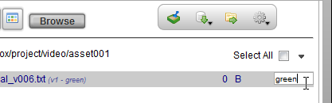
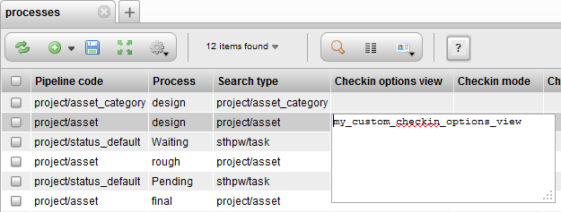
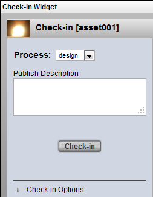

# General Check-in Widget

**General Check-in Widget**

**Description**

This is the new preferred Check-in Widget for 3.7+. It makes use of the
Java Applet to accomplish various kinds of check-in functions like
checking in a single file, sequences of files, or directories. The
**copy** or **preallocate** transfer mode should be used when dealing with a
large file transfer. **Upload** transfer mode only supports checking in
single files and sequences of files. **Upload** is set to be the default
in case new users do not have the handoff directory readily set up.

**Info**

<table>
<colgroup>
<col width="28%" />
<col width="71%" />
</colgroup>
<tbody>
<tr class="odd">
<td>
<strong>Name</strong>
</td>
<td>
General Check-in Widget
</td>
</tr>
<tr class="even">
<td>
<strong>Class</strong>
</td>
<td>
tactic.ui.widget.CheckinWdg
</td>
</tr>
<tr class="odd">
<td>
<strong>Category</strong>
</td>
<td>
Widget
</td>
</tr>
<tr class="even">
<td>
<strong>Supported Interfaces</strong>
</td>
<td>
TableLayoutWdg
</td>
</tr>
<tr class="odd">
<td>
<strong>TACTIC Version Support</strong>
</td>
<td>
3.7.0 

</td>
</tr>
<tr class="even">
<td>
<strong>Required database columns</strong>
</td>
<td>
none
</td>
</tr>
</tbody>
</table>

**Options**

<table>
<colgroup>
<col width="28%" />
<col width="71%" />
</colgroup>
<tbody>
<tr class="odd">
<td>
<strong>transfer_mode</strong>
</td>
<td>
<strong>upload</strong>, <strong>copy</strong> and <strong>move</strong> are supported. <strong>copy</strong> is recommended for most situations when users are usually granted only read access to the TACTIC asset repo. <em>(default is copy)</em>
</td>
</tr>
<tr class="even">
<td>
<strong>mode</strong>
</td>
<td>
<strong>sequence</strong>, <strong>file</strong>, <strong>dir</strong>, and <strong>add</strong> are supported. <strong>sequence</strong> is for file sequence checkin; <strong>file</strong> is for single file checkin; <strong>dir</strong> is for directory checkin; and <strong>add</strong> is for appending file or dir to an existing snapshot. If not specified, multiple selections will be available for the user to choose. Note: upload transfer mode only supports single file or file sequence checkin.
</td>
</tr>
<tr class="odd">
<td>
<strong>checkin_script_path</strong>
</td>
<td>
a custom checkin script path to specify an override on what functions get called during a checkin. Note: If trying to do some preprocessing with the file or directory before checking in, just make use of validate_script_path function using Client Trigger. Client Trigger works by setting up this check-in script as a Client Trigger callback that affects the search type rather than just a column definition.
</td>
</tr>
<tr class="even">
<td>
<strong>validate_script_path</strong>
</td>
<td>
a script path pointing to a JavaScript file that is run before the actual checkin. If it throws an error using &quot;throw(&lt;error message&gt;)&quot;, the checkin will not initiate. This path can also use it to run some client-side preprocessing of the file or directory. It is not set up as a display option but rather as a Client Trigger callback.
</td>
</tr>
<tr class="odd">
<td>
<strong>checkout_script_path</strong>
</td>
<td>
a custom check-out script path to specify to override what happens during a check-out.
</td>
</tr>
<tr class="even">
<td>
<strong>process</strong>
</td>
<td>
If set, the process specified will be pre-selected when the General Check-in Widget is drawn,
</td>
</tr>
<tr class="odd">
<td>
<strong>lock_process</strong>
</td>
<td>
If set to true, the user will not be able to choose a different process during a checkin, in the General Check-in Widget
</td>
</tr>
<tr class="even">
<td>
<strong>show_context</strong>
</td>
<td>
When set to true, the <strong>context</strong> will be displayed to the user. <em>(default is false)</em>
</td>
</tr>
</tbody>
</table>

**Gear Menu Options**

The Gear Menu in the Check-in Widget provides the following
administration options:

<table>
<colgroup>
<col width="32%" />
<col width="68%" />
</colgroup>
<tbody>
<tr class="odd">
<td>
<strong>Edit Process</strong>
</td>
<td>
Load the process options pop-up. <em>The process and subcontext options are described further in the sections below</em>
</td>
</tr>
<tr class="even">
<td>
<strong>List Processes</strong>
</td>
<td>
List all of the processes for the current pipeline. This provides the same access to the as the Edit Process option but for all processes.
</td>
</tr>
<tr class="odd">
<td>
<strong>Show Server Transaction Log</strong>
</td>
<td>
Show the standard server transaction log
</td>
</tr>
<tr class="even">
<td>
<strong>Undo Last Server Transaction</strong>
</td>
<td>
Undo the last transaction. <em>When undoing a checkin, the files will also be removed in the file system.</em>
</td>
</tr>
<tr class="odd">
<td>
<strong>Redo Last Server Transaction</strong>
</td>
<td>
Redo the last transaction. <em>When redoing a checkin, the files will be restored in the file system.</em>
</td>
</tr>
</tbody>
</table>

**Implementation**

The default settings will allow a user to check in files to an assets in
the "publish" process. It provides a very general and loosely enforced
workflow to check in and manage files. Often, it is required, that a
particular process has very strict enforcement of naming conventions and
check-in procedures.

The General Check-in widget is highly configured and can be tuned
precisely for each part of the process. The various customizations can
fall into the following categories:

Validation, Subcontext options, Custom interface, Custom check-in
script, Naming conventions

Each of these can be customized for the particular widget or at the
process level.

**Validation**

Validation is a custom script that will is run before the check-in
process occurs. It provides the ability to check that all files in the
checkin conform to some custom logic required for a successful checkin.
If the validation script fails, then the entire checkin is aborted.

**Client Side Triggers**

A client trigger set up allows control over what check-in script or
validate\_checkin script to call during a checkin. Here is an example of
how to set the checkin/validate\_folder script to run before the check in
of prod/asset. The event name is
CheckinWdg|validate\_script\_path|&lt;search\_type&gt;. If only a particular
process is desired to be run on check in for, like "texture", the event
name would become CheckinWdg|validate\_script\_path|prod/asset|texture. To
override the checkin\_script\_path, use the event
CheckinWdg|checkin\_script\_path|&lt;search\_type&gt;. If this event-based set-up
seems a bit too involving, override the checkin\_script\_path for just
this instance of the widget by using the standard display option
&lt;checkin\_script\_path&gt;.

**Process Options**

By default, the subcontext selection is set to **(auto)**. It is the
simplest to use and allows TACTIC to auto generate the subcontext.
Because the subcontext is auto generated, strict naming conventions for
the file are often sacrificed for ease of use. By default, the checked
in file will just have a version number attached to it.

It is possible to force a limited list of subcontext options on a
particular checkin. This means that the files checked in will be named
according to the subcontext selected and provides a limited set of
approved containers in which files can be checked in.

**Process/Context/Subcontext**

Checkin’s are always categorized by process. If there is no pipeline
defined, the default process "publish" will be used. Categorizing
checkin’s by the process in the pipeline of an asset organizes the work
done for an asset according to its product life cycle.

Another important attribute of a checkin is the context. Assets are
versioned according to their context which provide a namespace for
versioning checkin’s of an asset. All checkin’s of an asset with the
same context are versioned together. The context of an asset is a
particular way to view an asset.

For example, a 2D drawing of a character and a 3D model of the same
character represent the same abstract asset, so are two different
contents of the asset. This can be implemented in TACTIC by specifying
the following in the Check-in Widget’s Context Options:

     Context Options: 2D_drawing|3D_model

Although the context can be any string, most often, it is built up from
other parameters. The convention usually used is
"&lt;process&gt;/&lt;subcontext&gt;". All of TACTIC’s built-in check-in tools assume
this relationship. The subcontext provides a namespace for checking in
multiple subcategories of files within a single context.

The following is an example of these subcontext options:

    Subcontext Options: hi|med|low

Naming conventions are often strictly enforced, meaning that the folder
and the file name are automatically supplied on check in of a file to
the central repository.

**Default Check-in Widget Options**

In the panel on the right, when something from the list is selected for
check in, the corresponding Check-in type (e.g.. **file**, **directory**,
**sequence**, **multiple individual files**) is automatically selected by
the Check-in Widget.

For example, on the panel on the right, if a *file* is selected for
check in, the Check-in type will automatically switch to **A File** under
the Check-in Options on the bottom left:

For example, if a *folder* is selected to check in on the right panel,
the Check-in type will automatically switch to **A Directory** under the
Check-in Options on the bottom left:

**More Context and Subcontext Examples**

**Example 1)**

To check in *high resolution* and *low resolution* files for a model
process, first specify the **context\_options** under:

**Checkin Widget → Gear Menu → Edit Process:**

Specify the following Context Options:

    Context Options: model/hi|model/lo

**OR** specify the following Subcontext Options:

    Subcontext Options: hi|lo

Both of the choices above give the *same* result.

Result:

    process = model
    context = model/hi   (or model/lo)

Only use either the context field or the subcontext field but not both
fields.

> **Note**
>
> If values are specified for *both* the **context\_options** and the
> **subcontext\_options**, only the **context\_options** will be used (the
> **subcontext\_options** will be ignored).

**Example 2)**

To provide the same options (hi and lo) and avoid using subcontexts
specify the following **context\_options**:

    context_options: model_hi|model_lo

Result:

    process = model
    context = model_hi    (or model_lo)

Notice that the forward slash '/' was not used, which avoids using
subcontexts.

**Example 3)**

The following is another example of how to avoiding using subcontexts
altogether.

To check in a *proxy* and a *staging* context for a model process,
specify the following **context\_options**:

    context_options: model_proxy|model_staging

Result:

    process = model
    context = model_proxy    (or model_staging)

Again, notice that the forward slash '/' was not used, which avoids
using subcontexts.

**Subcontext Keywords: (auto), (main) and (text)**

The following subcontext option keywords are supported:

<table>
<colgroup>
<col width="30%" />
<col width="69%" />
</colgroup>
<tbody>
<tr class="odd">
<td>
<strong>(auto)</strong>
</td>
<td>
Uses the filename as the subcontext <em>(<strong>auto</strong> is the default if no values are specified for the context or subcontext options)</em>
</td>
</tr>
<tr class="even">
<td>
<strong>(main)</strong>
</td>
<td>
Uses the process as the context
</td>
</tr>
<tr class="odd">
<td>
<strong>(text)</strong>
</td>
<td>
Allows the user to specify their own context for the file to check in
</td>
</tr>
</tbody>
</table>

Example for **(auto)**:

<table>
<colgroup>
<col width="28%" />
<col width="71%" />
</colgroup>
<tbody>
<tr class="odd">
<td>
<strong>process:</strong>
</td>
<td>
design
</td>
</tr>
<tr class="even">
<td>
<strong>filename:</strong>
</td>
<td>
my_checkin_file.txt
</td>
</tr>
<tr class="odd">
<td>
<strong>subcontext option selected:</strong>
</td>
<td>
(auto)
</td>
</tr>
</tbody>
</table>

Result:

    context = design/my_checkin_file.txt

Example for **(main)**:

<table>
<colgroup>
<col width="28%" />
<col width="71%" />
</colgroup>
<tbody>
<tr class="odd">
<td>
<strong>process:</strong>
</td>
<td>
design
</td>
</tr>
<tr class="even">
<td>
<strong>subcontext option selected:</strong>
</td>
<td>
(main)
</td>
</tr>
</tbody>
</table>

Result:

    context = design (because  is the process)

Example for\*(text)\*:

To check in different colors of a car for the design process eg. a green
version of the car and a red version

<table>
<colgroup>
<col width="28%" />
<col width="71%" />
</colgroup>
<tbody>
<tr class="odd">
<td>
<strong>process:</strong>
</td>
<td>
design
</td>
</tr>
<tr class="even">
<td>
<strong>subcontext option selected:</strong>
</td>
<td>
(text)
</td>
</tr>
<tr class="odd">
<td>
<strong>custom context inputted</strong>
</td>
<td>
green
</td>
</tr>
</tbody>
</table>

Result:

    context = design/blue

**Providing a Custom Layout View For the Check-in Options**

A custom layout view can be provided in the check-in panel as options.

For example, to provide check boxes during the check in to submit the
job to the render farm or to submit the file for the review process,
create a custom view and specify the view in the **Check Options View**.

To do this, first, create a custom view under:

**Admin Views → Project → Widget Config**

Below is an example of a custom layout view:

note:

*In the example custom view above, to make use of these custom UI check
boxes, more work needs to be done to override the checkin\_script or
checkin\_validate\_script.*

*The checkin\_script and the checkin\_validate script can be found under:
Checkin Widget → Gear Menu → List Processes*

*Example validate scripts can be found at the end of this Check-in
Widget doc in the section labeled Example Scripts: Example 1 and 2.*

Then, specify the name of the view under:

**Checkin Widget → Gear Menu → List Processes**

In the Check-in Options View, specify the name of the custom layout view
for the check-in options:

Finally, select a file to check in, the custom view with the check-in
options will appear on the panel on the left.

<table>
<colgroup>
<col width="36%" />
<col width="63%" />
</colgroup>
<thead>
<tr class="header">
<th><strong>Without custom check-in options:</strong></th>
<th><strong>With customer check-in options:</strong></th>
</tr>
</thead>
<tbody>
<tr class="odd">
<td>

</td>
<td>

</td>
</tr>
</tbody>
</table>

**Script Samples**

This script can be saved in the Script Editor accessible through the
Gear Menu.

Example 1: checkin/validate\_folder

    var values = bvr.values;
    var file_path = values.file_paths[0];
    var sk = values.search_key;
    var applet = spt.Applet.get();

    var file_list = applet.list_dir(file_path);

    for (var i=0; i <file_list.length; i++){

        var base =spt.path.get_basename(file_list[i]);
        if ( base == 'DATA') {
             throw('it contains a DATA folder. Checkin aborted');

        }
    }

Example 2: checkin/validate\_file

    var values = bvr.values;
    var file_path = values.file_paths[0];
    var sk = values.search_key;
    var applet = spt.Applet.get();

    var base =spt.path.get_basename(file_path);
    if ( base.test(/\\.mov$/)) {
         throw('it does not have a mov extension. Validation failed.');
    }

Example 3: Custom checkin\_script using display option
"checkin\_script\_path". Also retrieving and showing the values of
checkboxes. The default snapshot\_type is file, if the file extension is
.mov, the snapshot\_type is set to 'mov'.

    var file_paths = bvr.values.file_paths;
    var description = bvr.values.description;
    var search_key = bvr.values.search_key;
    var context = bvr.values.context;
    var transfer_mode = bvr.values.transfer_mode
    var is_current = bvr.values.is_current;
    var path = file_paths[0]
    spt.app_busy.show("File Checkin", path);

    var values_dic = bvr.custom_options;
    console.log(value_dic);

    var snapshot_type = 'file';
    if (path.test(/\\.mov$/)){
        snapshot_type = 'mov';
    }
    var server = TacticServerStub.get();
    snapshot = server.simple_checkin(search_key, context, path,
    {description: description, mode: transfer_mode, is_current: is_current,
     snapshot_type:'mov'});

**Advanced**

The General Check-in Widget is usually invoked with a
CheckinButtonElementWdg with a transfer mode specified. In this
implementation, the process will be preselected as "texture", providing
the pipeline for this sObject does contain a process named 'texture'.

    <element name='general_checkin' title=' '>
      <display class='tactic.ui.widget.CheckinButtonElementWdg'>
        <transfer_mode>copy</transfer_mode>
        <process>texture</process>
      </display>
      </element>

In this implementation, the process will be preselected as "model",
providing the pipeline for this sObject does contain a process named
'model'. The user cannot switch to other processes in the pipeline, and
only "New Directory" mode can be selected.

    <element name='general_checkin' title=' '>
      <display class='tactic.ui.widget.CheckinButtonElementWdg'>
        <transfer_mode>copy</transfer_mode>
        <process>model</process>
         <lock_process>true</lock_process>
        <mode>dir</mode>
      </display>
    </element>
