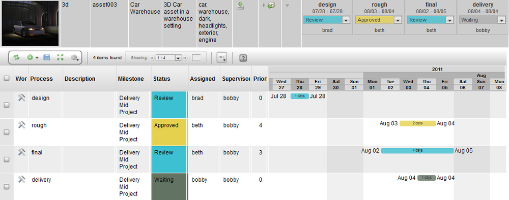

# Hidden Row

**Description**

The HiddenRowToggleWdg is used to add a cell to a table which when toggled, exposes a hidden view. This vew supports the embedding the following Widgets:

-   TableLayoutWdg

-   CustomLayoutWdg

-   ViewPanelWdg

**Info**

<table>
<colgroup>
<col width="28%" />
<col width="71%" />
</colgroup>
<tbody>
<tr class="odd">
<td>
<strong>Name</strong>
</td>
<td>
HiddenRowToggleWdg
</td>
</tr>
<tr class="even">
<td>
<strong>Common Title</strong>
</td>
<td>
Hidden Row
</td>
</tr>
<tr class="odd">
<td>
<strong>Class</strong>
</td>
<td>
tactic.ui.table.HiddenRowToggleWdg
</td>
</tr>
<tr class="even">
<td>
<strong>Category</strong>
</td>
<td>
Table Layout Widget
</td>
</tr>
<tr class="odd">
<td>
<strong>Supported Interfaces</strong>
</td>
<td>
TableLayoutWdg
</td>
</tr>
<tr class="even">
<td>
<strong>TACTIC Version Support</strong>
</td>
<td>
3.0.0 <code>+</code>
</td>
</tr>
<tr class="odd">
<td>
<strong>Required database columns</strong>
</td>
<td>
none
</td>
</tr>
</tbody>
</table>

**Usage**

The HiddenRowToggleWdg is primarily a configuration tool which provides very simple usage for the user. By clicking the expand arrow, the hidden row will expand. Also, to batch expand the same HiddenRow for multiple rows in the table, select the desired rows (SObjects) and in the table header, do one of the following:

Click the triangle to expand or collapse the HiddenRow for the selected SObjects.

**Options**

<table>
<colgroup>
<col width="28%" />
<col width="71%" />
</colgroup>
<tbody>
<tr class="odd">
<td>
<strong>dynamic_class</strong>
</td>
<td>
The class to embed in the hidden row
</td>
</tr>
<tr class="even">
<td>
<strong>static</strong>
</td>
<td>
The view is loaded when the page loads
</td>
</tr>
<tr class="odd">
<td>
<strong>parent_key</strong>
</td>
<td>
The parent key of the parent SObject (Internal)
</td>
</tr>
</tbody>
</table>

**Advanced**

    The following HiddenRowToggleWdg is defined in the definition view for a prod/sequence. The embedded table shows a view of prod/shot SObjects in a view called shot_hierarchy

      <element name='shots'>
        <display class='HiddenRowToggleWdg'>
          <dynamic_class>tactic.ui.panel.TableLayoutWdg</dynamic_class>
            <search_type>prod/shot</search_type>
            <view>shot_hierarchy</view>
            <mode>simple</mode>
            <do_search>true</do_search>
            <show_row_select>false</show_row_select>
        </display>
      </element>

    The following HiddenRowToggleWdg is used to show a view of prod/asset SObjects which have been planned (assiciated) to a prod/shot SObject. In this case, the available <expression/> option is used in the TableLayoutWdg to get the assets by traversing through the follwoing search types:

    prod/shot -> prod/shot_instance -> prod/asset
      <element name='assets'>
        <display class='HiddenRowToggleWdg'>
          <dynamic_class>tactic.ui.panel.TableLayoutWdg</dynamic_class>
            <search_type>prod/asset</search_type>
            <view>assets_hierarchy</view>
            <expression>@SOBJECT(prod/shot_instance.prod/asset)</expression>
            <mode>simple</mode>
            <do_search>true</do_search>
            <show_row_select>false</show_row_select>
        </display>
      </element>

    The following example shows how the dynamic_class is used to point to which widget to use in the hidden row.

      <element name='tasks'>
        <display class='HiddenRowToggleWdg'>
          <dynamic_class>tactic.ui.panel.TableLayoutWdg</dynamic_class>
            <search_type>sthpw/task</search_type>
            <view>task_hierarchy</view>
            <mode/>
            <do_search>true</do_search>
            <show_row_select>true</show_row_select>
        </display>
      </element>
