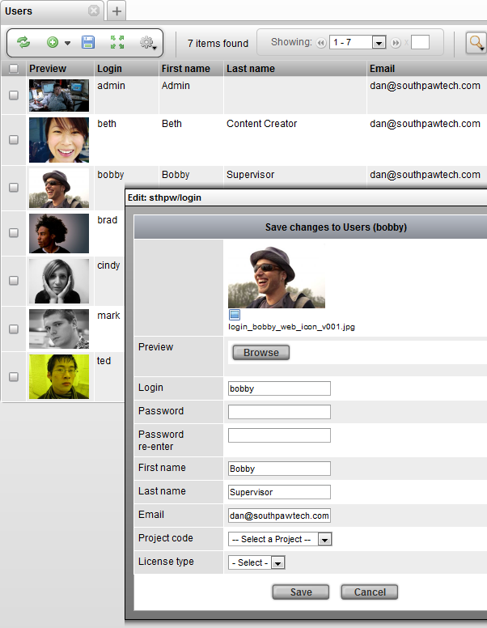
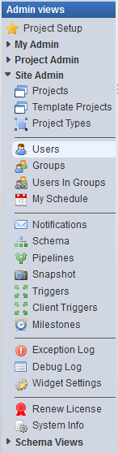
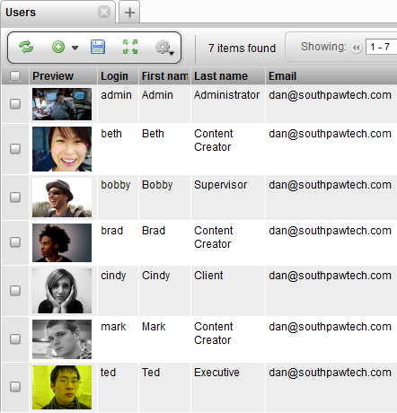

# Insert a New User

**Insert a New User**

**Users and Groups**

Login access to TACTIC is controlled by a user login system. In TACTIC,
users can also be assigned to groups, which are used to apply various
access rules.

> **Note**
>
> ActiveDirectory/LDAP can be used as the authentication method. Please
> refer to the index for those instructions.

User logins are tracked, as well as what transactions they executed.
This information allows for accountability throughout the system for all
users (i.e. "who did what and when").

To manage and insert users, open the **Users** view under Admin View→Site
Admin→Users.

This view shows the list of all TACTIC users in the system. You must add
users here for TACTIC to recognize them. To insert a new user, click on
the Insert button and fill out the appropriate fields.

To edit an existing user, right click on the row and select **Edit** from
the context menu. The user’s password can be set here.
