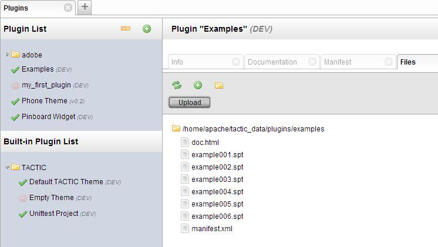
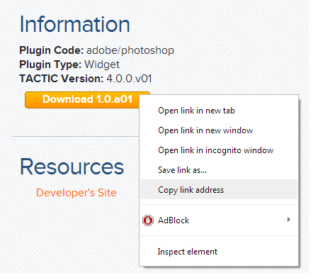
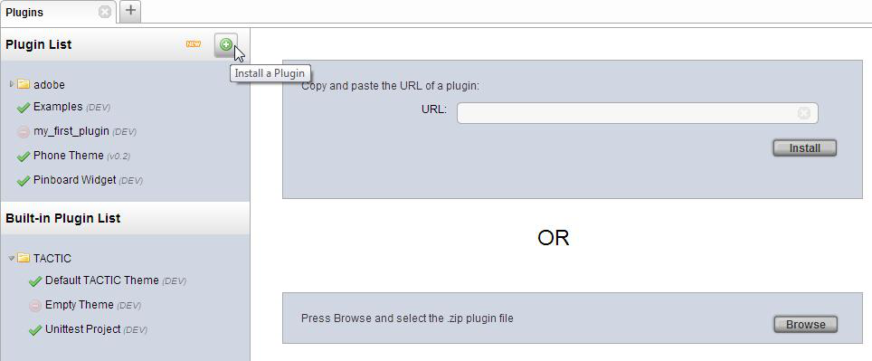

# Install and Activate

**Install and Activate**

**Plugin Manager**

The Plugin Manager is the primary tool for loading, unloading, deleting
and creating plugins.

To open the Plugin Manager, go to:

**sidebar → Admin views → Project → Plugins**

**How to Install a Plugin**

Plugins are installed through the Plugin Manager. When a plugin is
installed, the plugin’s .zip file is placed in the
&lt;TACTIC\_DATA\_DIR&gt;/dist and the contents are extracted to the
&lt;TACTIC\_DATA\_DIR&gt;/plugin directory.

There are two ways to install a plugin, one way is through the URL. This
involves copying the link address of the .zip file from the plugin page.
You can then paste the URL back in tactic and press **Install**.

The other way to install a plugin is to browse for the .zip file. Once
the Plugin Manager is open, do the following:

-   click on the green plus "+" button to open the panel

-   click on the **Browse** and select the .zip file you have downloaded.

**How to Activate a Plugin**

Plugins are activated through the Plugin Manager.

Once the plugin is installed (see section above on installing a plugin)
the plugin will appear in the Plugin List.

In order to use a plugin in a particular project, it must be activated.
"Activation" of a plugin will register the plugin and import any
configuration as specified in the .spt file. Since each project has its
own set of independent plugins, it is possible that different plugins
versions are active on different projects. However, only one version of
a plugin may be active at a time on any given project. This allows you
to have several different plugins installed in Tactic but you select
which ones you want to have active in the project you are working on.

To activate a plugin, in the Plugin Manager, select the plugin from the
Plugin List. The panel on the right will open.

In the new panel, select **Info** from the list of tabs and click on the
**Activate** button.

**Multiple versions of the same plugin**

A TACTIC installation can have multiple different versions of the same
plugin installed, but only one version of the plugin can be active on a
single project. For the most part, different projects can have different
plugins active without interference. Because of the flexibility of
TACTIC and TACTIC’s plugins, it is entirely possible to break this, so
care must be taken to write self-contained plugins that will not
interfere with others.

**Updating a plugin**

Plugins can be updated simply by deactivating an older version and
activating a new version of the plugin. Most plugins should have no
trouble with this, however, it is possible that any given plugin
requires special instructions. Refer to the documentation of the
individual plugin for more details if any exist.
