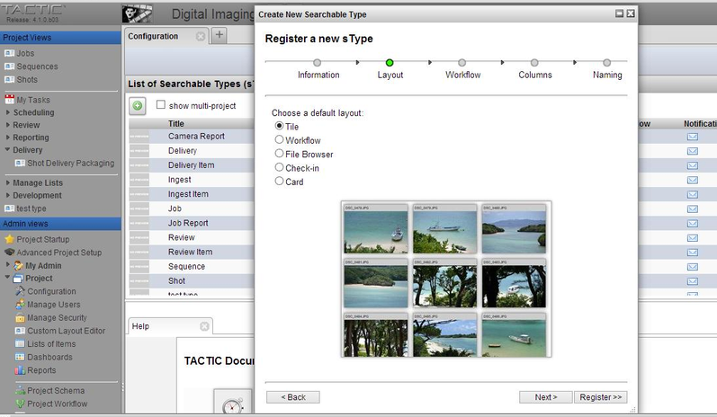
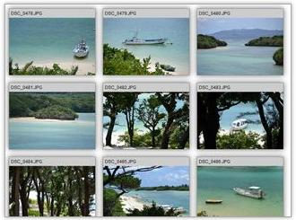
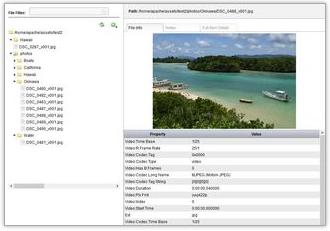
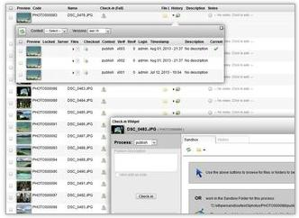
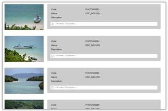

# sType Creation: Option for default layout

Default layout is an option in the Register a New sType Wizard. It
selects the default layout to view for the sType. There are five options
available: Tile, Workflow, File Browser, Check-in and Card.

**Tile**

**File Browser**

**Check-in**

**Card**

