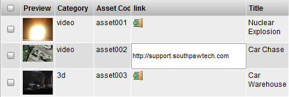

# Link Element

**Description**

The Link Element Widget facilitates creation of a hyperlink. Clicking on
the link button opens the hyperlink in a new tab in the web browser.

**Info**

<table>
<colgroup>
<col width="28%" />
<col width="71%" />
</colgroup>
<tbody>
<tr class="odd">
<td>
<strong>Name</strong>
</td>
<td>
Link Element
</td>
</tr>
<tr class="even">
<td>
<strong>Common Title</strong>
</td>
<td>
Link
</td>
</tr>
<tr class="odd">
<td>
<strong>Class</strong>
</td>
<td>
Link
</td>
</tr>
<tr class="even">
<td>
<strong>TACTIC Version Support</strong>
</td>
<td>
3.0.0 

</td>
</tr>
<tr class="odd">
<td>
<strong>Required database columns</strong>
</td>
<td>
none
</td>
</tr>
</tbody>
</table>

**Usage**

Go into edit mode for the Link column. Specify the full URL to a
hyperlink, such as: <http://support.southpawtech.com>.

Save the data and refresh the view.

Click on the link icon and the link to the web page will be opened in a
new tab.

**Implementation**

The Link Element Widget can be created using the Create New Column and
specifying: Display → Widget → **Link**.

**Options**

The ability to specify a customize icon to appears in the row.

**Advanced**

    <element name="link" title="link" edit="true" color="false">
      <display widget="link"/>
    </element>
