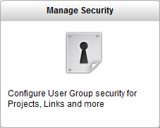
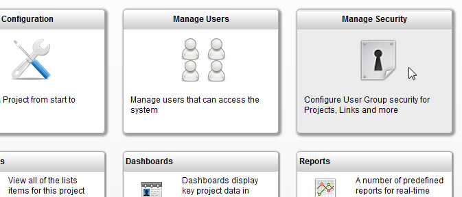
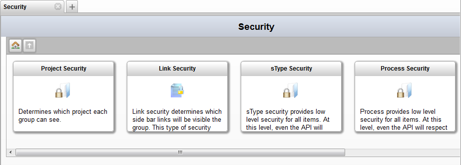
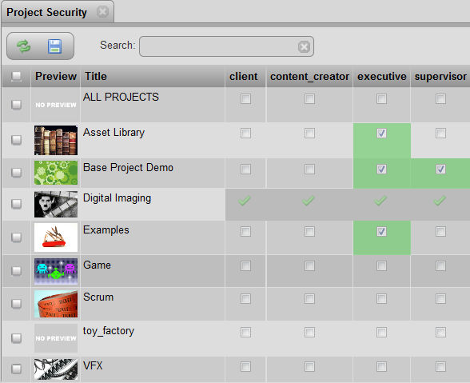
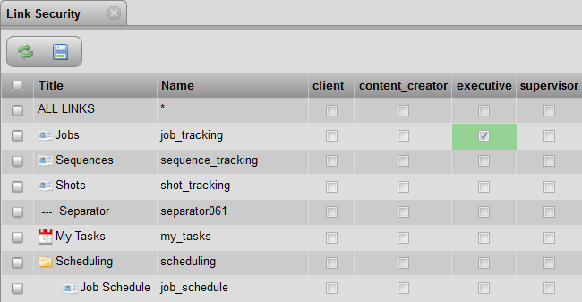
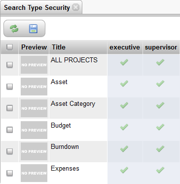
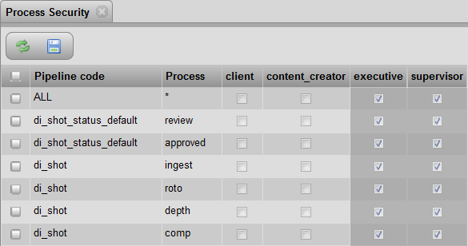
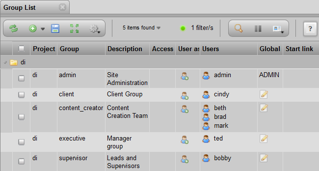
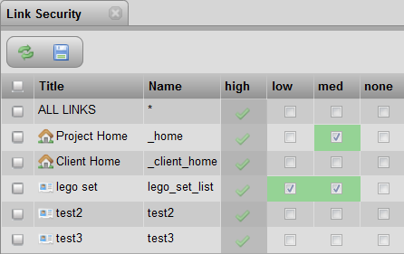

# Manage Security

This document only applies to security level 2. This security level can
be set in the TACTIC config file.

To open the **Manage Security** view, go to the sidebar under:

**Project Startup → Manage Security**

> **Note**
>
> The default security level for a fresh install of TACTIC 3.7 is security
> level 1.
>
> The default security level for a fresh install of TACTIC 3.8 is security
> level 2.
>
> If upgrading from TACTIC 3.7 to 3.8, the security level is not affected
> (and will probably be level 1).
>
> The security level can be set in the TACTIC config file.

In the **Manage Security** view, the following tools are provided:

<table>
<colgroup>
<col width="26%" />
<col width="73%" />
</colgroup>
<tbody>
<tr class="odd">
<td>
<strong>Project Security</strong>
</td>
<td>
Determines which project each group can see. Each project is listed with checkboxes for each group. Adding a checkmark allows the users associate with that group to see the project.

</td>
</tr>
<tr class="even">
<td>
<strong>Link Security</strong>
</td>
<td>
Determines which side bar links will be visible to the group. This type of security applies only to the interface.

<strong>Note</strong>

If no columns of groups (eg. client, content_creator, etc.) appear in this view, go to Project Security and allow some groups to view the current project.
</td>
</tr>
<tr class="odd">
<td>
<strong>sType Security</strong>
</td>
<td>
Provides low level security for all items. At this level, even the API will respect these security levels.

<strong>Note</strong>

If no columns of groups (eg. client, content_creator, etc.) appear in this view, go to Project Security and allow some groups to view the current project.
</td>
</tr>
<tr class="even">
<td>
<strong>Process Security</strong>
</td>
<td>
Provides low level security for all items. At this level, even the API will respect these security levels..

</td>
</tr>
<tr class="odd">
<td>
<strong>Groups List</strong>
</td>
<td>
Lists all the groups. The following fields can be modified: <strong>group, description, users, global access ruls, start link</strong>

</td>
</tr>
</tbody>
</table>

**Understanding Predefined Security Access Levels**

TACTIC provides a set of predefined security access levels (i.e. none,
low, medium, high) to make it easier to start setting up what a group
can see. Associating a group with an access levels presets all the
security settings. After that, the administrator can return the Managing
Security tool to allow further access in addition to the presets. The
presets are outlined in the table below. By default, when an access
level is not manually provided for a group, a low access level is
assigned.

*Description of Access Privileges*

<table>
<colgroup>
<col width="36%" />
<col width="50%" />
<col width="13%" />
</colgroup>
<tbody>
<tr class="odd">
<td>
access level: <strong>none</strong>
</td>
<td>
Can see some projects?

Can see all the links in the sidebar?

Can see all the processes?

Can see all search types?
</td>
<td>
No

No

No

No
</td>
</tr>
<tr class="even">
<td>
access level: <strong>min</strong>
</td>
<td>
Can see some projects?

Can see all the links in the sidebar?

Can see all the processes?

Can see all search types?
</td>
<td>
Yes

No

No

Yes
</td>
</tr>
<tr class="odd">
<td>
access level: <strong>low</strong>
</td>
<td>
Can see some projects?

Can see all the links in the sidebar?

Can see all the processes?

Can see all search types?
</td>
<td>
Yes

No

Yes

Yes
</td>
</tr>
<tr class="even">
<td>
access level: <strong>medium</strong>
</td>
<td>
Can see all projects?

Can see all the links in the sidebar?

Can see all the processes?

Can see all search types?
</td>
<td>
Yes No

Yes

Yes
</td>
</tr>
<tr class="odd">
<td>
access level: <strong>high</strong>
</td>
<td>
Can see all projects?

Can see all the links in the sidebar?

Can see all the processes?

Can see all search types?
</td>
<td>
Yes

Yes

Yes

Yes
</td>
</tr>
</tbody>
</table>

> **Note**
>
> In the **Group List** view, if the field name **Project Code** is left
> empty, then the group can see all the projects.
>
> If the field named **Project Code** is filled in, then the access rules
> are specific to that project.

**How the Access Levels are Built Up**

To better understand the differences between the Access Levels, the
following is an explanation of how the levels were built up:

Access Level **None**: cannot see anything. Need to use Security tools, as
shown in the "What the Manage Security View Provides" section, to define
fully customized group security i.e. Project, Link, sType and Process
Security tools

Access Level **Min**: Can see some *projects* and *sTypes*.

Access Level **Low**: Default Access Level. Can see what **min** sees and
all the *processes*.

Access Level **Medium**: Can see what **low** sees and all the *projects*.

Access Level **High**: Can see what **medium** sees and all the *links*.

**Where To Find the Access Levels**

To set the access level for a group go to the sidebar under:

**Project Startup → Manage Security → Groups List → Access Level**

**The Different Check Mark Indicators**

The solid green check mark indicates that a privilege is due to the
Access Level associated to the group that the user is in. In order to
remove the green check mark, the user must be removed from this group or
the group’s Access Level must be changed.

If additional privileges are added, the check marks are blue with a
green background.

In the screen shot below, the group (named 'high') is the only group
with Access Level **High**. The TACTIC Administrator added the other
privileges for the other groups.

For more advanced access control (such as controlling access to edit
individual columns), please see the setup doc title: **Advanced Access
Rule Configuration**
