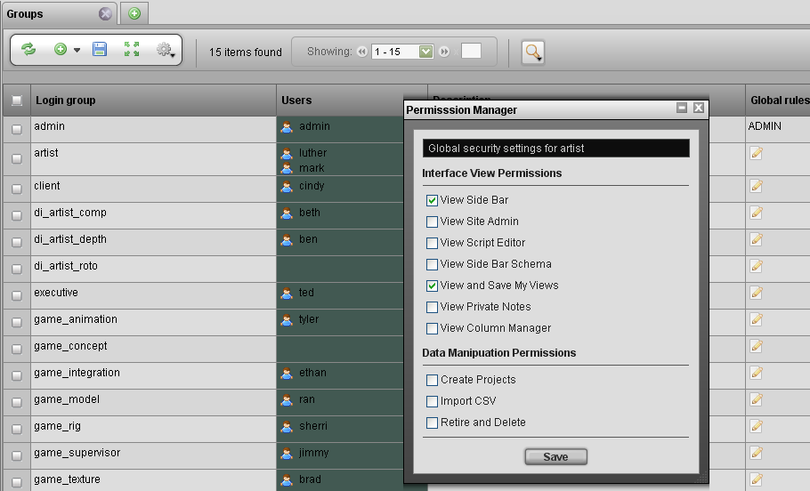
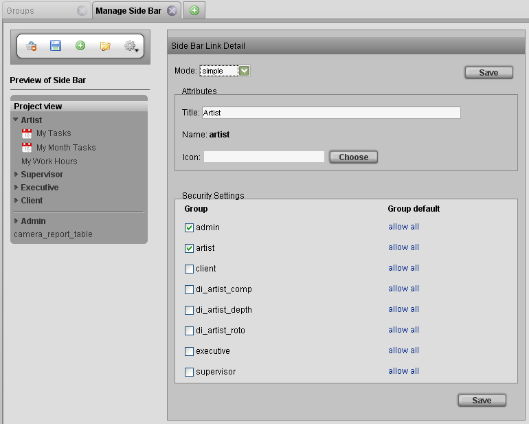

# Managing Access Rules

**TACTIC Security**

All information in TACTIC goes through a series of security checks that
are built into the lowest level of the software. The security
architecture is a rules-based system where an access request to any
piece of information must satisfy all the rules before the user gains
access to it.

Each user has a login. User logins are assigned to groups, and each
group can have a number of access rules attached to it. These rules
determine what a user is permitted to see and do in TACTIC. At the base
level, these permissions are XML structured rules that are stored in the
"access\_rules" property of a group SObject. Although inserting these
rules directly into the XML code allows for the most flexibility for the
project manager, there are various other aspects of the TACTIC interface
that can also assist in the rule creation process.

**Managing Rules**

The "groups" search type contains a property (available in the column
manager) named "Global rules." When this property is included in the
view, a click-able button is available to load the global rules pop-up.
This pop-up provides several predefined global access rules that can be
applied to the group:

<table>
<colgroup>
<col width="50%" />
<col width="50%" />
</colgroup>
<thead>
<tr class="header">
<th><strong>View Side Bar</strong></th>
<th>View access for the complete side bar.</th>
</tr>
</thead>
<tbody>
<tr class="odd">
<td>
<strong>View Site Admin</strong>
</td>
<td>
Allow access to see the &quot;Site Admin&quot; section of the side bar.
</td>
</tr>
<tr class="even">
<td>
<strong>View Script Editor</strong>
</td>
<td>
Access to the Script Editor
</td>
</tr>
<tr class="odd">
<td>
<strong>View Side Bar Schema</strong>
</td>
<td>
Allow access to the schema section of the side bar.
</td>
</tr>
<tr class="even">
<td>
<strong>View and Save My Views</strong>
</td>
<td>
Save personal My Views
</td>
</tr>
<tr class="odd">
<td>
<strong>View Private Notes</strong>
</td>
<td>
Allow viewing of private notes.
</td>
</tr>
<tr class="even">
<td>
<strong>View Column Manager</strong>
</td>
<td>
Allow viewing of the column manager
</td>
</tr>
</tbody>
</table>

<table>
<colgroup>
<col width="50%" />
<col width="50%" />
</colgroup>
<thead>
<tr class="header">
<th><strong>Create Projects</strong></th>
<th>Allow creating of new projects.</th>
</tr>
</thead>
<tbody>
<tr class="odd">
<td>
<strong>Import CSV</strong>
</td>
<td>
Import CSV Files.
</td>
</tr>
<tr class="even">
<td>
<strong>Retire and Delete</strong>
</td>
<td>
Allow the ability to retire and delete in the right-click context menu..
</td>
</tr>
</tbody>
</table>

To customize the options for these rules, click the edit icon in the
Global Permissions column for the desired group. From the rule selection
pop-up that appears, select one of the options. When you click the save
button, they are committed to the access rule XML for the chosen group.

**Side bar Manager Security**

You can select which groups can see each of the links in the TACTIC side
bar manager.

The Element Detail window lists all groups in the system. Check any
group to allow access (or uncheck to deny access). When you click the
**Save Definition** button, your changes are saved to each group’s
"access\_rules" property. To view your changes in the XML code for any of
the groups, navigate to a group view which has the "access\_rules"
property column.
