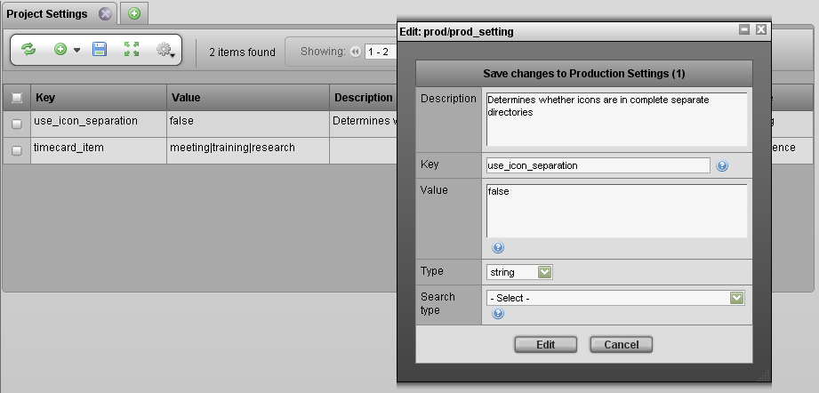

# Modify Project Settings

Use the Project Settings tab to control the various options that exist
within TACTIC. Most project settings are defined to work with the
widgets that use them and when defined, the "Type" property specifies
how the "Value" property is delivered to the widget. The different types
of settings are outlined below.

-   String - A single string argument, this may be a true/false to define
    how a widget is displayed (i.e. hide a specific aspect)

-   Sequence - A sequence of items to choose from for entry (i.e. review|revise|complete)

-   Map - A map is a sequence in which each item has a label and name assignment. This accommodates a separation between what is shown in a
    drop-down \[name\] vs what is entered into the database \[label\] (i.e. rvw:Review|rev:Revise|com:Complete)

> **Note**
>
> The overall items in the sequence or map are separated with a pipe '|'
> character and the value:label are separated with a Colin ':' character

Most settings are types of "sequences" that appear in TACTIC as a
drop-down. For example, the notes\_dailies\_context setting defines the
different kinds of context you can use in entering notes for dailies.

To insert a project setting, click the insert button in the view.

The properties for the project setting search type are listed below:

<table>
<colgroup>
<col width="23%" />
<col width="76%" />
</colgroup>
<thead>
<tr class="header">
<th><strong>Description</strong></th>
<th>A description of the purpose of the project settings</th>
</tr>
</thead>
<tbody>
<tr class="odd">
<td>
<strong>Key</strong>
</td>
<td>
This property serves as the 'code' identifier of the setting
</td>
</tr>
<tr class="even">
<td>
<strong>Value</strong>
</td>
<td>
The Values for the setting.
</td>
</tr>
<tr class="odd">
<td>
<strong>Type</strong>
</td>
<td>
The 'type' of data definition of the value data. This tells the widget begin delivered the value how the data should be displayed.
</td>
</tr>
<tr class="even">
<td>
<strong>Search Type</strong>
</td>
<td>
A search type to associate the project setting to, this help further filter the settings.
</td>
</tr>
</tbody>
</table>

Any widgets that make use of a new project setting not yet defined in
TACTIC will prompt the user to insert data for a new project setting.

**Commonly Project Setting Examples**

This table lists the some commonly used project settings in TACTIC.

<table>
<colgroup>
<col width="34%" />
<col width="32%" />
<col width="16%" />
<col width="16%" />
</colgroup>
<thead>
<tr class="header">
<th><strong>key</strong></th>
<th>Description</th>
<th>Default Value</th>
<th>Type</th>
</tr>
</thead>
<tbody>
<tr class="odd">
<td>
<strong>flash_output_format</strong>
</td>
<td>
Output format for a Flash project, swf OR mov
</td>
<td>
swf
</td>
<td>
string
</td>
</tr>
<tr class="even">
<td>
<strong>fps</strong>
</td>
<td>
Frames per second
</td>
<td>
24
</td>
<td>
string
</td>
</tr>
<tr class="odd">
<td>
<strong>handle_texture_dependency</strong>
</td>
<td>
Handle texture dependencies when performing a checkin in a 3D application. Accepted values are 'true', 'false', 'optional'.
</td>
<td>
true
</td>
<td>
string
</td>
</tr>
<tr class="even">
<td>
<strong>notes_dailies_context</strong>
</td>
<td>
Notes context used in the Dailies tab
</td>
<td>
anim|effects|model
</td>
<td>
sequence
</td>
</tr>
<tr class="odd">
<td>
<strong>shot_hierarchy</strong>
</td>
<td>
Shot hierarchy structure. Accepted values are 'episode_sequence' or 'sequence'.
</td>
<td>
sequence
</td>
<td>
string
</td>
</tr>
<tr class="even">
<td>
<strong>bin_label</strong>
</td>
<td>
Label for a Bin
</td>
<td>
n/a
</td>
<td>
string
</td>
</tr>
<tr class="odd">
<td>
<strong>bin_type</strong>
</td>
<td>
Type of Bin
</td>
<td>
n/a
</td>
<td>
string
</td>
</tr>
<tr class="even">
<td>
<strong>web_file_size</strong>
</td>
<td>
dimension of the web type file size, e.g. 640x480
</td>
<td>
640x480
</td>
<td>
string
</td>
</tr>
<tr class="odd">
<td>
<strong>thumbnail_protocol</strong>
</td>
<td>
The protocol through which the link of a thumbnail is opened. Accepted values are 'file', 'http'.
</td>
<td>
http
</td>
<td>
string
</td>
</tr>
<tr class="even">
<td>
<strong>versionless_mode</strong>
</td>
<td>
The global setting for copy or symlink for versionless check-ins
</td>
<td>
copy
</td>
<td>
string
</td>
</tr>
</tbody>
</table>

