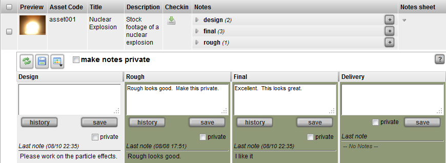

# Note Sheet Widget

**Description**

The Note Sheet Widget allows entering of many notes in different
contexts and different parents at the same time. It can be used for
entering notes for any search types. By default, it uses the parent’s
pipeline processes as the contexts for note entry. Notes can be saved
either individually or altogether. There is an option to make a note
private as well.

**Info**

<table>
<colgroup>
<col width="28%" />
<col width="71%" />
</colgroup>
<tbody>
<tr class="odd">
<td>
<strong>Name</strong>
</td>
<td>
Note Sheet Widget
</td>
</tr>
<tr class="even">
<td>
<strong>Common Title</strong>
</td>
<td>
Note Sheet
</td>
</tr>
<tr class="odd">
<td>
<strong>Class</strong>
</td>
<td>
tactic.ui.app.NoteSheetWdg
</td>
</tr>
<tr class="even">
<td>
<strong>Category</strong>
</td>
<td>
Table Element Widget
</td>
</tr>
<tr class="odd">
<td>
<strong>Supported Interfaces</strong>
</td>
<td>
TableLayoutWdg
</td>
</tr>
<tr class="even">
<td>
<strong>TACTIC Version Support</strong>
</td>
<td>
2.5.0 

</td>
</tr>
<tr class="odd">
<td>
<strong>Required database columns</strong>
</td>
<td>
none
</td>
</tr>
</tbody>
</table>

**Usage**

When used with regular sTypes with its pipeline\_code set, the Note Sheet
Widget automatically displays the pipeline processes as note context
options. Each enabled context is marked with a check in the check box,
which goes along with a text box for note entry. Indicate which contexts
display for input by selecting the appropriate check boxes. When used
with a child search\_type like a task, the Note Sheet Widget assumes its
context attribute as the note context.

Clicking on "**save**" icon will save all of the notes together for this
parent. To save one note at a time, click on the individual **save**
button under the corresponding note.

The private check box turns a note access as private if checked. The
history button is used to display all the note entries for a context.

**Implementation**

The Note Sheet Widget is a common column that can be added using the
Column Manager.

**Options**

<table>
<colgroup>
<col width="28%" />
<col width="71%" />
</colgroup>
<thead>
<tr class="header">
<th><strong>dynamic_class</strong></th>
<th>Set the class name of the widget to be displayed</th>
</tr>
</thead>
<tbody>
<tr class="odd">
<td>
<strong>pipeline_code</strong>
</td>
<td>
Specifies a particular pipeline_code to use or if the parent of this note sheet widget does not have the 'pipeline_code' attribute e.g. 'model'. If unspecified, it will be based on the pipeline_code value of its parent.
</td>
</tr>
<tr class="even">
<td>
<strong>element_class</strong>
</td>
<td>
To override the default element class NoteTableElementWdg, modify the look or add extra buttons to the UI to enter notes. One method is just to override the method get_action_wdg()
</td>
</tr>
<tr class="odd">
<td>
<strong>use_parent</strong>
</td>
<td>
When a note sheet is added to a sType like task or snapshot but it is set up so that the note is targeted at its parent, which could be an asset or shot. If so, set this display option to true.
</td>
</tr>
<tr class="even">
<td>
<strong>append_context</strong>
</td>
<td>
Used to add contexts that are not defined in the pipeline. Separate the contexts with a pipe character if there are more than one, e.g. producer
</td>
</tr>
</tbody>
</table>

**Advanced**

    <element name="notes_sheet" edit="false">
        <display class="HiddenRowToggleWdg">
            <dynamic_class>tactic.ui.app.NoteSheetWdg</dynamic_class>
        </display>
    </element>
