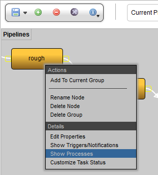
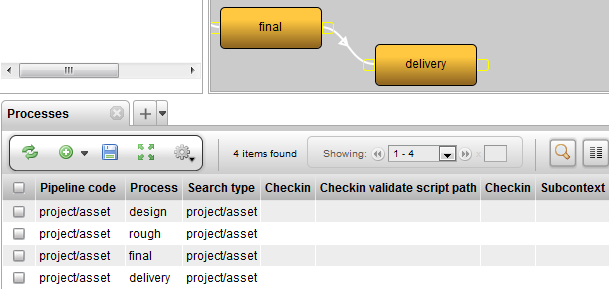

# Pipeline Process Options

Each node has a number of properties that can be set. These properties
may be used by TACTIC to derive useful information. These properties
are:

<table>
<colgroup>
<col width="16%" />
<col width="83%" />
</colgroup>
<tbody>
<tr class="odd">
<td>
<strong>Task Status Pipeline</strong>
</td>
<td>
Selects from a list of 'Task Status Pipelines' to connect the selected process to. This accommodates a separate set of statuses for the specific process. These pipelines are defined the same way other pipelines are. The only difference is that these pipelines are assigned to the sthpw/task sType. This property represents the &quot;code&quot; property of the task pipeline.
</td>
</tr>
<tr class="even">
<td>
<strong>Assign Login Group</strong>
</td>
<td>
Specifies the process to a particular group of artists.
</td>
</tr>
<tr class="odd">
<td>
<strong>Supervisor Login Group</strong>
</td>
<td>
Specifies the process to a particular group of supervisors.
</td>
</tr>
<tr class="even">
<td>
<strong>Default Duration</strong>
</td>
<td>
Set the a duration schedule (in days) of the process.
</td>
</tr>
<tr class="odd">
<td>
<strong>Color</strong>
</td>
<td>
The color to represent the process in the GUI. For example the Task Status Widget can be setup to display the color of the process.
</td>
</tr>
<tr class="even">
<td>
<strong>Label</strong>
</td>
<td>
Add a label for the process.
</td>
</tr>
</tbody>
</table>

To open the **Edit Properties** pop-up, select a node and then click on
the **Properties** button on the tools shelf:

Further process options can be found by right clicking on the node in
the:

**Pipeline Editor → Show Processes**

The **Processes** tab will appear in the panel at the bottom:

<table>
<colgroup>
<col width="16%" />
<col width="83%" />
</colgroup>
<thead>
<tr class="header">
<th><strong>Pipeline Code</strong></th>
<th>eg. project/asset</th>
</tr>
</thead>
<tbody>
<tr class="odd">
<td>
<strong>Process</strong>
</td>
<td>
eg. design, rough, finale, delivery, etc.
</td>
</tr>
<tr class="even">
<td>
<strong>Search Type</strong>
</td>
<td>
eg. project/asset
</td>
</tr>
<tr class="odd">
<td>
<strong>Checkin Mode</strong>
</td>
<td>
File
</td>
</tr>
<tr class="even">
<td>
Directory
</td>
<td>
Sequence
</td>
</tr>
<tr class="odd">
<td>
Multiple Files
</td>
<td>
<strong>Checkin Validate Script Path</strong>
</td>
</tr>
<tr class="even">
<td>
Path to a script which is run upon checkin for validation.
</td>
<td>
<strong>Checkin Options View</strong>
</td>
</tr>
<tr class="odd">
<td>
Advanced custom layout to be used for checkin view.
</td>
<td>
<strong>Subcontext</strong>
</td>
</tr>
</tbody>
</table>

