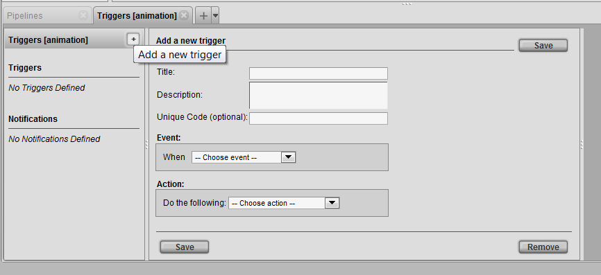
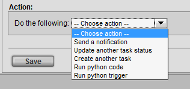

# Project Automation - Triggers

Triggers are events that are called upon a transaction to automate
workflow. These triggers can be accessed within the Project Workflow
view.

**Admin Viwes → Project Admin → Project Workflow**

Each process in the pipeline can have their own triggers. Right clicking
on a process and choosing **show notification/trigger** option will open a
tab to define a trigger for that specific process.

The trigger tab will also display the assigned process. Clicking the
insert button will open the trigger UI.

<table>
<colgroup>
<col width="16%" />
<col width="84%" />
</colgroup>
<thead>
<tr class="header">
<th><strong>Title</strong></th>
<th>Title of the trigger.</th>
</tr>
</thead>
<tbody>
<tr class="odd">
<td>
<strong>Description</strong>
</td>
<td>
Description of the trigger.
</td>
</tr>
<tr class="even">
<td>
<strong>Unique Code</strong>
</td>
<td>
[multiblock cell omitted]
</td>
</tr>
<tr class="odd">
<td>
<strong>Event</strong>
</td>
<td>
Drop down list of trigger events. This event is where the trigger is called.
</td>
</tr>
<tr class="even">
<td>
<strong>Action</strong>
</td>
<td>
The action is what the event will
</td>
</tr>
</tbody>
</table>

**EVENT**

The Events drop down list provides a wide range of different triggers.

Depending on the trigger the Event box may show additional options.

**A new note is added** - This Event will be called when a new note is
inserted into the process.

**A task status is changed** - This event will be called when a status is
changed. The event box also gives a additional option to choose specific
status.

**A task is assigned** - This event will be called when any task in the
specified process is assigned.

**Files are checked in** - This event will be called when there is a
checkin to the specified trigger. This event also gives a additional
option to choose what process the action will effect.

**Files are checked out**- This event will be called when there is a
checkout to the specified trigger.

**Cusom Event** -

**ACTION**

The Action drop down list provides a series of predifined actions that
work with the above events.

**Send a notification** - See project automation notification docs.

**Update another task status** - This action will update a task status.
This action also opens additional options to update status of current
and other process of the pipeline as well as the option of status.

**Create another task** - This Action will create a task upon event. This
action also opens additional options to choose from creating a task in
current or next process.

**Run python code** - This Action will run python code upon event. The
action box opens additional options to name and insert a python code.

**Run python trigger** - This Action will run python trigger upon event.
The action box opens additional option to insert the name of the
trigger. These can be custom written scripts that can be called from
Tactic’s API.

When satisfied with the options set to run a trigger, the trigger must
be saved in order to be applied. When the trigger is saved the title of
the trigger will appear benieth the triggers panel.

There are no limitations of how many triggers you can have. Each process
can have multiple triggers applied.
