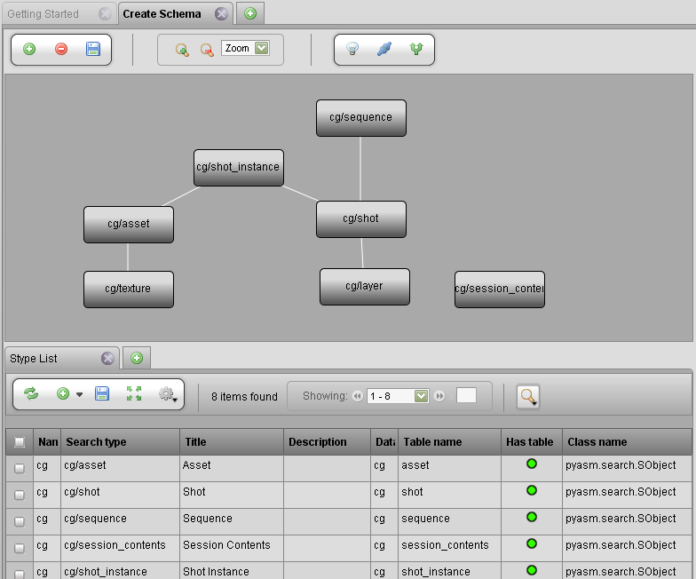
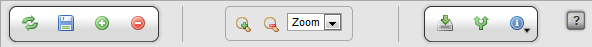
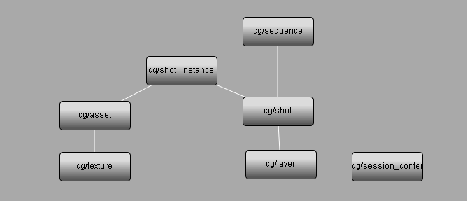
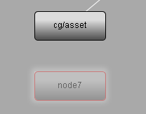
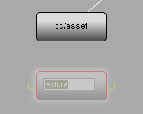
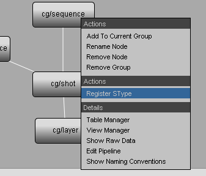
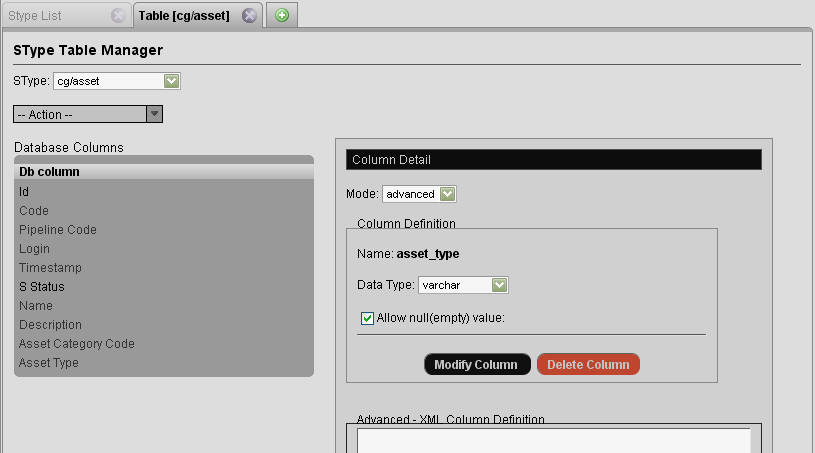
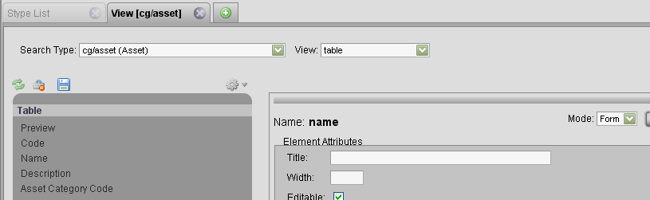
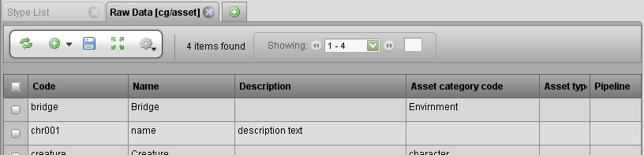
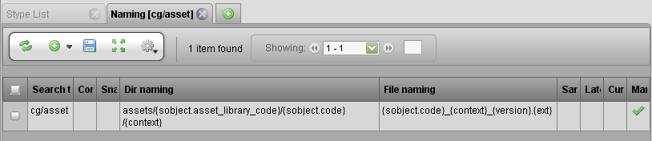

# Project Schema

The project schema is used to create structure or a "data model" of a
project. The Schema view defines the type of items managed by using a
visual graphical node editor. The Schema Editor displays the layout of
the created sTypes and the connections between them.

The Project Schema Editor is available through the Getting Started link
in the side bar which is available after creating a project, or under
the Admin Views under Project Admin → Project Schema in the side bar.

The Project Schema editor is an essential tool used for the creation of
new project templates. This editor is used to layout the various types
of objects (files, assets) that will be managed and produced on a
project. These types (sTypes) are searchable within TACTIC. Node based
layout and work-flow, allows for simple manipulation and creation of
these various sTypes and their relationships to each other.

**Editor Button Shelf**

**Main Editor Buttons**

<table>
<colgroup>
<col width="50%" />
<col width="50%" />
</colgroup>
<tbody>
<tr class="odd">
<td>
<strong>Add</strong>
</td>
<td>
Add a new node to the canvas. This represents an unregistered sType
</td>
</tr>
<tr class="even">
<td>
<strong>Delete</strong>
</td>
<td>
Delete the selected nodes or connections from the canvas
</td>
</tr>
<tr class="odd">
<td>
<strong>Save</strong>
</td>
<td>
Save all changes to the schema
</td>
</tr>
</tbody>
</table>

**Editor Zoom Controls**

<table>
<colgroup>
<col width="50%" />
<col width="50%" />
</colgroup>
<tbody>
<tr class="odd">
<td>
<strong>Zoom In</strong>
</td>
<td>
Zoom the canvas in
</td>
</tr>
<tr class="even">
<td>
<strong>Zoom Out</strong>
</td>
<td>
Zoom the canvas out
</td>
</tr>
<tr class="odd">
<td>
<strong>Zoom Options</strong>
</td>
<td>
Allow for choosing the zoom level.
</td>
</tr>
</tbody>
</table>

**Node Options (Applies to the selected nodes or connections)**

<table>
<colgroup>
<col width="50%" />
<col width="50%" />
</colgroup>
<tbody>
<tr class="odd">
<td>
<strong>Register sType</strong>
</td>
<td>
Registers the selected nodes as new Searchable Types using the registration wizard. If more than one node is selected, the sTypes will be registered in batch.
</td>
</tr>
<tr class="even">
<td>
<strong>Edit Connection</strong>
</td>
<td>
Load the connection editor pop-up.
</td>
</tr>
<tr class="odd">
<td>
<strong>Edit Pipelines</strong>
</td>
<td>
Load the Project Work-flow (pipeline) editor.
</td>
</tr>
</tbody>
</table>

**Laying out the sTypes**

To create a new Searchable Type (sType) in the schema, add a new node to
the canvas using the \[+\] button in the editor. It’s also possible to
create a new node from an existing node by simply dragging a connection
line from the output handle of the existing node.

Once the type has been created on the canvas, it can be renamed by right
clicking on the node or using a "CTRL-click" on the node.

> **Note**
>
> It is important to note that during this initial process, you are
> creating a "blueprint" for your project. The next steps are to
> **register** the sTypes. Each sType in TACTIC is represented as a table in
> the project database, this table is required to go through a
> registration process. This process will generate the table as well as
> provide the opportunity to add columns (properties), a pipeline, default
> views for the sidebar and more.

**Workflow (Pipelines)**

Where applicable, you can add the pipeline attribute to a search type to
allow for association of the sObjects to a particular pipeline. Having a
pipeline assigned allows an sObject to travel through a set number of
processes. For each of these processes, a task can be created and
assigned to a user, files can be checked in, notes can be submitted and
work hours can be logged.

By choosing "Has Pipeline" on creation, an extra "pipeline\_code"
property will be added to store pipeline associations and a Pipeline
will be created and registered for the new sType.

> **Note**
>
> To edit the pipeline, you can click the pipeline link in the top of the
> editor or, in the sidebar navigate to Project Admin → Project Workflow.

**Node Options**

Once registered, each node provides options for further configuration of
sType related project setup and configuration, which can be executed
through the main shelf buttons or by right-clicking on a node:

**Editor Actions**

<table>
<colgroup>
<col width="50%" />
<col width="50%" />
</colgroup>
<tbody>
<tr class="odd">
<td>
<strong>Add to Current Group</strong>
</td>
<td>
Adds the selected node(s) to the current group (pipeline)
</td>
</tr>
<tr class="even">
<td>
<strong>Rename Node</strong>
</td>
<td>
Rename the node (sType)
</td>
</tr>
<tr class="odd">
<td>
<strong>Remove Node</strong>
</td>
<td>
Remove the node (sType)
</td>
</tr>
<tr class="even">
<td>
<strong>Remove Group</strong>
</td>
<td>
Removes the group (pipeline)
</td>
</tr>
</tbody>
</table>

**Node Actions**

<table>
<colgroup>
<col width="50%" />
<col width="50%" />
</colgroup>
<tbody>
<tr class="odd">
<td>
<strong>Register sType</strong>
</td>
<td>
Loads the sType registration wizard
</td>
</tr>
</tbody>
</table>

**Node Options**

<table>
<colgroup>
<col width="50%" />
<col width="50%" />
</colgroup>
<tbody>
<tr class="odd">
<td>
<strong>Table Manager</strong>
</td>
<td>
Load the Database table manager for the selected type <em>(see &quot;Table Manager&quot; below)</em>
</td>
</tr>
<tr class="even">
<td>
<strong>View Manager</strong>
</td>
<td>
Loads the view manager for the selected sType <em>(see &quot;View Manager&quot; below)</em>
</td>
</tr>
<tr class="odd">
<td>
<strong>Show Raw Data</strong>
</td>
<td>
Loads the Raw database data in a table for the selected sType <em>(see &quot;Raw Data&quot; below)</em>
</td>
</tr>
<tr class="even">
<td>
<strong>Edit Pipeline</strong>
</td>
<td>
Loads the Workflow Editor allowing access to edit the pipelines related to the selected sType.
</td>
</tr>
<tr class="odd">
<td>
<strong>Show File Naming</strong>
</td>
<td>
Loads the file naming table for the selected sType <em>(see &quot;File Naming&quot; below)</em>
</td>
</tr>
</tbody>
</table>

**Table Manager**

**View Manager**

**Raw Data**

**File Naming**

