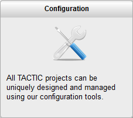

# Project Startup - Configuration

\\1) First, open the **Configuration View** under:

Project Startup → Configuration

\\2) In the **Project Configuration** view, the following tools are
provided (once the first Searchable Type has been created):

<table>
<colgroup>
<col width="26%" />
<col width="73%" />
</colgroup>
<tbody>
<tr class="odd">
<td>
<strong>View</strong>
</td>
<td>
Load the list of the items for that Search Type in the panel below. The drop down selection next to the View button switched the layout view between: Tile, List, Content, Task Schedule, Check-in, Overview, Tools.
</td>
</tr>
<tr class="even">
<td>
<strong>Add</strong>
</td>
<td>
Add new item to Search Type.
</td>
</tr>
<tr class="odd">
<td>
<strong>Import</strong>
</td>
<td>
Import items from a CSV file into that Search Type.
</td>
</tr>
<tr class="even">
<td>
<strong>Custom Columns</strong>
</td>
<td>
Add custom columns of a datatype to the Search Type.s
</td>
</tr>
<tr class="odd">
<td>
<strong>Workflow</strong>
</td>
<td>
Add processes to the workflow and specify the different Task Statuses
</td>
</tr>
<tr class="even">
<td>
<strong>Notifications</strong>
</td>
<td>
Add an email notification: on an event, perform an action.
</td>
</tr>
<tr class="odd">
<td>
<strong>Triggers</strong>
</td>
<td>
Add a trigger: on an event, perform and action.
</td>
</tr>
<tr class="even">
<td>
<strong>Edit</strong>
</td>
<td>
Edit the Search Type.
</td>
</tr>
</tbody>
</table>

> **Note**
>
> \_(Advanced)\_To go to the **Advanced Project Setup Tools** click on the
> button on the top right with the black graduate cap.

\\3) (Advanced) In the **Project Configuration** view, the following tools
are provided (once the first Searchable Type has been created):
