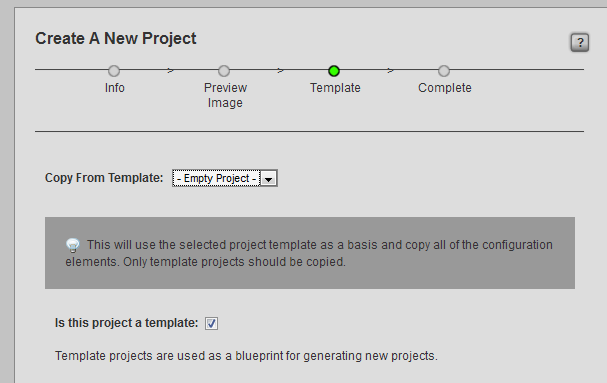

# Project Templates

When a new project is created based on a **template** project, the
following internal structure will be copied over:

<table>
<colgroup>
<col width="26%" />
<col width="73%" />
</colgroup>
<thead>
<tr class="header">
<th><strong>search types</strong> and <strong>custom columns</strong></th>
<th>[multiblock cell omitted]</th>
</tr>
</thead>
<tbody>
<tr class="odd">
<td>
<strong>pipeline</strong> and <strong>task statuses</strong>
</td>
<td>
[multiblock cell omitted]
</td>
</tr>
<tr class="even">
<td>
<strong>notifications</strong> and <strong>triggers</strong>
</td>
<td>
The *notificaions*and *triggers*are copied over from the template.
</td>
</tr>
<tr class="odd">
<td>
<strong>sidebar</strong>
</td>
<td>
The links of the views in the sidebar are copied over from the template.
</td>
</tr>
</tbody>
</table>

> **Note**
>
> The only difference between a project that is a template and a regular
> project is simply a checkmark in a column named **is\_template** in the
> projects table.

To toggle the **is\_template** attribute of a regular project, as the
administrator go to:

**Admin views → Site Admin → Projects**

Add the column **is\_template** and remove the Search Filters.

Notice that there exists the following view for convenience:

**Admin views → Site Admin → Template Projects**

> **Note**
>
> After a new project is created based on a template, any changes made to
> the template will not affect the new project.
>
> ie. only the structure that existed in the template at the time the
> project was created will be used
