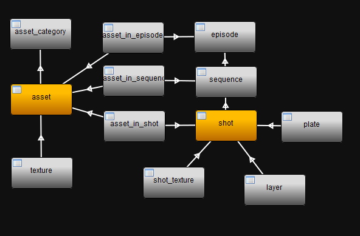

# Select Filter Element Widget

**Description**

This widget provides a drop down selection menu of values for a column
for the Simple Search to do filtering on.

**Info**

<table>
<colgroup>
<col width="28%" />
<col width="71%" />
</colgroup>
<tbody>
<tr class="odd">
<td>
<strong>Name</strong>
</td>
<td>
Select Filter Element Widget
</td>
</tr>
<tr class="even">
<td>
<strong>Class</strong>
</td>
<td>
tactic.ui.filter.SelectFilterElementWdg
</td>
</tr>
<tr class="odd">
<td>
<strong>TACTIC Version Support</strong>
</td>
<td>
3.7+
</td>
</tr>
<tr class="even">
<td>
<strong>Required database columns</strong>
</td>
<td>
none
</td>
</tr>
</tbody>
</table>

**Options**

<table>
<colgroup>
<col width="28%" />
<col width="71%" />
</colgroup>
<tbody>
<tr class="odd">
<td>
<strong>title</strong>
</td>
<td>
The title for the Select Filter Element. For example:

&lt;element name='artist_name' title='Artist Name'&gt;
</td>
</tr>
<tr class="even">
<td>
<strong>values</strong> <em>(required)</em>
</td>
<td>
The values to populate the drop down selection with. For example, it can be a TACTIC expression:

&lt;values_expr&gt;@GET(sthpw/login.login)&lt;/values_expr&gt;

or, it can be a pipe separated list of values. For example:

&lt;values&gt;new|open|in_dev|need_info|on_hold|need_validation|closed|invalid&lt;/values&gt;
</td>
</tr>
<tr class="odd">
<td>
<strong>column</strong> <em>(required)</em>
</td>
<td>
The table column to do the select from. For example:

&lt;column&gt;asset_category_code&lt;/column&gt;
</td>
</tr>
</tbody>
</table>

**Implementation**

Find or define the filter view in the Widget Config and use the
following XML code as an example of what to add to the config:

    <config>
      <custom_filter>
        <element name='dynamic'>
          <display class='tactic.ui.filter.SelectFilterElementWdg'>
              <values_expr>@GET(project/asset_category.code))</values_expr>
              <column>asset_category_code</column>
          </display>
        </element>
      </custom_filter>
    </config>

For the above example, this filter will provide a list of asset category
codes to select from.

Notice that an icon of a green light appears next to the filter if it is
being used:

**Example 1**

The following example demonstrates the Select Filter Element Widget
providing filtering options for scrum tickets.

Below is what the Select Filter Elements look like in the user
interface:

Below is what the config for the above example looks like in the Widget
Config:

    <config>
      <custom_filter>

        <element name='assigned'>
            <display class='tactic.ui.filter.SelectFilterElementWdg'>
              <values_expr>@GET(sthpw/login.login)</values_expr>
              <column>assigned</column>
            </display>
        </element>

        <element name='status'>
            <display class='tactic.ui.filter.SelectFilterElementWdg'>
              <values>new|open|in_dev|need_info|on_hold|need_validation|closed|invalid</values>
              <column>status</column>
            </display>
        </element>

        <element name='type'>
            <display class='tactic.ui.filter.SelectFilterElementWdg'>
              <values_expr>@UNIQUE(@GET(scrum/ticket.type))</values_expr>
              <column>type</column>
            </display>
        </element>

        <element name='sprint'>
            <display class='tactic.ui.filter.SelectFilterElementWdg'>
              <values_expr>@GET(scrum/sprint.title)</values_expr>
              <column>scrum/sprint.title</column>
            </display>
        </element>

        <element name='feature'>
            <display class='tactic.ui.filter.SelectFilterElementWdg'>
              <values_expr>@GET(scrum/feature.title)</values_expr>
              <column>scrum/feature.title</column>
            </display>
        </element>

        <element name='product'>
            <display class='tactic.ui.filter.SelectFilterElementWdg'>
              <values_expr>@GET(scrum/product.title)</values_expr>
              <column>scrum/feature.scrum/product.title</column>
            </display>
        </element>

        <element name='customer'>
            <display class='tactic.ui.filter.SelectFilterElementWdg'>
              <values_expr>@UNIQUE(@GET(scrum/ticket.customer_code))</values_expr>
              <column>customer_code</column>
            </display>
        </element>

      </custom_filter>
    </config>

**Example 2**

The following example is from the VFX project. It demonstrates how the
Select Filter Element Widget can provide filtering options on assets
based on columns not belonging to the current table itself.

Below is the schema for the VFX project. From the **asset** search type, a
Select Filter Element is built based for attributes in the
**asset\_category**, **sequence**, **shot** and search types.

Below is what the Select Filter Elements look like in the user
interface:

Below is what the config for the above example looks like in the Widget
Config:

    <config>
      <custom_filter>
        <element name='keywords'/>

        <element name='asset_category'>
            <display class='tactic.ui.filter.SelectFilterElementWdg'>
              <values_expr>@GET(vfx/asset_category.code))</values_expr>
              <column>asset_category</column>
            </display>
        </element>

        <element name='sequence'>
            <display class='tactic.ui.filter.SelectFilterElementWdg'>
              <values_expr>@GET(vfx/sequence.code))</values_expr>
              <column>vfx/asset_in_sequence.sequence_code</column>
            </display>
        </element>

        <element name='shot'>
            <display class='tactic.ui.filter.SelectFilterElementWdg'>
              <values_expr>@GET(vfx/shot.code))</values_expr>
              <column>vfx/asset_in_shot.shot_code</column>
            </display>
        </element>

      </custom_filter>
    </config>

**Note**: the column attribute can only point to sTypes of the local
database. For example if you are in vfx project’s sequence page, you
can’t filter for task status of a shot with
&lt;column&gt;vfx/shot.sthpw/task.status&lt;/column&gt;. An alternative is to use
the Advanced Search Criteria’s children section or the cross\_db
attribute of the KeywordFilterElementWdg.

    <!-- in a task view, search for the shot's title attribute-->

    <element name="keywords">
      <display class="tactic.ui.filter.KeywordFilterElementWdg">
        <mode>keyword</mode>
        <column>vfx/shot.title</column>
        <cross_db>true</cross_db>
      </display>
    </element>
