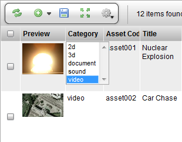

# Select

**Description**

The Select Widget is a simple widget version of an HTML drop down
selection box. The widget is used for making a selection from a
predefined list of items. Many built-in dropdown widgets in TACTIC
extend from the Select Widget.

**Info**

<table>
<colgroup>
<col width="28%" />
<col width="71%" />
</colgroup>
<thead>
<tr class="header">
<th><strong>Name</strong></th>
<th>Select Widget</th>
</tr>
</thead>
<tbody>
<tr class="odd">
<td>
<strong>Class</strong>
</td>
<td>
SelectWdg
</td>
</tr>
<tr class="even">
<td>
<strong>TACTIC Version Support</strong>
</td>
<td>
2.5.0 \+
</td>
</tr>
<tr class="odd">
<td>
<strong>Required database columns</strong>
</td>
<td>
None, but typically this is attached to a data column
</td>
</tr>
</tbody>
</table>

**Usage**

Usage of the Select Widget is straightforward. Simply click on the
Select Widget button to open the drop down selection box. Then, select
one of the menu items. Sometimes items are grouped and separated by a
group label represented as &lt;&lt; *label*&gt;&gt;. In that case, selecting the
group label will trigger a warning pop-up. To unset a value, you can
usually select the empty value with the label '-- Select --'.

**Implementation**

The select is often setup in the Edit Column definition → Edit Tab. It
is edited for the state for column data where the user should only be
able to choose from a list of predefined values.

**Options**

<table>
<colgroup>
<col width="28%" />
<col width="71%" />
</colgroup>
<thead>
<tr class="header">
<th><strong>values</strong></th>
<th>A list of data values separated by the pipe character '|', e.g. model|anim|lighting</th>
</tr>
</thead>
<tbody>
<tr class="odd">
<td>
<strong>labels</strong>
</td>
<td>
A list of display labels separated by the pipe character '|', e.g. Model|Anim|LGT
</td>
</tr>
<tr class="even">
<td>
<strong>empty</strong>
</td>
<td>
When set to true, the Select Widget will contain an empty option.
</td>
</tr>
<tr class="odd">
<td>
<strong>values_expr</strong>
</td>
<td>
This serves the same purpose as values but in the form of an expression. The input item of the expression has to exist for this to function properly.(ie @GET(vfx/sequence.code) ). If it is used in the menu of an item in insert mode, you should set mode_expr to 'absolute'
</td>
</tr>
<tr class="even">
<td>
<strong>labels_expr</strong>
</td>
<td>
This serves the same purpose as labels but in the form of an expression. The input item of the expression has to exist for this to function properly (ie @GET(vfx/sequence.name) ). If it is used in the menu of an item in insert mode, you should set mode_expr to 'absolute'
</td>
</tr>
<tr class="odd">
<td>
<strong>mode_expr</strong>
</td>
<td>
If left unset, the default is to use the current item in the expression defined in values_expr and labels_expr. If set to 'absolute', the input item for the expression will be an empty list.
</td>
</tr>
<tr class="even">
<td>
<strong>query</strong>
</td>
<td>
In the form of &lt;search_type&gt;|&lt;value&gt;|&lt;label&gt;, you can instruct the widget to retrieve the values and labels from the a particular sType. For example, to get all the asset codes from the sType 'vfx/asset', you can use 'vfx/asset|code|code'. To change the label to display asset’s name instead, you can use 'vfx/asset|code|name'.
</td>
</tr>
</tbody>
</table>

**Advanced**

The following example uses the query option to get the **code** of a
parent shot item but, display the **name** value in the list. This query
option is older. The values\_expr and labels\_expr option are preferred.

    <element name="parent_code">
      <display class="SelectWdg">
        <query>prod/shot|code|name</query>
      </display>
    </element>

The following gets the same result but, uses expressions. This allows
for more robust queries for values and labels.

    <element name="parent_code">
      <display class="SelectWdg">
        <mode_expr>absolute</mode_expr>
        <values_expr>@GET(prod/shot.code)</values_expr>
        <labels_expr>@GET(prod/shot.name)</labels_expr>
      </display>
    </element>

The following sets a hard coded list of values and labels for the
SelectWdg.

    <element name="status">
      <display class="SelectWdg">
        <values>waiting|in_progress|complete</values>
        <labels>Waiting|In Progress|Complete</labels>
      </display>
    </element>
