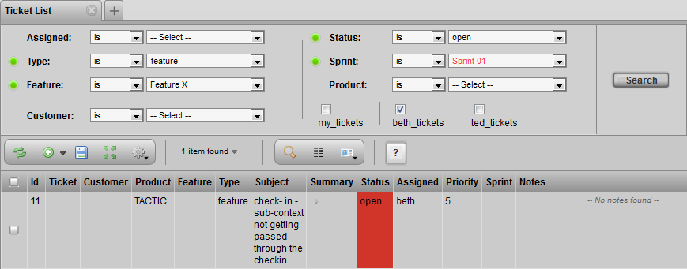
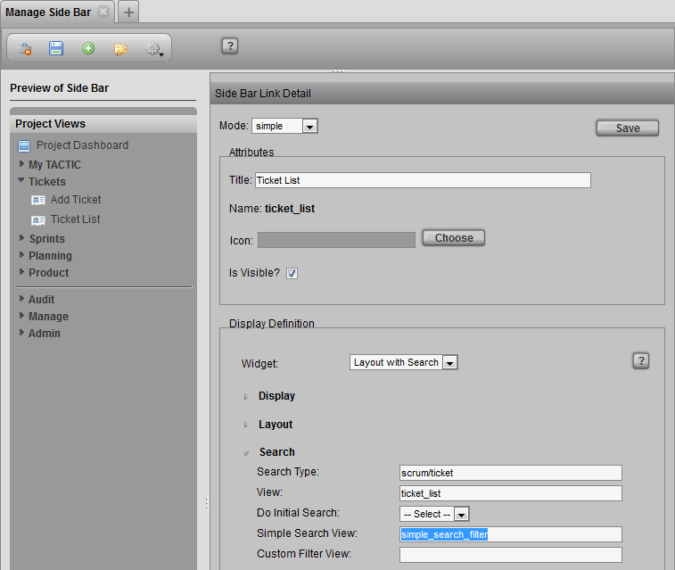

# How To Set Up A Simple Search Filter

**Description**

Adding a Simple Search Filter at the top of a view helps filter the
table for particular values on certain columns. A filter can be created
using a Select Filter Element Widget or by running an expression using a
Checkbox Filter Element Widget. (To set up the Select and Checkbox
Filter Element Widgets, please refer to the setup docs by the same
name.)

**Implementation**

Below are the steps to modify or add a Simple Search Filter to a view.
The Simple Search View for the ticket list in the Scrum Project is used
below as an example.

1) Go to the sidebar and open the view:

**Admin Views → Project → Manage Side Bar**

2) Look for the value in the following field:

**Display Definition → Search → Simple Search View**

3) Open the Widget Config under:

**Admin Views → Project → Widget Config**.

Filter by the *search\_type*: **scrum/ticket**

Filter by the *view* found in the Simple Search View field of the Manage
Side Bar view.

In the Scrum example with the tickets, we would search for the
\_view\_named: **simple\_search\_filter**

> **Note**
>
> If the *Simple Search View* field is empty, TACTIC will look for the
> default Simple Search View filter named: **custom\_filter**.

4) In the Widget Config entry, edit the *config* field:

In the example below, the following Checkbox Filter Element Widgets were
added: my\_tickets, beth\_tickets and ted\_tickets

    <config>
      <simple_search_filter>

        <element name='assigned'>
            <display class='tactic.ui.filter.SelectFilterElementWdg'>
              <values_expr>@GET(sthpw/login.login)</values_expr>
              <column>assigned</column>
            </display>
        </element>

        <element name='status'>
            <display class='tactic.ui.filter.SelectFilterElementWdg'>
              <values>new|open|in_dev|need_info|on_hold|need_validation|closed|invalid</values>
              <column>status</column>
            </display>
        </element>

        <element name='type'>
            <display class='tactic.ui.filter.SelectFilterElementWdg'>
              <values_expr>@UNIQUE(@GET(scrum/ticket.type))</values_expr>
              <column>type</column>
            </display>
        </element>

        <element name='sprint'>
            <display class='tactic.ui.filter.SelectFilterElementWdg'>
              <values_expr>@GET(scrum/sprint.title)</values_expr>
              <column>scrum/sprint.title</column>
            </display>
        </element>

        <element name='feature'>
            <display class='tactic.ui.filter.SelectFilterElementWdg'>
              <values_expr>@GET(scrum/feature.title)</values_expr>
              <column>scrum/feature.title</column>
            </display>
        </element>

        <element name='product'>
            <display class='tactic.ui.filter.SelectFilterElementWdg'>
              <values_expr>@GET(scrum/product.title)</values_expr>
              <column>scrum/feature.scrum/product.title</column>
            </display>
        </element>

        <element name='customer'>
            <display class='tactic.ui.filter.SelectFilterElementWdg'>
              <values_expr>@UNIQUE(@GET(scrum/ticket.customer_code))</values_expr>
              <column>customer_code</column>
            </display>
        </element>

      </simple_search_filter>
    </config>

Here are some miscellaneous date related examples:

       <element name="dates">
          <display class="tactic.ui.filter.DateFilterElementWdg">
                <column>creation_date</column>
          </display>
        </element>
        <!-- this makes use of the status log to filter tasks completed or set to review since a particular date -->
        <element name='completed_date'>
            <display class='tactic.ui.filter.DateFilterElementWdg'>
              <column>sthpw/status_log['to_status','in','Complete|Review'].timestamp</column>
            </display>
        </element>

       <element name="date_range">
          <display class="tactic.ui.filter.DateRangeFilterElementWdg">
                <start_date_col>bid_start_date</start_date_col>
                <end_date_col>bid_end_date</end_date_col>
                <op>in</op>
          </display>
        </element>

For more examples of the Keyword Search, Select Filter, and Date Filter,
refer to those docuements.

**Note**: To filter for data from another database, the cross\_db attribute
of the KeywordFilterElementWdg can be used.

    <!-- in a task view, search for the shot's title attribute-->

    <element name="keywords">
      <display class="tactic.ui.filter.KeywordFilterElementWdg">
        <mode>keyword</mode>
        <column>vfx/shot.title</column>
        <cross_db>true</cross_db>
      </display>
    </element>
