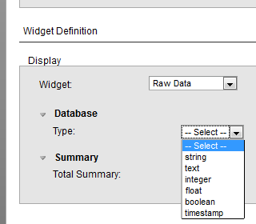

# Simple Table Element

**Description**

This widget displays the value in the database "as is", in its raw
unformatted form. This is the default display widget.

> **Note**
>
> The Simple Table Element widget is the same as the Raw Data widget.

**Info**

<table>
<colgroup>
<col width="28%" />
<col width="71%" />
</colgroup>
<tbody>
<tr class="odd">
<td>
<strong>Name</strong>
</td>
<td>
Simple Table Element
</td>
</tr>
<tr class="even">
<td>
<strong>Class</strong>
</td>
<td>
raw_data
</td>
</tr>
<tr class="odd">
<td>
<strong>TACTIC Version Support</strong>
</td>
<td>
3.0.0 \+
</td>
</tr>
<tr class="even">
<td>
<strong>Required database columns</strong>
</td>
<td>
none
</td>
</tr>
</tbody>
</table>

**Implementation**

Use this widget to display the value in the database "as is", without
any pre-formatting. This widget is the default display widget.

**Options**

<table>
<colgroup>
<col width="30%" />
<col width="69%" />
</colgroup>
<tbody>
<tr class="odd">
<td>
<strong>type</strong>
</td>
<td>
The database type: string, text, int, float, boolean, timestamp
</td>
</tr>
</tbody>
</table>

**Example**

For example, to display the keywords field, as is, from the Edit Column
Definition→View Mode: Select **Widget → Raw Data → text**.

**Advanced**

Below is the XML for the above example.

    <element name="keywords" title="test" edit="true" color="false">
      <display widget="raw_data">
        <type>text</type>
      </display>
    </element>
