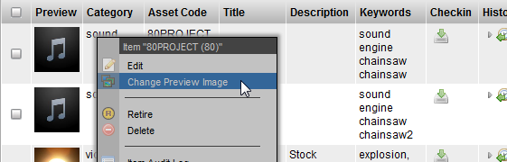

# SimpleUploadWdg

**Description**

The Simple Upload Widget is used for uploading files in-line in tables
and also in edit windows. It is the simplest form of Tactic checkin as
is allows for uploading of a single file and uses only a single hard
coded (configured) checkin context.

**Info**

<table>
<colgroup>
<col width="28%" />
<col width="71%" />
</colgroup>
<tbody>
<tr class="odd">
<td>
<strong>Name</strong>
</td>
<td>
Simple Upload Widget
</td>
</tr>
<tr class="even">
<td>
<strong>Class</strong>
</td>
<td>
tactic.ui.widget.SimpleUploadWdg
</td>
</tr>
<tr class="odd">
<td>
<strong>Category</strong>
</td>
<td>
Edit Widgets
</td>
</tr>
<tr class="even">
<td>
<strong>Supported Interfaces</strong>
</td>
<td>
TableWdg, EditWdg
</td>
</tr>
<tr class="odd">
<td>
<strong>TACTIC Version Support</strong>
</td>
<td>
2.5.0 \+
</td>
</tr>
<tr class="even">
<td>
<strong>Required database columns</strong>
</td>
<td>
none
</td>
</tr>
</tbody>
</table>

**Implementation**

This widget is available as part of the "preview" common column. It is
also used when right-clicking on an item and choosing "Change preview"
or "Checkin File"

**Options**

<table>
<colgroup>
<col width="28%" />
<col width="71%" />
</colgroup>
<tbody>
<tr class="odd">
<td>
<strong>Common Name(s)/Title</strong>
</td>
<td>
Preview, Snapshot, Files
</td>
</tr>
<tr class="even">
<td>
<strong>Context</strong>
</td>
<td>
TableWdg, EditWdg
</td>
</tr>
<tr class="odd">
<td>
<strong>Show Preview?</strong>
</td>
<td>
2.5.0 \+
</td>
</tr>
</tbody>
</table>

**Advanced**

    <element name='preview'>
      <display class='tactic.ui.widget.SimpleUploadWdg'>
        <context>icon</context>
      </display>
    </element>
