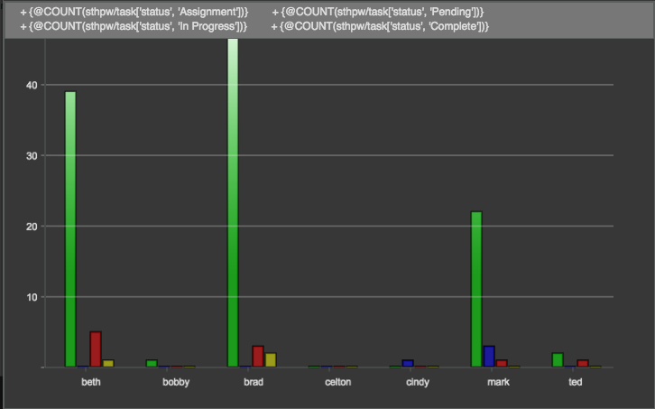

SObjectChartWdg

**Description**

The SObjectChartWdg is a tool to chart data related to sObjects.

**Info**

<table>
<colgroup>
<col width="28%" />
<col width="71%" />
</colgroup>
<tbody>
<tr class="odd">
<td>
<strong>Name</strong>
</td>
<td>
SObjectChartWdg
</td>
</tr>
<tr class="even">
<td>
<strong>Class</strong>
</td>
<td>
tactic.ui.chart.SObjectChartWdg
</td>
</tr>
<tr class="odd">
<td>
<strong>TACTIC Version Support</strong>
</td>
<td>
4.4.0+
</td>
</tr>
<tr class="even">
<td>
<strong>Required database columns</strong>
</td>
<td>
none
</td>
</tr>
</tbody>
</table>

**Implementation**

The SObjectChartWdg is driven by input sObjects and y-axis elements, where
the y-axis elements are expressions or columns that each input sObject will
evaluated against.

The input sObjects can be specified with the options "expression", "search\_type", or
"search\_keys". Expression will override search\_type, and search\_type will override
search\_keys.

For example,

    expression = "@SOBJECT(sthpw/login['login', 'NEQ', 'admin'])"
    search_type = "sthpw/login"
    search_keys = ['sthpw/login?code=brad']

A single y-axis can be specified with option "y\_axis", or multiple elements can be specified
with option "elements" as a "|" separated list. Individual y-axis elements can be a TACTIC
expression enclosed in "{" and "}" or a predefined column for the search\_type.

For example,

    y_axis = "{@COUNT(sthpw/task['status', 'Assignment'])}"
    elements = "num_assignment|num_pending|num_completed"

The y-axis elements will be displayed side by side for each sObject, and x-axis
label is specified through the option "x\_axis".

**Options**

<table>
<colgroup>
<col width="31%" />
<col width="68%" />
</colgroup>
<tbody>
<tr class="odd">
<td>
<strong>chart_type</strong>
</td>
<td>
Defines the type of chart that will be displayed for all y-axis elements. Can be 'line', 'bar', or 'area'. Defaults to 'bar'.
</td>
</tr>
<tr class="even">
<td>
<strong>chart_types</strong>
</td>
<td>
Defines the type of chart that will be displayed corresponding to each y-axis element.
</td>
</tr>
<tr class="odd">
<td>
<strong>title</strong>
</td>
<td>
Title to display in chart. Note: The legend will cover the title.
</td>
</tr>
<tr class="even">
<td>
<strong>width</strong>
</td>
<td>
The pixel width of the chart. Defaults to 800.
</td>
</tr>
<tr class="odd">
<td>
<strong>height</strong>
</td>
<td>
The pixel height of the chart. Defaults to 500.
</td>
</tr>
<tr class="even">
<td>
<strong>x_axis</strong>
</td>
<td>
The x-axis element label. This should be a column of the inputs sObjects. Defaults to 'code'.
</td>
</tr>
<tr class="odd">
<td>
<strong>y_axis</strong>
</td>
<td>
The y-axis element. This should be a column or expression of the input sObjects.
</td>
</tr>
<tr class="even">
<td>
<strong>elements</strong>
</td>
<td>
y-axis elements separated by a &quot;|&quot;.
</td>
</tr>
<tr class="odd">
<td>
<strong>expression</strong>
</td>
<td>
TACTIC expression which specifies sObjects for charting.
</td>
</tr>
<tr class="even">
<td>
<strong>search_type</strong>
</td>
<td>
Search type which specifies sObjects for charting.
</td>
</tr>
<tr class="odd">
<td>
<strong>search_keys</strong>
</td>
<td>
Search keys of sObjects for charting.
</td>
</tr>
</tbody>
</table>

