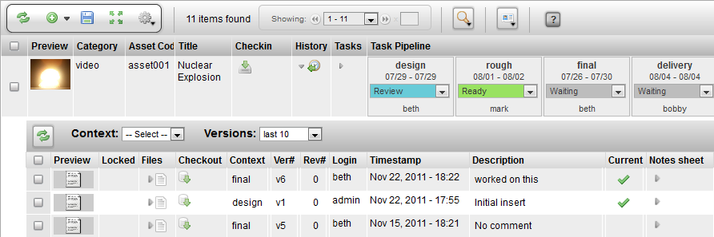

# Checkin History

**Description**

The Checkin History Widget is a toggle that opens a hidden row that
displays all the snapshots (snapshots are checkins at a particular
moment in time for a context) for an item.

**Info**

<table>
<colgroup>
<col width="28%" />
<col width="71%" />
</colgroup>
<tbody>
<tr class="odd">
<td>
<strong>Name</strong>
</td>
<td>
Checkin History Widget
</td>
</tr>
<tr class="even">
<td>
<strong>Common Title</strong>
</td>
<td>
History
</td>
</tr>
<tr class="odd">
<td>
<strong>Class</strong>
</td>
<td>
tactic.ui.widget.SObjectCheckinHistoryWdg
</td>
</tr>
<tr class="even">
<td>
<strong>Category</strong>
</td>
<td>
Common
</td>
</tr>
<tr class="odd">
<td>
<strong>TACTIC Version Support</strong>
</td>
<td>
3.0.0 \+
</td>
</tr>
<tr class="even">
<td>
<strong>Required database columns</strong>
</td>
<td>
none
</td>
</tr>
</tbody>
</table>

**Usage**

The following details are displayed by the Checkin History Widget for a
task:

-   **preview** of the snapshot

-   whether checkout of the snapshot is **locked**

-   toggle to open a hidden row to list the **files** in the snapshot

-   link to **checkout** this particular snapshot

-   **context** of the snapshot

-   **version** of the snapshot

-   **revision** of the snapshot

-   **login** who checked in the snapshot

-   **timestamp** of the checkin

-   **description** written by the user at the time of the snapshot

-   indicator whether the snapshot is the **current** version for that
    context

-   toggle to open the notes using the **Note Sheet** Widget

**Implementation**

The Checkin History Widget can be found as a common column that can be
added using the Column Manager.

**Options**

There are no options provided for the Checkin History Widget.

**Advanced**

    <element name="history" edit="false">
        <display class="HiddenRowToggleWdg">
            <icon>HISTORY</icon>
            <dynamic_class>tactic.ui.widget.SObjectCheckinHistoryWdg</dynamic_class>
        </display>
    </element>
