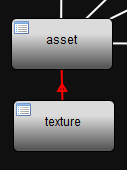
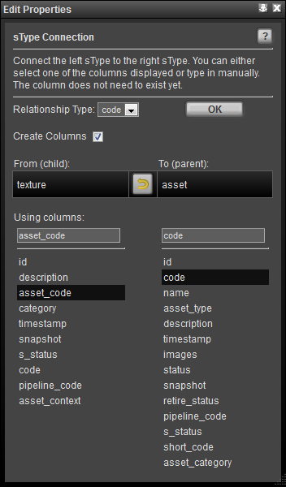

# Connecting sTypes

In a project, items (ie. files, assets) may be related to each other.
For example, a car is built with various parts that can be identified
separately but are all related to the same car. Another example can be
found cinematic film production. The cinematic footage of one movie is
commonly broken down into sequences and shots.

**How do these relationships work in TACTIC?** - Each sType is represented
as a table in the database and each entry in the table represents an
sObject. The relationships are created when storing matching data
"properties" in each of the tables. In the example tables below there
are "Sequence" and "Shot" sTypes. The "code" column matches the
"sequence\_code" column which illustrates which shot is related to which
sequence.

<table>
<colgroup>
<col width="50%" />
<col width="50%" />
</colgroup>
<thead>
<tr class="header">
<th>code</th>
<th>description</th>
</tr>
</thead>
<tbody>
<tr class="odd">
<td>
SEQ001
</td>
<td>
The first sequence
</td>
</tr>
<tr class="even">
<td>
SEQ002
</td>
<td>
The first sequence
</td>
</tr>
</tbody>
</table>

<table>
<colgroup>
<col width="34%" />
<col width="32%" />
<col width="32%" />
</colgroup>
<thead>
<tr class="header">
<th>sequence_code</th>
<th>code</th>
<th>description</th>
</tr>
</thead>
<tbody>
<tr class="odd">
<td>
SEQ001
</td>
<td>
SEQ001_001
</td>
<td>
Sequence one shot one
</td>
</tr>
<tr class="even">
<td>
SEQ001
</td>
<td>
SEQ001_002
</td>
<td>
Sequence one shot two
</td>
</tr>
<tr class="odd">
<td>
SEQ002
</td>
<td>
SEQ002_001
</td>
<td>
Sequence two shot one
</td>
</tr>
</tbody>
</table>

In the Schema Editor, relationships are represented by lines connecting
the nodes. When these connections are made, the columns used to relate
the sTypes can be chosen in the Connection Editor.

To create a new connection, hover over a node and click-drag a
connection to the desired node (sType).

> **Note**
>
> The direction of the arrow in the connection indicates from child to
> parent.

After a connection is made, the Connection Attributes editor will open
to enable the choice of column relationships. It is also possible to
create new columns from this editor.

> **Note**
>
> The yellow **Switch** button  in the middle
> of the tool toggles which node is the child and which one is the parent.
