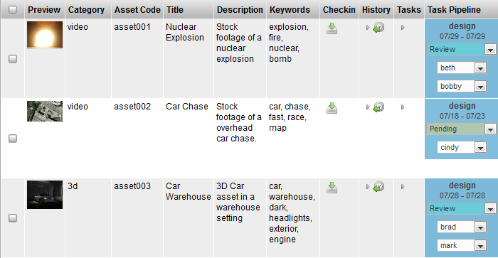

# Table Layout

**Description**

The TableLayoutWdg is the primary widget used to layout tabular data. It
is primarily driven by the widget configuration. The TableLayoutWdg has
the ability to display complex widgets inside each cell, to inline edit
the data and to color code cells. It is the widget that is most often
used to display information within the TACTIC.

**Info**

<table>
<colgroup>
<col width="28%" />
<col width="71%" />
</colgroup>
<tbody>
<tr class="odd">
<td>
<strong>Name</strong>
</td>
<td>
Table Layout
</td>
</tr>
<tr class="even">
<td>
<strong>Class</strong>
</td>
<td>
tactic.ui.panel.TableLayoutWdg
</td>
</tr>
<tr class="odd">
<td>
<strong>TACTIC Version Support</strong>
</td>
<td>
2.5.0 \+
</td>
</tr>
<tr class="even">
<td>
<strong>Required database columns</strong>
</td>
<td>
none
</td>
</tr>
</tbody>
</table>

**Implementation**

The TableLayoutWdg makes use of "views" which are defined in the widget
config for each project. When the Table is loaded as part of an
interface, a view configuration is passed into it which defines which
columns and widgets should be displayed in the view. Typically, these
view configurations are automatically saved in the background when a
user saves a view from within the TACTIC interface. The table itself
provides the ability to add, remove, rearrange, resize and group columns
which can then be saved out often as links in the sidebar.

The following shows a simplified version for an "asset tracking" view as
saved in the background widget config.

    <config>
      <asset_tracking layout="TableLayoutWdg" >
        <element name="preview" width="74px"/>
        <element name="asset_category_code" width="64px"/>
        <element name="code" width="61px"/>
        <element name="title" width="121.883px"/>
        <element name="description" width="276.75px"/>
        <element name="keywords" width="253.367px"/>
        <element name="general_checkin" width="27px"/>
        <element name="history" width="42px"/>
        <element name="task_edit" width="29px"/>
        <element name="task_status_edit" width="223.167px"/>
      </asset_tracking>
    </config>

The widget configuration is an XML document. In this example, it defines
an "asset\_tracking" view with elements (preview, asset\_category, code,
title, description, keywords, etc…​).

To draw what to display, TableLayoutWdg looks at the list of elements
defined in the widget config and draws a column for each element. TACTIC
then draws a row for each item that was either retrieved from a search,
an expression or by supplied items. Each cell in the table represents an
item being drawn by the defined element for a given column.

While the top widget configuration defines the list of elements to draw
the columns, the exact definition of each element do not necessarily
appear here. There are a number of views which define an element. Some
of these elements may be defined inline or they may be defined
elsewhere. There is a set hierarchy which the TableLayoutWdg looks for
to find the definition of a particular element.

The hierarchy which TableLayoutWdg looks to find the definition for an
element is as follows:

1.  the given type, view combination in the widget\_config table

2.  the "definition" view for the given type in the widget\_config table

3.  the predefined views for a given type (modules shipped with TACTIC
    will have predefined views for may of the items to ensure proper
    functioning of TACTIC even if there are no entries in the widget\_config database)

4.  the "default\_definition" for a given sType as defined in the
    predefined views.

The third and fourth locations only apply to predefined sTypes that are
shipped with TACTIC. All custom types will only use the first two.

**Options**

<table>
<colgroup>
<col width="31%" />
<col width="68%" />
</colgroup>
<tbody>
<tr class="odd">
<td>
<strong>search_type</strong>
</td>
<td>
Define the sType that this table will be displaying. It is used both for finding the appropriate widget config and for handling search (if necessary). Defaults to &quot;table&quot;.
</td>
</tr>
<tr class="even">
<td>
<strong>view</strong>
</td>
<td>
Defines the view that this table will displaying. It used to find the appropriate widget config to display the table.
</td>
</tr>
<tr class="odd">
<td>
<strong>insert_view</strong>
</td>
<td>
Specify the path to a custom insert view.
</td>
</tr>
<tr class="even">
<td>
<strong>edit_view</strong>
</td>
<td>
Specify the path to a custom edit view.
</td>
</tr>
<tr class="odd">
<td>
<strong>ingest_custom_view</strong>
</td>
<td>
Specify a custom layout view that Ingest Files menu option opens in a new tab.
</td>
</tr>
<tr class="even">
<td>
<strong>ingest_data_view</strong>
</td>
<td>
Specify a view similar to edit view that defines any data to be saved with each ingested sobject.
</td>
</tr>
<tr class="odd">
<td>
<strong>expression</strong>
</td>
<td>
Specify an expression to drive the search. The expression must return items. e.g. @SEARCH(sthpw/note) or @SOBJECT(sthpw/note)
</td>
</tr>
<tr class="even">
<td>
<strong>config_xml</strong>
</td>
<td>
Explicitly define the widget config. the kwarg view is preferred over this.
</td>
</tr>
<tr class="odd">
<td>
<strong>do_search</strong>
</td>
<td>
By default, the TableLayoutWdg will handle the search itself. However, certain widgets may wish to turn this functionality off because they are supplying the search (internally used by ViewPanelWdg) - true, false.
</td>
</tr>
<tr class="even">
<td>
<strong>order_by</strong>
</td>
<td>
Add an explicit order by in the search
</td>
</tr>
<tr class="odd">
<td>
<strong>parent_key</strong>
</td>
<td>
Set a specific parent for the search
</td>
</tr>
<tr class="even">
<td>
<strong>checkin_context</strong>
</td>
<td>
Override the checkin context for Check-in New File - publish (default).
</td>
</tr>
<tr class="odd">
<td>
<strong>checkin_type</strong>
</td>
<td>
Override the checkin type for Check-in New File - auto, strict.
</td>
</tr>
<tr class="even">
<td>
<strong>width</strong>
</td>
<td>
Define an initial overall width for the table
</td>
</tr>
<tr class="odd">
<td>
<strong>show_gear</strong>
</td>
<td>
Determine whether to show the gear menu - true, false.
</td>
</tr>
<tr class="even">
<td>
<strong>show_search</strong>
</td>
<td>
Determine whether to show the search box - true, false.
</td>
</tr>
<tr class="odd">
<td>
<strong>show_search_limit</strong>
</td>
<td>
Determine whether to show the search limit - true, false.
</td>
</tr>
<tr class="even">
<td>
<strong>show_insert</strong>
</td>
<td>
Determine whether to show the insert button - true, false.
</td>
</tr>
<tr class="odd">
<td>
<strong>show_refresh</strong>
</td>
<td>
Display the refresh button on the shelf - true, false.
</td>
</tr>
<tr class="even">
<td>
<strong>show_keyword_search</strong>
</td>
<td>
Determine whether to show the Keyword search input - true, false.
</td>
</tr>
<tr class="odd">
<td>
<strong>show_select</strong>
</td>
<td>
Determine whether to show row_selection - true, false.
</td>
</tr>
<tr class="even">
<td>
<strong>show_shelf</strong>
</td>
<td>
Determine whether to show the action shelf - true, false.
</td>
</tr>
<tr class="odd">
<td>
<strong>show_layout_switcher</strong>
</td>
<td>
Determine whether to show the layout switcher - true, false.
</td>
</tr>
<tr class="even">
<td>
<strong>show_column_manager</strong>
</td>
<td>
Determine whether to show the column manager - true, false.
</td>
</tr>
<tr class="odd">
<td>
<strong>show_collection_tool</strong>
</td>
<td>
Determine whether to show the collection button - true, false.
</td>
</tr>
<tr class="even">
<td>
<strong>show_context_menu</strong>
</td>
<td>
Determine whether to show the context menu - true, false.
</td>
</tr>
<tr class="odd">
<td>
<strong>show_expand</strong>
</td>
<td>
Determine whether to show the expand button - true, false.
</td>
</tr>
<tr class="even">
<td>
<strong>show_help</strong>
</td>
<td>
Determine whether to show the help button - true, false.
</td>
</tr>
<tr class="odd">
<td>
<strong>show_border</strong>
</td>
<td>
Determine whether to show the table border - true, false.
</td>
</tr>
<tr class="even">
<td>
<strong>show_header</strong>
</td>
<td>
Determine whether to show the table header - true, false.
</td>
</tr>
<tr class="odd">
<td>
<strong>show_insert</strong>
</td>
<td>
Determine whether to show the insert button - true, false.
</td>
</tr>
<tr class="even">
<td>
<strong>search_limit</strong>
</td>
<td>
The number of items to show on each page. e.g. 20 A value &lt; 0 means no limit affecting the search.
</td>
</tr>
<tr class="odd">
<td>
<strong>search_limit_mode</strong>
</td>
<td>
Determine if it displays top, bottom or both search limit - bottom, top, both
</td>
</tr>
<tr class="even">
<td>
<strong>mode</strong>
</td>
<td>
Determine whether to draw with widgets or just use the raw data - widget, raw.
</td>
</tr>
<tr class="odd">
<td>
<strong>element_names</strong>
</td>
<td>
Explicitly set the element names to be drawn
</td>
</tr>
</tbody>
</table>

**Advanced**

Very often, the TableLayoutWdg is not used directly, but is used through
the ViewPanelWdg, which combines the TableLayoutWdg with the SearchWdg.
Using ViewPanelWdg will provide all the functionality in a table view

Using the TableLayoutWdg does provide a simpler view if the search is
already known,

This simple example shows the login table and the objects are explicitly
given.

    from tactic.ui.panel import TableLayoutWdg
    div = DivWdg()
    table = TableLayoutWdg(search_type='sthpw/login', view='table')
    sObjects = Search("sthpw/login").get_sObject()
    table.set_sObjects(sObjects)
    div.add(table)

An expression can be set for the search as well.

    from tactic.ui.panel import TableLayoutWdg
    div = DivWdg()
    expression = "@SOBJECT(sthpw/login)"
    table = TableLayoutWdg(search_type='sthpw/login', view='table',expression=expression)
    div.add(table)

This example embeds the login table with a "table" view in a
CustomLayoutWdg.

    <config>
    <login>
      <html>
        <h1>This is the login table</h1>
        <element name='login_table'/>
      </html>
      <element name='login_table'>
        <display class='tactic.ui.panel.TableLayoutWdg'>
          <search_type>sthpw/login</search_type>
          <view>table</view>
          <expression>@SOBJECT(sthpw/login)</expression>
        </display>
      </element>
    </login>
    </config>

The widget config views determine how the TableLayoutWdg draws itself.
There are a few custom attributes that a view can define. The view can
define many parts of how the TableLayoutWdg is displayed. The following
hides the "insert" button and makes each of the cells non-editable.
These attributes are useful for reports which are generally not
editable.

    <?xml version="1.0" encoding="UTF-8"?>
    <config>
      <simple insert='false' edit='false'>
        <element name="preview"/>
        <element name="code"/>
        <element name="name"/>
        <element name="description"/>
      </simple>
    </config>
