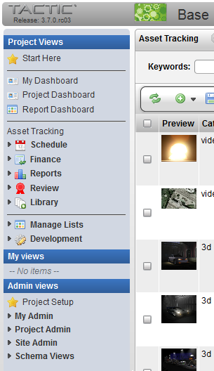
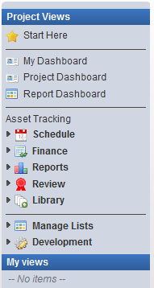
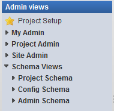
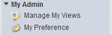
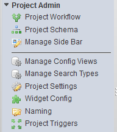
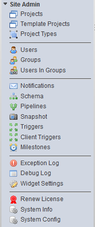
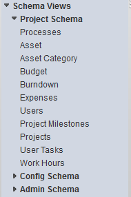
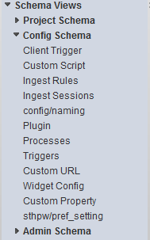
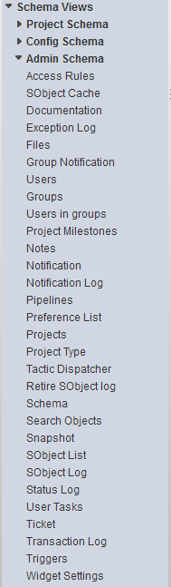

# Sidebar Configuration

**Description**

The TACTIC sidebar is the main menu system for navigating through the
views of all TACTIC search types. The access rules applied to a specific
account determine the contents of the sidebar as well as which views and
search types are displayed when a user is logged in.

The items in the sidebar provide links to existing views of the
different search types within a project. These views are built by your
organization’s production manager based on a selection of columns
(properties), layouts (order and column width) and a search. If a search
view is available, it provides a dynamic report based on the definition
of the search.

Users at different levels can configure the sidebar to include only
those views they need, or to include views that manage items and their
relationships. For example, a user may want to set up a view where only
the name, code and description of their own "storyboards" as in the
view. Or, the user may set up a view where, for example, only those
storyboards with a name containing the word "episode" and where child
tasks have a status of "review" are in the view.

The sidebar is divided into three different categories, "Project Views",
"My Views" and "Admin Views".

**Project Views and My Views**

The Project Views provides a way to save project wide views that
everyone across the entire project would want to see. It also has a
manageable list of custom user views.

The Project Views can be defined by the person in the role of the
project manager. Views can also be hidden from specific user groups.

**My View** contains a list of links to views that were created by the
login user themselves. These usually are created by the user to cater to
their own personal work flow.

**Admin Views**

**Admin Views** displays the project schema and the TACTIC system and
administration schemas. Access to the Admin Views section of the sidebar
is generally reserved for admin level users.

**Project Setup** - After initial creation of the project, this view
contains the tools to setup the project: Create the Schema, Create
Workflow, Manage the Side Bar.

**My Admin** - My Admin holds views that will allow the users to manage My
Views and My Preferences.

<table>
<colgroup>
<col width="28%" />
<col width="71%" />
</colgroup>
<thead>
<tr class="header">
<th><strong>Manage My Views</strong></th>
<th>Edits the views saved in the &quot;My Views&quot; section.</th>
</tr>
</thead>
<tbody>
<tr class="odd">
<td>
<strong>My Preference</strong>
</td>
<td>
Preferences include: Debug, Web Client Logging Level, Color Palette, Language, Quick Text for Note Sheet Thumbnail Size
</td>
</tr>
</tbody>
</table>

**Project Admin** - Project specific views to manage the Project Workflow,
Schema, Side Bar, Config Views, Search Types, Naming, Triggers.

<table>
<colgroup>
<col width="28%" />
<col width="71%" />
</colgroup>
<tbody>
<tr class="odd">
<td>
<strong>Project Workflow</strong>
</td>
<td>
Workflow Editor for creating and editing processes and task status pipeline.
</td>
</tr>
<tr class="even">
<td>
<strong>Project Schema</strong>
</td>
<td>
Schema Editor for creating and editing types and relationship connections.
</td>
</tr>
<tr class="odd">
<td>
<strong>Manage Side Bar</strong>
</td>
<td>
Edit the links and folders in the side bar.
</td>
</tr>
<tr class="even">
<td>
<strong>Manager Config Views</strong>
</td>
<td>
Edit the asset view for each type.
</td>
</tr>
<tr class="odd">
<td>
<strong>Manage Search Types</strong>
</td>
<td>
Edit the columns for each type.
</td>
</tr>
<tr class="even">
<td>
<strong>Project Settings</strong>
</td>
<td>
Set project settings such as use_icon_separation.
</td>
</tr>
<tr class="odd">
<td>
<strong>Widget Config</strong>
</td>
<td>
Look up and edit widget configuration by category, type, view name or key words in configuration.
</td>
</tr>
<tr class="even">
<td>
<strong>Naming</strong>
</td>
<td>
Edit the automatic file naming and directory naming for checkin’s.
</td>
</tr>
<tr class="odd">
<td>
<strong>Project Triggers</strong>
</td>
<td>
Edit the triggers by event, process, class name, script path, description, mode.
</td>
</tr>
</tbody>
</table>

**Site Admin** - Site Administrator view to manage the Project, Templates,
Types, Users, Groups, Users in Groups, Notifications, Schema, Pipelines,
Snapshot, Triggers, Client Triggers, Milestones, Exception Log, Debug
Log, Widget Settings, System Info, System Config

<table>
<colgroup>
<col width="28%" />
<col width="71%" />
</colgroup>
<tbody>
<tr class="odd">
<td>
<strong>Projects</strong>
</td>
<td>
Edit the project info: preview, category, title, is_template, color scheme palette
</td>
</tr>
<tr class="even">
<td>
<strong>Template Projects</strong>
</td>
<td>
Edit the project info for projects marked as template projects.
</td>
</tr>
<tr class="odd">
<td>
<strong>Project Types</strong>
</td>
<td>
Edit the project type info: dir naming cls, file naming cls, node naming cls, sObject naming cls, repo handler cls
</td>
</tr>
<tr class="even">
<td>
<strong>Users</strong>
</td>
<td>
Edit the list of TACTIC users: preview, first name, last name, email, licence type
</td>
</tr>
<tr class="odd">
<td>
<strong>Groups</strong>
</td>
<td>
Edit the list of TACTIC groups: add group, users, description, global rules, access rules
</td>
</tr>
<tr class="even">
<td>
<strong>Users in Groups</strong>
</td>
<td>
Drag and drop interface to assign users to one or more groups.
</td>
</tr>
<tr class="odd">
<td>
<strong>Notifications</strong>
</td>
<td>
Email notification configuration: email test, event, description, subject, message, group, rules, process, mail to,
</td>
</tr>
<tr class="even">
<td>
<strong>Schema</strong>
</td>
<td>
Edit schema configuration, schema relationship connections.
</td>
</tr>
<tr class="odd">
<td>
<strong>Pipelines</strong>
</td>
<td>
Edit workflow pipelines: color, description, type, project code
</td>
</tr>
<tr class="even">
<td>
<strong>Snapshot</strong>
</td>
<td>
Edit snapshots taken: preview, files, context, version, revision, login, description, is_current, is_latest
</td>
</tr>
<tr class="odd">
<td>
<strong>Triggers</strong>
</td>
<td>
Edit triggers: event, class name, script path, description, mode, project code
</td>
</tr>
<tr class="even">
<td>
<strong>Client Triggers</strong>
</td>
<td>
Edit client triggers: event, callback, description
</td>
</tr>
<tr class="odd">
<td>
<strong>Milestones</strong>
</td>
<td>
Edit the list of milestone information: due date, lists tasks for that milestone, completion display
</td>
</tr>
<tr class="even">
<td>
<strong>Exception Log</strong>
</td>
<td>
Lists all the exceptions when they occur: login, timestamp, class, message, stack traces.
</td>
</tr>
<tr class="odd">
<td>
<strong>Debug Log</strong>
</td>
<td>
Lists the debug log: category, level, message, timestamp, login
</td>
</tr>
<tr class="even">
<td>
<strong>Widget Settings</strong>
</td>
<td>
Lists all the widgets and their settings.
</td>
</tr>
<tr class="odd">
<td>
<strong>Renew License</strong>
</td>
<td>
List TACTIC server license information and allow to browse for a new license: TACTIC version, who licensed to, max users, current users, expiry date.
</td>
</tr>
<tr class="even">
<td>
<strong>System Info</strong>
</td>
<td>
Lists TACTIC server system information: server info, client, load balancing, mail server, asset folders, link test, python script test, clear side bar cache
</td>
</tr>
<tr class="odd">
<td>
<strong>System Config</strong>
</td>
<td>
Edit TACTIC Server configuration setup: Asset Management Setup, Mail Server, Look and Feel.
</td>
</tr>
</tbody>
</table>

**Schema Views** - The schema view provides a hierarchical view of all of
the search types in a project. The schema view can be a starting point
when to create a project or user view.

The **Admin Schema** appears in the schema sidebar and is accessible by
users in the admin group. The Admin Schema provides access to types at
the project and server level (e.g. users, groups, triggers and
pipelines).
