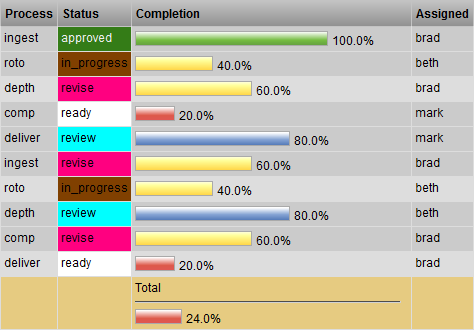
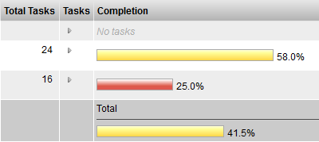
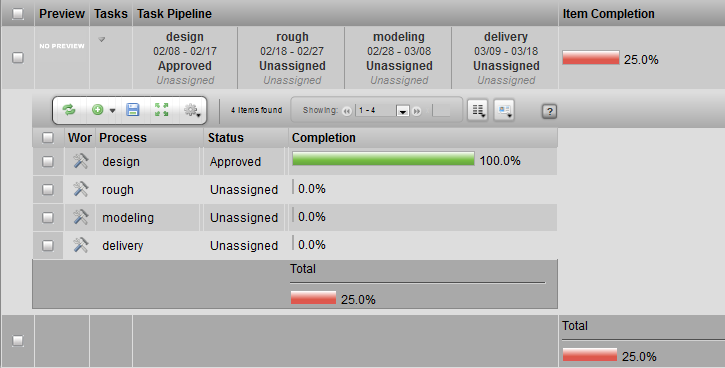
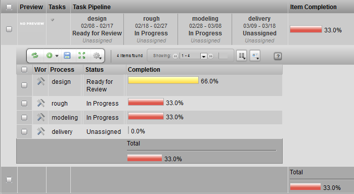

# Completion

**Description**

The Task Completion Widget provides a graphical bar chart to represent
the progress of an item by the completion rate of its child tasks.

**Info**

<table>
<colgroup>
<col width="28%" />
<col width="71%" />
</colgroup>
<tbody>
<tr class="odd">
<td>
<strong>Name</strong>
</td>
<td>
Task Completion Widget
</td>
</tr>
<tr class="even">
<td>
<strong>Common Title</strong>
</td>
<td>
Task Completion Widget
</td>
</tr>
<tr class="odd">
<td>
<strong>Class</strong>
</td>
<td>
tactic.ui.table.TaskCompletionWdg
</td>
</tr>
<tr class="even">
<td>
<strong>TACTIC Version Support</strong>
</td>
<td>
2.5.0 

</td>
</tr>
<tr class="odd">
<td>
<strong>Required database columns</strong>
</td>
<td>
none
</td>
</tr>
</tbody>
</table>

**Usage**

This is a display-only widget. If all the tasks are completed for a
shot, the bar reading would be 100%. Otherwise, a partial completion
would be calculated based on tallying all the child tasks. If there are
no tasks for the item, "No tasks" is displayed.

**Implementation**

It is a common column that can be added using the Column Manager. The
item name is "completion".

**Options**

<table>
<colgroup>
<col width="28%" />
<col width="71%" />
</colgroup>
<tbody>
<tr class="odd">
<td>
task_expr
</td>
<td>
An expression to get to the tasks relative to the current sObject. e.g. @SOBJECT(prod/shot.sthpw/task)
</td>
</tr>
</tbody>
</table>

**Advanced**

        <element name="completion" edit="false">
            <display class="tactic.ui.table.TaskCompletionWdg"/>
        </element>

**How The "Completion" is Calculated**

**Example 1:**

Let’s say that we have a task in a pipeline with the following
processes:

4 processes: Design, Rough, Modeling, Delivery

Let’s say that for each process, there are:

4 statuses: Unassigned, In Progress, Ready\_for\_Review, Approved.

If the task is in the status: Unassigned, the task is 0% complete.

If the task is in the status: Started, the task is 33.3% complete.

If the task is in the status: Ready\_for\_Review , the task is 66.6%
complete.

If the task is in the status: Approved, the task is 100% complete.

Let’s say the task in the Rough process has the status 'Approved'. That
means that is 100% complete for the Rough process. In the other 3
processes, it is at Unassigned, which is 0% complete.

Then, the TOTAL completion would be (1.0 + 0 + 0 + 0 ) / 4 = 25%
complete.

**Example 2:**

Using the same process and task statuses, let’s say the task in the
Rough process has the status 'Ready\_for\_Review'. That means that is 66%
complete for the Rough process. In the other 2 processes, it is at
Started, which is 33.3% complete. In the last processes, it is at
Unassigned, which is 0% complete.

Then, the TOTAL completion would be (0.666 + .333 + .333 + 0 ) / 4 =
33.3% complete. .
