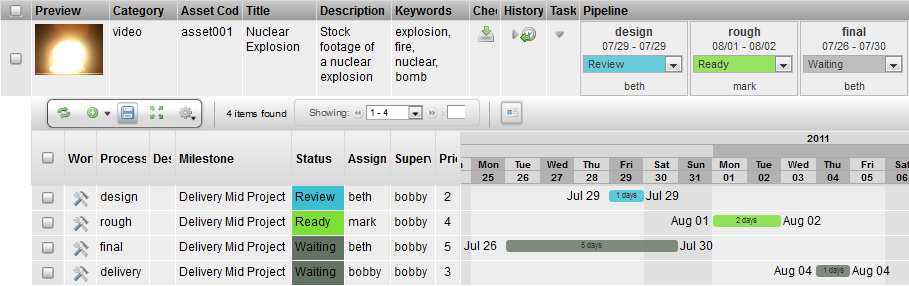

# Task Edit

**Description**

The Task Edit Widget is a toggle that opens a hidden row that displays
all the tasks for an item. If there are multiple processes for an item,
the tasks for those processes will be displayed.

**Info**

<table>
<colgroup>
<col width="28%" />
<col width="71%" />
</colgroup>
<tbody>
<tr class="odd">
<td>
<strong>Name</strong>
</td>
<td>
Task Edit
</td>
</tr>
<tr class="even">
<td>
<strong>Common Title</strong>
</td>
<td>
Tasks
</td>
</tr>
<tr class="odd">
<td>
<strong>Class</strong>
</td>
<td>
tactic.ui.panel.TableLayoutWdg
</td>
</tr>
<tr class="even">
<td>
<strong>Category</strong>
</td>
<td>
Table Layout Widget
</td>
</tr>
<tr class="odd">
<td>
<strong>Supported Interfaces</strong>
</td>
<td>
TableLayoutWdg
</td>
</tr>
<tr class="even">
<td>
<strong>TACTIC Version Support</strong>
</td>
<td>
3.0.0 

</td>
</tr>
<tr class="odd">
<td>
<strong>Required database columns</strong>
</td>
<td>
none
</td>
</tr>
</tbody>
</table>

**Usage**

The following details are displayed by the Task Edit Widget for a task:

-   a link to the task’s Work Area (where the Checkin and Checkout tools
    can be found)

-   the task’s description

-   status for that process

-   the user assigned to the process

-   the supervisor of that process

-   the priority

-   start and end date for the process in the form of a Gantt chart

**Implementation**

The Task Edit Widget is a common column that can be added using the
Column Manager.

**Options**

There are no options provided for the Task Edit Widget.

**Advanced**

    <element name="task_edit" title="Tasks" edit="false">
        <display class="HiddenRowToggleWdg">
            <dynamic_class>tactic.ui.panel.TableLayoutWdg</dynamic_class>
        </display>
    </element>
